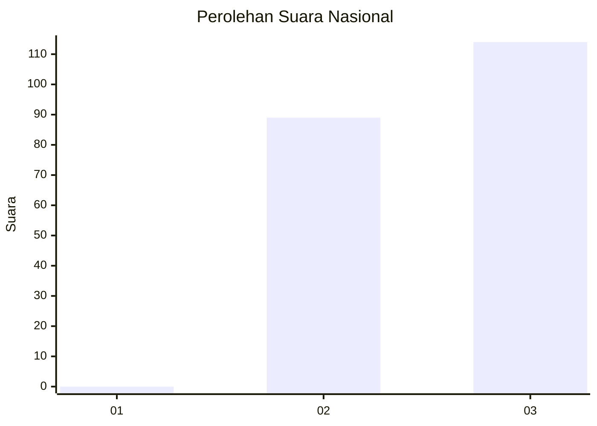
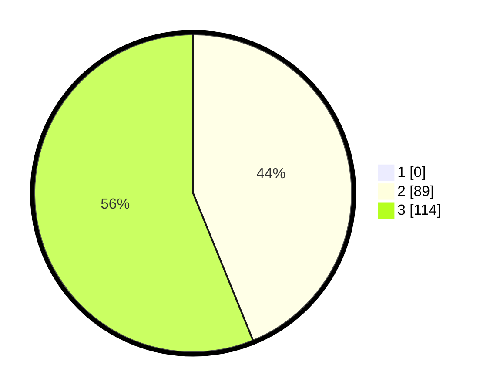

# Hasil

## Grafik

## Tabel

| No. | Nama Paslon    | Suara | Suara (raw) | Persentase |
|:--- |:-------------- | -----:| -----------:| ----------:|
| 1   | ANIES MUHAIMIN | 0     | [0][p-1]    | 0,00       |
| 2   | PRABOWO GIBRAN | 89    | [89][p-2]   | 43,84      |
| 3   | GANJAR MAHFUD  | 114   | [114][p-3]  | 56,16      |

[p-1]: https://github.com/gigit-pemilu/pemilu-2024/blob/main/pilpres/hitung-suara/sub/51-bali/sub/02-tabanan/sub/02-selemadeg-timur/sub/2004-mambang/sub/005-tps/sub/paslon-1.txt
[p-2]: https://github.com/gigit-pemilu/pemilu-2024/blob/main/pilpres/hitung-suara/sub/51-bali/sub/02-tabanan/sub/02-selemadeg-timur/sub/2004-mambang/sub/005-tps/sub/paslon-2.txt
[p-3]: https://github.com/gigit-pemilu/pemilu-2024/blob/main/pilpres/hitung-suara/sub/51-bali/sub/02-tabanan/sub/02-selemadeg-timur/sub/2004-mambang/sub/005-tps/sub/paslon-3.txt

## Foto C Plano

https://sirekap-obj-formc.kpu.go.id/ed30/pemilu/ppwp/51/02/02/20/04/5102022004005-20240215-092741--6d2c3a39-be61-4dec-9fe3-618148f686ef.jpg

https://sirekap-obj-formc.kpu.go.id/ed30/pemilu/ppwp/51/02/02/20/04/5102022004005-20240215-092804--e06e80b7-db0e-42bc-9676-5741c7375a7e.jpg

https://sirekap-obj-formc.kpu.go.id/ed30/pemilu/ppwp/51/02/02/20/04/5102022004005-20240215-092753--5c63e2b3-239d-4316-b8d0-741d8f428c94.jpg

## Metadata

| Key        | Value               |
| ---------- | ------------------- |
| Time Stamp | 2024-02-15 21:30:27 |

## DATA PEMILIH TETAP

Jumlah pemilih dalam DPT: **231**.
 * L: **110**.
 * P: **121**.

## DATA PENGGUNA HAK PILIH

Jumlah pengguna hak pilih dalam DPT: **205**.
 * L: **100**.
 * P: **105**.

Jumlah pengguna hak pilih dalam DPTb: **2**.
 * L: **0**.
 * P: **2**.

Jumlah pengguna hak pilih dalam DPK: **0**.
 * L: **0**.
 * P: **0**.

Jumlah pengguna hak pilih: **207**.
 * L: **100**.
 * P: **107**.

## JUMLAH SUARA SAH DAN TIDAK SAH

JUMLAH SELURUH SUARA SAH: **203**.

JUMLAH SUARA TIDAK SAH: **4**.

JUMLAH SELURUH SUARA SAH DAN SUARA TIDAK SAH: **207**.

