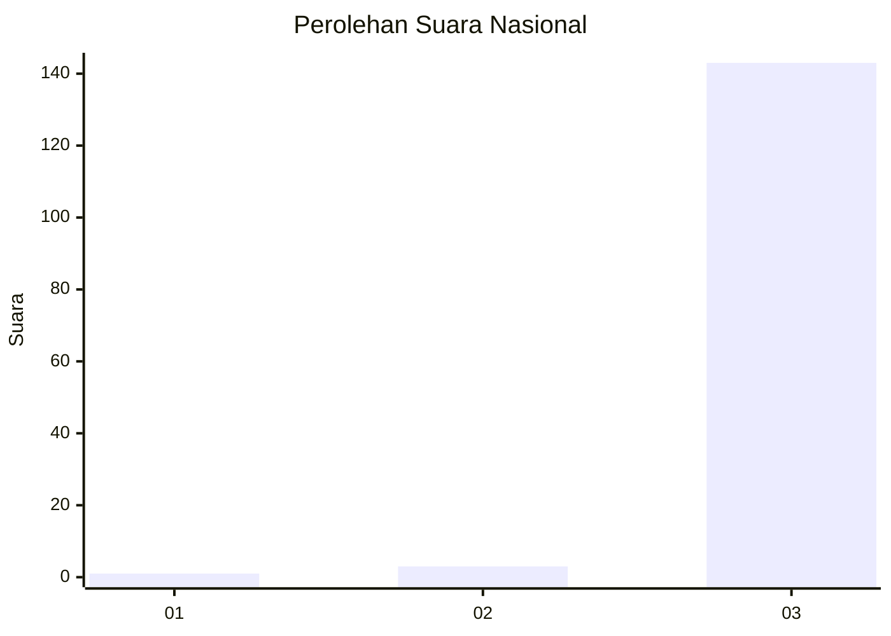
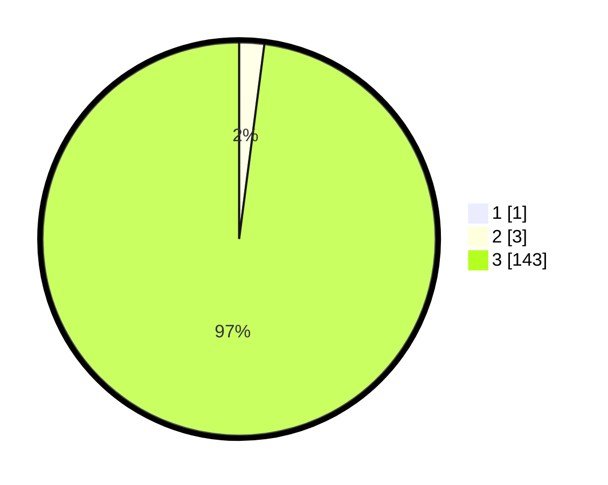

# Hasil

## Grafik

## Tabel

| No. | Nama Paslon    | Suara | Suara (raw) | Persentase |
|:--- |:-------------- | -----:| -----------:| ----------:|
| 1   | ANIES MUHAIMIN | 1     | [1][p-1]    | 0,68       |
| 2   | PRABOWO GIBRAN | 3     | [3][p-2]    | 2,04       |
| 3   | GANJAR MAHFUD  | 143   | [143][p-3]  | 97,28      |

[p-1]: https://github.com/gigit-pemilu/pemilu-2024/blob/main/pilpres/hitung-suara/sub/51-bali/sub/02-tabanan/sub/02-selemadeg-timur/sub/2004-mambang/sub/006-tps/sub/paslon-1.txt
[p-2]: https://github.com/gigit-pemilu/pemilu-2024/blob/main/pilpres/hitung-suara/sub/51-bali/sub/02-tabanan/sub/02-selemadeg-timur/sub/2004-mambang/sub/006-tps/sub/paslon-2.txt
[p-3]: https://github.com/gigit-pemilu/pemilu-2024/blob/main/pilpres/hitung-suara/sub/51-bali/sub/02-tabanan/sub/02-selemadeg-timur/sub/2004-mambang/sub/006-tps/sub/paslon-3.txt

## Foto C Plano

https://sirekap-obj-formc.kpu.go.id/066c/pemilu/ppwp/51/02/02/20/04/5102022004006-20240216-010806--d584c9c1-ce90-4571-9fde-6a50dc5c3abc.jpg

https://sirekap-obj-formc.kpu.go.id/066c/pemilu/ppwp/51/02/02/20/04/5102022004006-20240216-010813--fb18239c-4d5c-4249-a8fb-5e8e25c3d6ec.jpg

https://sirekap-obj-formc.kpu.go.id/066c/pemilu/ppwp/51/02/02/20/04/5102022004006-20240216-010809--27e8ee3b-b112-4c5a-9b1a-44649618e954.jpg

## Metadata

| Key        | Value               |
| ---------- | ------------------- |
| Time Stamp | 2024-02-16 09:30:28 |

## DATA PEMILIH TETAP

Jumlah pemilih dalam DPT: **0**.
 * L: **0**.
 * P: **0**.

## DATA PENGGUNA HAK PILIH

Jumlah pengguna hak pilih dalam DPT: **0**.
 * L: **0**.
 * P: **0**.

Jumlah pengguna hak pilih dalam DPTb: **0**.
 * L: **0**.
 * P: **0**.

Jumlah pengguna hak pilih dalam DPK: **0**.
 * L: **0**.
 * P: **0**.

Jumlah pengguna hak pilih: **0**.
 * L: **0**.
 * P: **0**.

## JUMLAH SUARA SAH DAN TIDAK SAH

JUMLAH SELURUH SUARA SAH: **147**.

JUMLAH SUARA TIDAK SAH: **2**.

JUMLAH SELURUH SUARA SAH DAN SUARA TIDAK SAH: **149**.

