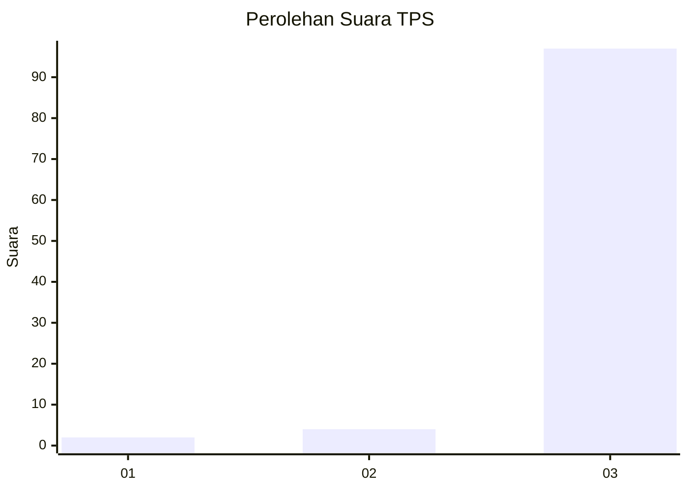
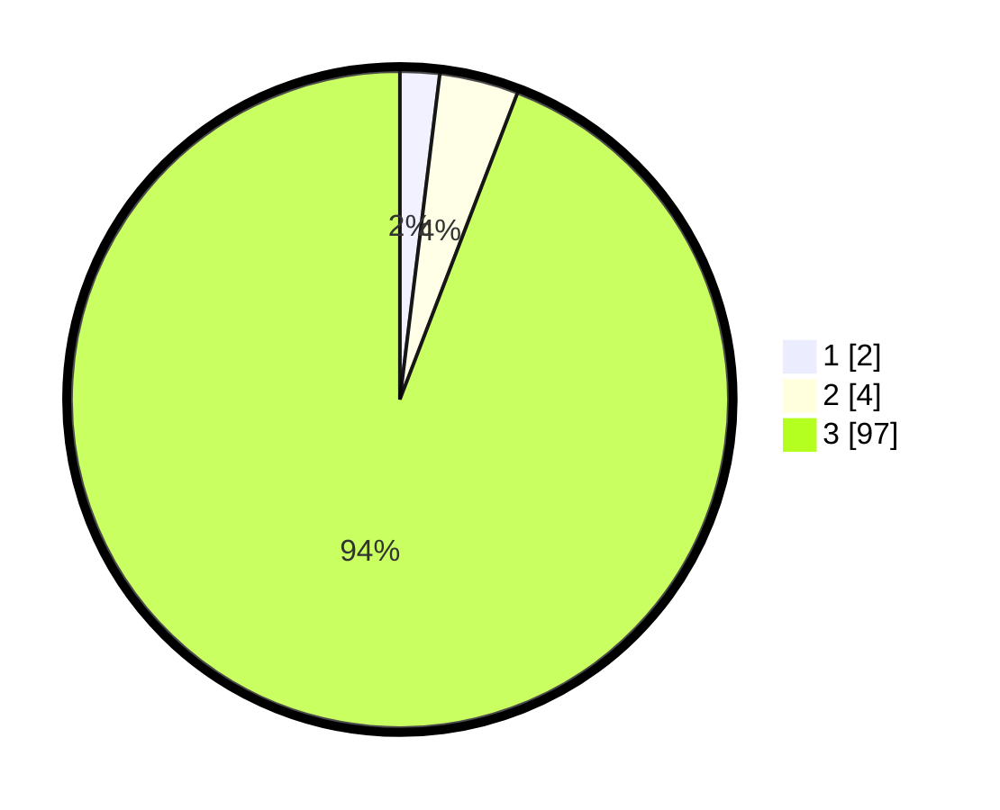

# Hasil

## Grafik

## Tabel

| No. | Nama Paslon    | Suara | Suara (raw) | Persentase |
|:--- |:-------------- | -----:| -----------:| ----------:|
| 1   | ANIES MUHAIMIN | 2     | [2][p-1]    | 1,94       |
| 2   | PRABOWO GIBRAN | 4     | [4][p-2]    | 3,88       |
| 3   | GANJAR MAHFUD  | 97    | [97][p-3]   | 94,17      |

[p-1]: https://github.com/gigit-pemilu/pemilu-2024-51-bali/blob/main/pilpres/hitung-suara/sub/51-bali/sub/02-tabanan/sub/02-selemadeg-timur/sub/2004-mambang/sub/007-tps/sub/paslon-1.txt
[p-2]: https://github.com/gigit-pemilu/pemilu-2024-51-bali/blob/main/pilpres/hitung-suara/sub/51-bali/sub/02-tabanan/sub/02-selemadeg-timur/sub/2004-mambang/sub/007-tps/sub/paslon-2.txt
[p-3]: https://github.com/gigit-pemilu/pemilu-2024-51-bali/blob/main/pilpres/hitung-suara/sub/51-bali/sub/02-tabanan/sub/02-selemadeg-timur/sub/2004-mambang/sub/007-tps/sub/paslon-3.txt

## Foto C Plano

https://sirekap-obj-formc.kpu.go.id/abe8/pemilu/ppwp/51/02/02/20/04/5102022004007-20240216-155210--d6de79d7-a45b-4789-a48e-d83fafc39800.jpg

https://sirekap-obj-formc.kpu.go.id/abe8/pemilu/ppwp/51/02/02/20/04/5102022004007-20240216-155211--aef78995-243a-48d4-aadb-0b5154dafd00.jpg

https://sirekap-obj-formc.kpu.go.id/abe8/pemilu/ppwp/51/02/02/20/04/5102022004007-20240216-155211--a410b444-8c3f-4757-b991-2363f4f6148f.jpg

## Metadata

| Key        | Value               |
| ---------- | ------------------- |
| Time Stamp | 2024-02-20 23:00:00 |

## DATA PEMILIH TETAP

Jumlah pemilih dalam DPT: **106**.
 * L: **53**.
 * P: **53**.

## DATA PENGGUNA HAK PILIH

Jumlah pengguna hak pilih dalam DPT: **104**.
 * L: **53**.
 * P: **51**.

Jumlah pengguna hak pilih dalam DPTb: **0**.
 * L: **0**.
 * P: **0**.

Jumlah pengguna hak pilih dalam DPK: **0**.
 * L: **0**.
 * P: **0**.

Jumlah pengguna hak pilih: **104**.
 * L: **53**.
 * P: **51**.

## JUMLAH SUARA SAH DAN TIDAK SAH

JUMLAH SELURUH SUARA SAH: **103**.

JUMLAH SUARA TIDAK SAH: **1**.

JUMLAH SELURUH SUARA SAH DAN SUARA TIDAK SAH: **104**.

