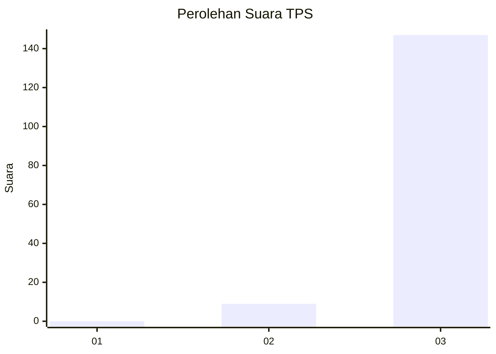
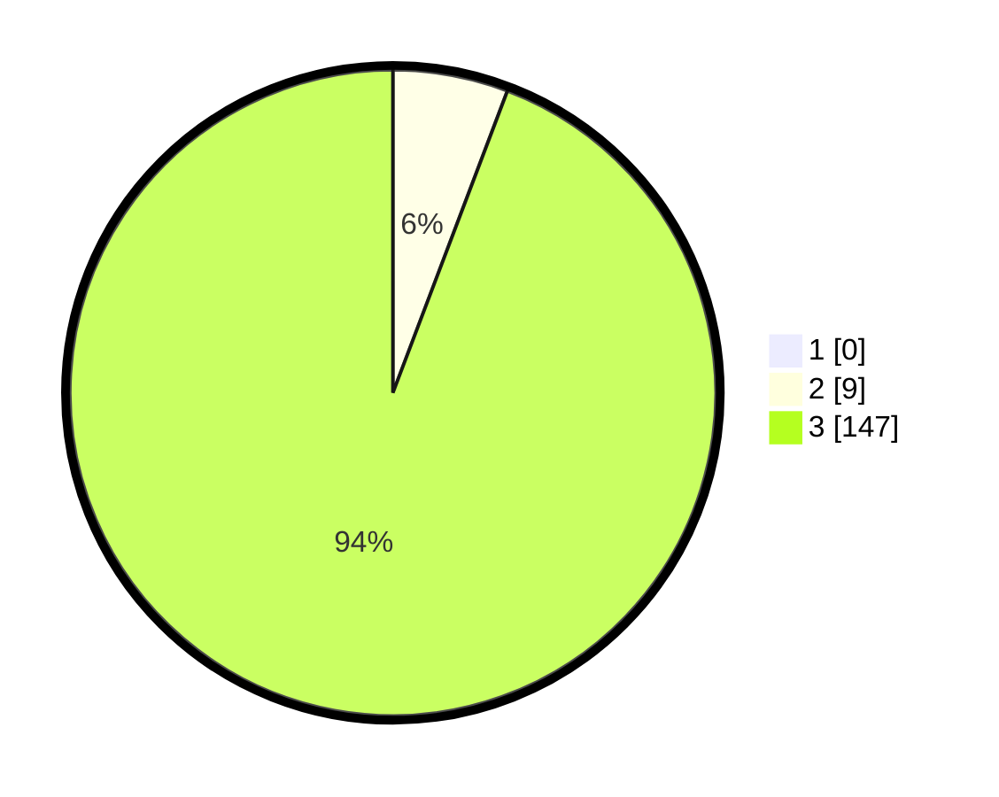

# Hasil

## Grafik

## Tabel

| No. | Nama Paslon    | Suara | Suara (raw) | Persentase |
|:--- |:-------------- | -----:| -----------:| ----------:|
| 1   | ANIES MUHAIMIN | 0     | [0][p-1]    | 0,00       |
| 2   | PRABOWO GIBRAN | 9     | [9][p-2]    | 5,77       |
| 3   | GANJAR MAHFUD  | 147   | [147][p-3]  | 94,23      |

[p-1]: https://github.com/gigit-pemilu/pemilu-2024-51-bali/blob/main/pilpres/hitung-suara/sub/51-bali/sub/02-tabanan/sub/02-selemadeg-timur/sub/2004-mambang/sub/008-tps/sub/paslon-1.txt
[p-2]: https://github.com/gigit-pemilu/pemilu-2024-51-bali/blob/main/pilpres/hitung-suara/sub/51-bali/sub/02-tabanan/sub/02-selemadeg-timur/sub/2004-mambang/sub/008-tps/sub/paslon-2.txt
[p-3]: https://github.com/gigit-pemilu/pemilu-2024-51-bali/blob/main/pilpres/hitung-suara/sub/51-bali/sub/02-tabanan/sub/02-selemadeg-timur/sub/2004-mambang/sub/008-tps/sub/paslon-3.txt

## Foto C Plano

https://sirekap-obj-formc.kpu.go.id/3b29/pemilu/ppwp/51/02/02/20/04/5102022004008-20240216-131802--c6065419-40c9-429a-8fbd-53f27041f83b.jpg

https://sirekap-obj-formc.kpu.go.id/3b29/pemilu/ppwp/51/02/02/20/04/5102022004008-20240216-131803--86c25631-4507-479e-b5a5-a4c5610746a7.jpg

https://sirekap-obj-formc.kpu.go.id/3b29/pemilu/ppwp/51/02/02/20/04/5102022004008-20240216-131802--2c85bcae-b3cc-424b-a455-c83cdca6b9d4.jpg

## Metadata

| Key        | Value               |
| ---------- | ------------------- |
| Time Stamp | 2024-02-16 14:00:34 |

## DATA PEMILIH TETAP

Jumlah pemilih dalam DPT: **161**.
 * L: **82**.
 * P: **79**.

## DATA PENGGUNA HAK PILIH

Jumlah pengguna hak pilih dalam DPT: **157**.
 * L: **80**.
 * P: **77**.

Jumlah pengguna hak pilih dalam DPTb: **0**.
 * L: **0**.
 * P: **0**.

Jumlah pengguna hak pilih dalam DPK: **0**.
 * L: **0**.
 * P: **0**.

Jumlah pengguna hak pilih: **157**.
 * L: **80**.
 * P: **77**.

## JUMLAH SUARA SAH DAN TIDAK SAH

JUMLAH SELURUH SUARA SAH: **156**.

JUMLAH SUARA TIDAK SAH: **1**.

JUMLAH SELURUH SUARA SAH DAN SUARA TIDAK SAH: **157**.

