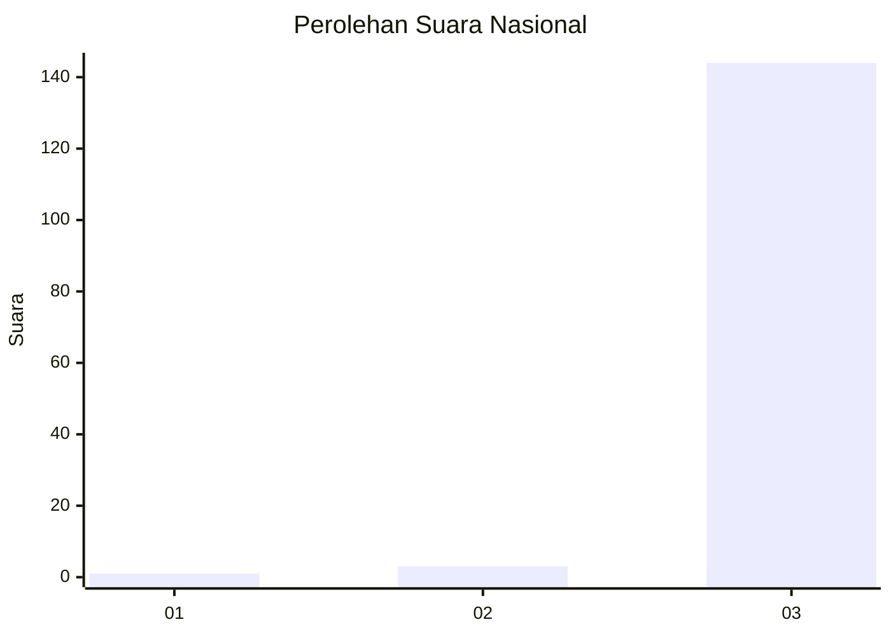
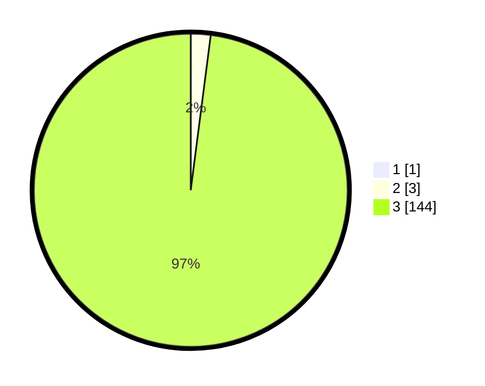

# Hasil

## Grafik

## Tabel

| No. | Nama Paslon    | Suara | Suara (raw) | Persentase |
|:--- |:-------------- | -----:| -----------:| ----------:|
| 1   | ANIES MUHAIMIN | 1     | [1][p-1]    | 0,68       |
| 2   | PRABOWO GIBRAN | 3     | [3][p-2]    | 2,03       |
| 3   | GANJAR MAHFUD  | 144   | [144][p-3]  | 97,30      |

[p-1]: https://github.com/gigit-pemilu/pemilu-2024/blob/main/pilpres/hitung-suara/sub/51-bali/sub/02-tabanan/sub/02-selemadeg-timur/sub/2004-mambang/sub/009-tps/sub/paslon-1.txt
[p-2]: https://github.com/gigit-pemilu/pemilu-2024/blob/main/pilpres/hitung-suara/sub/51-bali/sub/02-tabanan/sub/02-selemadeg-timur/sub/2004-mambang/sub/009-tps/sub/paslon-2.txt
[p-3]: https://github.com/gigit-pemilu/pemilu-2024/blob/main/pilpres/hitung-suara/sub/51-bali/sub/02-tabanan/sub/02-selemadeg-timur/sub/2004-mambang/sub/009-tps/sub/paslon-3.txt

## Foto C Plano

https://sirekap-obj-formc.kpu.go.id/1927/pemilu/ppwp/51/02/02/20/04/5102022004009-20240215-222455--fcbb77c9-82b6-4879-be43-a2074317e523.jpg

https://sirekap-obj-formc.kpu.go.id/1927/pemilu/ppwp/51/02/02/20/04/5102022004009-20240215-222457--380c042c-a675-481e-a34f-726361913db0.jpg

https://sirekap-obj-formc.kpu.go.id/1927/pemilu/ppwp/51/02/02/20/04/5102022004009-20240215-222455--ddaa50a1-3c4a-48a8-9554-48a060151fdc.jpg

## Metadata

| Key        | Value               |
| ---------- | ------------------- |
| Time Stamp | 2024-02-16 09:30:28 |

## DATA PEMILIH TETAP

Jumlah pemilih dalam DPT: **152**.
 * L: **76**.
 * P: **76**.

## DATA PENGGUNA HAK PILIH

Jumlah pengguna hak pilih dalam DPT: **146**.
 * L: **72**.
 * P: **74**.

Jumlah pengguna hak pilih dalam DPTb: **2**.
 * L: **1**.
 * P: **1**.

Jumlah pengguna hak pilih dalam DPK: **0**.
 * L: **0**.
 * P: **0**.

Jumlah pengguna hak pilih: **148**.
 * L: **73**.
 * P: **75**.

## JUMLAH SUARA SAH DAN TIDAK SAH

JUMLAH SELURUH SUARA SAH: **148**.

JUMLAH SUARA TIDAK SAH: **0**.

JUMLAH SELURUH SUARA SAH DAN SUARA TIDAK SAH: **148**.

