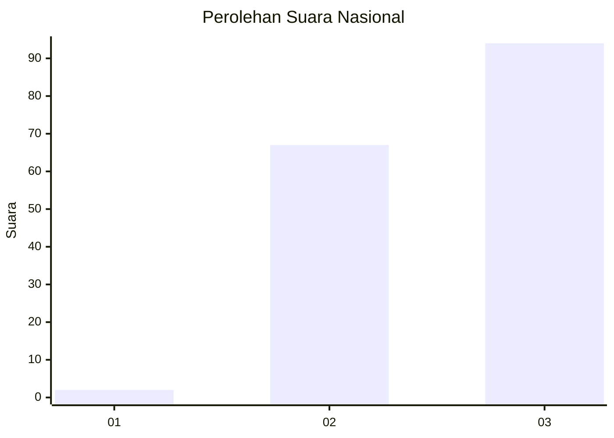
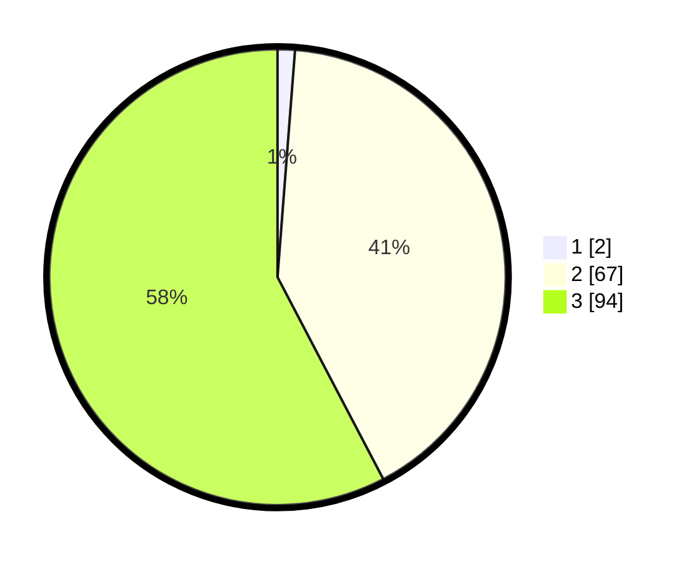

# Hasil

## Grafik

## Tabel

| No. | Nama Paslon    | Suara | Suara (raw) | Persentase |
|:--- |:-------------- | -----:| -----------:| ----------:|
| 1   | ANIES MUHAIMIN | 2     | [2][p-1]    | 1,23       |
| 2   | PRABOWO GIBRAN | 67    | [67][p-2]   | 41,10      |
| 3   | GANJAR MAHFUD  | 94    | [94][p-3]   | 57,67      |

[p-1]: https://github.com/gigit-pemilu/pemilu-2024/blob/main/pilpres/hitung-suara/sub/51-bali/sub/02-tabanan/sub/02-selemadeg-timur/sub/2004-mambang/sub/010-tps/sub/paslon-1.txt
[p-2]: https://github.com/gigit-pemilu/pemilu-2024/blob/main/pilpres/hitung-suara/sub/51-bali/sub/02-tabanan/sub/02-selemadeg-timur/sub/2004-mambang/sub/010-tps/sub/paslon-2.txt
[p-3]: https://github.com/gigit-pemilu/pemilu-2024/blob/main/pilpres/hitung-suara/sub/51-bali/sub/02-tabanan/sub/02-selemadeg-timur/sub/2004-mambang/sub/010-tps/sub/paslon-3.txt

## Foto C Plano

https://sirekap-obj-formc.kpu.go.id/2acf/pemilu/ppwp/51/02/02/20/04/5102022004010-20240216-004503--02b479be-ad2a-49e4-940d-b2548fbf262c.jpg

https://sirekap-obj-formc.kpu.go.id/2acf/pemilu/ppwp/51/02/02/20/04/5102022004010-20240216-004505--7855d110-aa68-49ae-b80f-dda28d8ff4f3.jpg

https://sirekap-obj-formc.kpu.go.id/2acf/pemilu/ppwp/51/02/02/20/04/5102022004010-20240216-004504--cffb05d9-054c-46ac-a04a-8725edf85526.jpg

## Metadata

| Key        | Value               |
| ---------- | ------------------- |
| Time Stamp | 2024-02-16 09:30:28 |

## DATA PEMILIH TETAP

Jumlah pemilih dalam DPT: **175**.
 * L: **84**.
 * P: **91**.

## DATA PENGGUNA HAK PILIH

Jumlah pengguna hak pilih dalam DPT: **160**.
 * L: **75**.
 * P: **85**.

Jumlah pengguna hak pilih dalam DPTb: **1**.
 * L: **1**.
 * P: **0**.

Jumlah pengguna hak pilih dalam DPK: **2**.
 * L: **1**.
 * P: **1**.

Jumlah pengguna hak pilih: **163**.
 * L: **77**.
 * P: **86**.

## JUMLAH SUARA SAH DAN TIDAK SAH

JUMLAH SELURUH SUARA SAH: **163**.

JUMLAH SUARA TIDAK SAH: **0**.

JUMLAH SELURUH SUARA SAH DAN SUARA TIDAK SAH: **163**.

