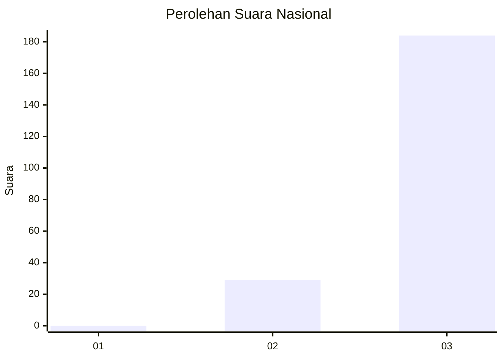
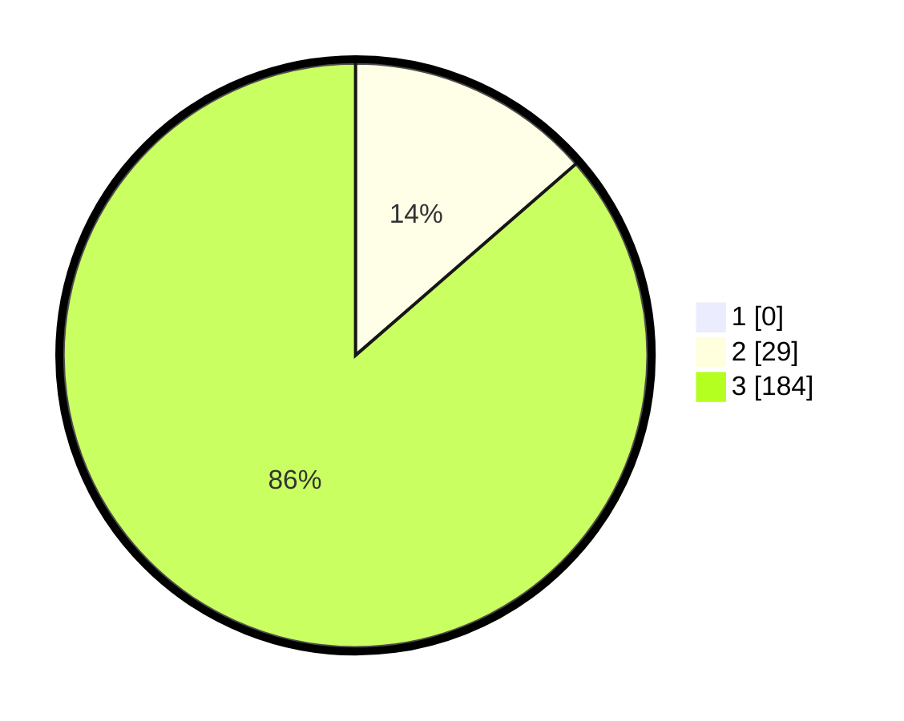

# Hasil

## Grafik

## Tabel

| No. | Nama Paslon    | Suara | Suara (raw) | Persentase |
|:--- |:-------------- | -----:| -----------:| ----------:|
| 1   | ANIES MUHAIMIN | 0     | [0][p-1]    | 0,00       |
| 2   | PRABOWO GIBRAN | 29    | [29][p-2]   | 13,62      |
| 3   | GANJAR MAHFUD  | 184   | [184][p-3]  | 86,38      |

[p-1]: https://github.com/gigit-pemilu/pemilu-2024/blob/main/pilpres/hitung-suara/sub/51-bali/sub/02-tabanan/sub/02-selemadeg-timur/sub/2004-mambang/sub/011-tps/sub/paslon-1.txt
[p-2]: https://github.com/gigit-pemilu/pemilu-2024/blob/main/pilpres/hitung-suara/sub/51-bali/sub/02-tabanan/sub/02-selemadeg-timur/sub/2004-mambang/sub/011-tps/sub/paslon-2.txt
[p-3]: https://github.com/gigit-pemilu/pemilu-2024/blob/main/pilpres/hitung-suara/sub/51-bali/sub/02-tabanan/sub/02-selemadeg-timur/sub/2004-mambang/sub/011-tps/sub/paslon-3.txt

## Foto C Plano

https://sirekap-obj-formc.kpu.go.id/e9e2/pemilu/ppwp/51/02/02/20/04/5102022004011-20240216-022059--fbbc0d6f-2e1e-46ee-becd-827252a1849a.jpg

https://sirekap-obj-formc.kpu.go.id/e9e2/pemilu/ppwp/51/02/02/20/04/5102022004011-20240216-022110--b920d028-7863-4bd3-8417-9b209ff610ea.jpg

https://sirekap-obj-formc.kpu.go.id/e9e2/pemilu/ppwp/51/02/02/20/04/5102022004011-20240216-022105--800704ba-458f-4f34-bd81-5f8f6f405356.jpg

## Metadata

| Key        | Value               |
| ---------- | ------------------- |
| Time Stamp | 2024-02-16 09:30:28 |

## DATA PEMILIH TETAP

Jumlah pemilih dalam DPT: **259**.
 * L: **121**.
 * P: **138**.

## DATA PENGGUNA HAK PILIH

Jumlah pengguna hak pilih dalam DPT: **212**.
 * L: **97**.
 * P: **115**.

Jumlah pengguna hak pilih dalam DPTb: **2**.
 * L: **1**.
 * P: **1**.

Jumlah pengguna hak pilih dalam DPK: **0**.
 * L: **0**.
 * P: **0**.

Jumlah pengguna hak pilih: **214**.
 * L: **98**.
 * P: **116**.

## JUMLAH SUARA SAH DAN TIDAK SAH

JUMLAH SELURUH SUARA SAH: **213**.

JUMLAH SUARA TIDAK SAH: **1**.

JUMLAH SELURUH SUARA SAH DAN SUARA TIDAK SAH: **214**.

