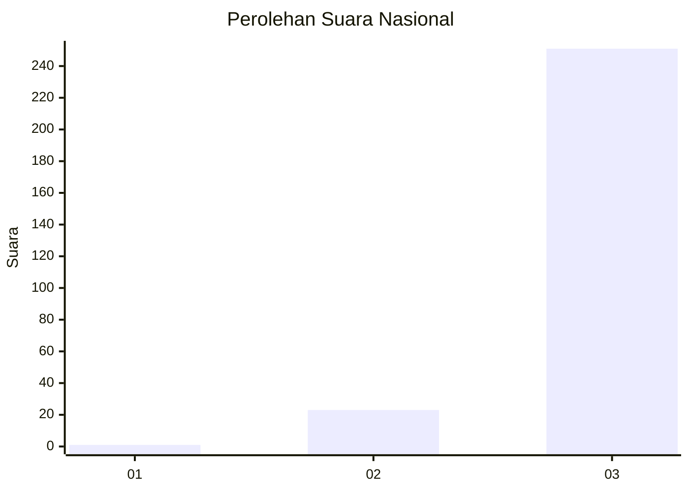
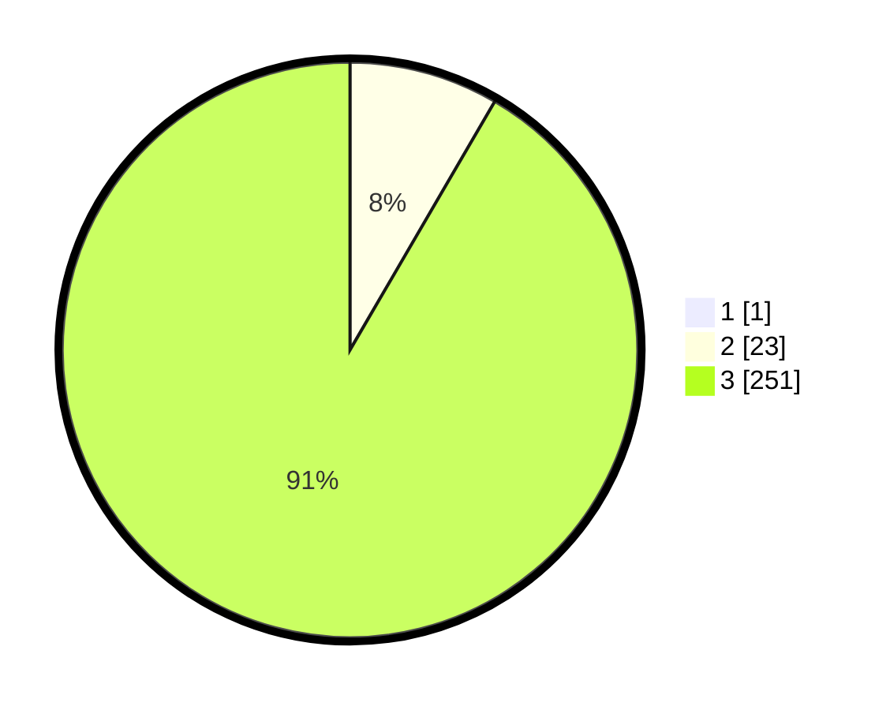

# Hasil

## Grafik

## Tabel

| No. | Nama Paslon    | Suara | Suara (raw) | Persentase |
|:--- |:-------------- | -----:| -----------:| ----------:|
| 1   | ANIES MUHAIMIN | 1     | [1][p-1]    | 0,36       |
| 2   | PRABOWO GIBRAN | 23    | [23][p-2]   | 8,36       |
| 3   | GANJAR MAHFUD  | 251   | [251][p-3]  | 91,27      |

[p-1]: https://github.com/gigit-pemilu/pemilu-2024/blob/main/pilpres/hitung-suara/sub/51-bali/sub/02-tabanan/sub/02-selemadeg-timur/sub/2004-mambang/sub/012-tps/sub/paslon-1.txt
[p-2]: https://github.com/gigit-pemilu/pemilu-2024/blob/main/pilpres/hitung-suara/sub/51-bali/sub/02-tabanan/sub/02-selemadeg-timur/sub/2004-mambang/sub/012-tps/sub/paslon-2.txt
[p-3]: https://github.com/gigit-pemilu/pemilu-2024/blob/main/pilpres/hitung-suara/sub/51-bali/sub/02-tabanan/sub/02-selemadeg-timur/sub/2004-mambang/sub/012-tps/sub/paslon-3.txt

## Foto C Plano

https://sirekap-obj-formc.kpu.go.id/963e/pemilu/ppwp/51/02/02/20/04/5102022004012-20240217-090849--c3f89446-69b5-49b8-8f57-8bba063e2ac2.jpg

https://sirekap-obj-formc.kpu.go.id/963e/pemilu/ppwp/51/02/02/20/04/5102022004012-20240217-090850--ae56a72b-b410-49f2-a066-3b5425dc1d75.jpg

https://sirekap-obj-formc.kpu.go.id/963e/pemilu/ppwp/51/02/02/20/04/5102022004012-20240217-090850--9452480d-8f46-4b16-96be-6fd51bcb1202.jpg

## Metadata

| Key        | Value               |
| ---------- | ------------------- |
| Time Stamp | 2024-02-20 23:00:00 |

## DATA PEMILIH TETAP

Jumlah pemilih dalam DPT: **290**.
 * L: **143**.
 * P: **147**.

## DATA PENGGUNA HAK PILIH

Jumlah pengguna hak pilih dalam DPT: **277**.
 * L: **135**.
 * P: **142**.

Jumlah pengguna hak pilih dalam DPTb: **0**.
 * L: **0**.
 * P: **0**.

Jumlah pengguna hak pilih dalam DPK: **3**.
 * L: **1**.
 * P: **2**.

Jumlah pengguna hak pilih: **280**.
 * L: **136**.
 * P: **144**.

## JUMLAH SUARA SAH DAN TIDAK SAH

JUMLAH SELURUH SUARA SAH: **274**.

JUMLAH SUARA TIDAK SAH: **6**.

JUMLAH SELURUH SUARA SAH DAN SUARA TIDAK SAH: **280**.

