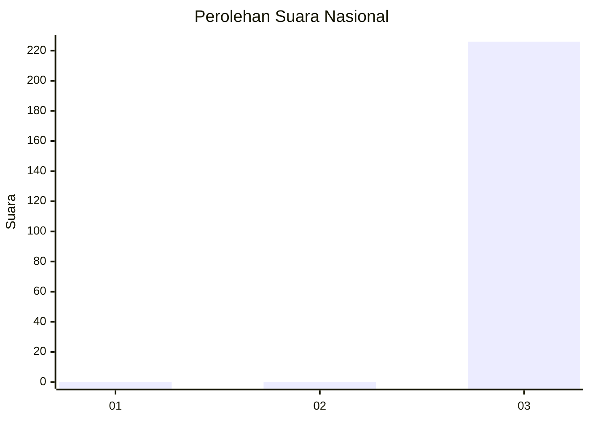
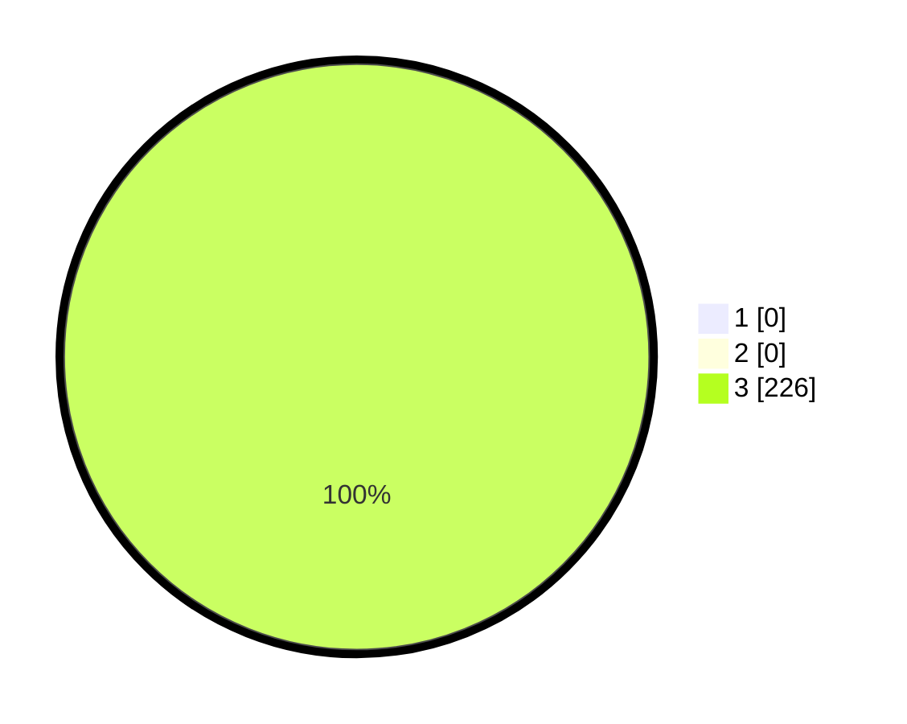

# Hasil

## Grafik

## Tabel

| No. | Nama Paslon    | Suara | Suara (raw) | Persentase |
|:--- |:-------------- | -----:| -----------:| ----------:|
| 1   | ANIES MUHAIMIN | 0     | [0][p-1]    | 0,00       |
| 2   | PRABOWO GIBRAN | 0     | [0][p-2]    | 0,00       |
| 3   | GANJAR MAHFUD  | 226   | [226][p-3]  | 100,00     |

[p-1]: https://github.com/gigit-pemilu/pemilu-2024/blob/main/pilpres/hitung-suara/sub/51-bali/sub/02-tabanan/sub/02-selemadeg-timur/sub/2004-mambang/sub/013-tps/sub/paslon-1.txt
[p-2]: https://github.com/gigit-pemilu/pemilu-2024/blob/main/pilpres/hitung-suara/sub/51-bali/sub/02-tabanan/sub/02-selemadeg-timur/sub/2004-mambang/sub/013-tps/sub/paslon-2.txt
[p-3]: https://github.com/gigit-pemilu/pemilu-2024/blob/main/pilpres/hitung-suara/sub/51-bali/sub/02-tabanan/sub/02-selemadeg-timur/sub/2004-mambang/sub/013-tps/sub/paslon-3.txt

## Foto C Plano

https://sirekap-obj-formc.kpu.go.id/dcce/pemilu/ppwp/51/02/02/20/04/5102022004013-20240216-141015--ed3b42f7-d66a-4b9b-9ae8-816ae004cac0.jpg

https://sirekap-obj-formc.kpu.go.id/dcce/pemilu/ppwp/51/02/02/20/04/5102022004013-20240216-141016--e0914565-82c0-4bd2-ba18-caa26d8c94b6.jpg

https://sirekap-obj-formc.kpu.go.id/dcce/pemilu/ppwp/51/02/02/20/04/5102022004013-20240216-141015--878cc581-fa41-4965-bbab-1de8c4c8c878.jpg

## Metadata

| Key        | Value               |
| ---------- | ------------------- |
| Time Stamp | 2024-02-16 14:30:33 |

## DATA PEMILIH TETAP

Jumlah pemilih dalam DPT: **228**.
 * L: **112**.
 * P: **116**.

## DATA PENGGUNA HAK PILIH

Jumlah pengguna hak pilih dalam DPT: **224**.
 * L: **111**.
 * P: **113**.

Jumlah pengguna hak pilih dalam DPTb: **2**.
 * L: **0**.
 * P: **2**.

Jumlah pengguna hak pilih dalam DPK: **0**.
 * L: **0**.
 * P: **0**.

Jumlah pengguna hak pilih: **226**.
 * L: **111**.
 * P: **115**.

## JUMLAH SUARA SAH DAN TIDAK SAH

JUMLAH SELURUH SUARA SAH: **226**.

JUMLAH SUARA TIDAK SAH: **0**.

JUMLAH SELURUH SUARA SAH DAN SUARA TIDAK SAH: **226**.

