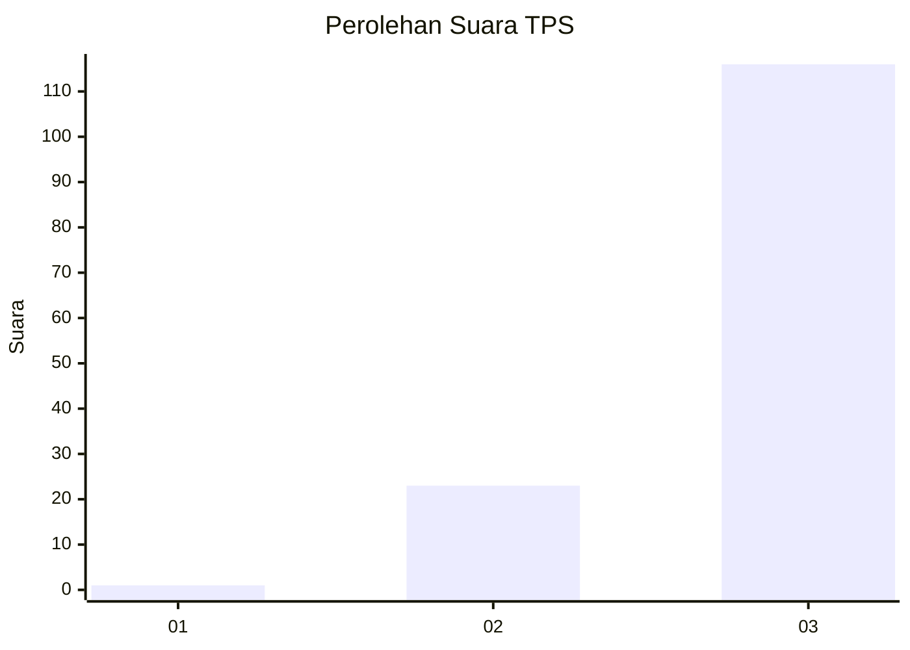
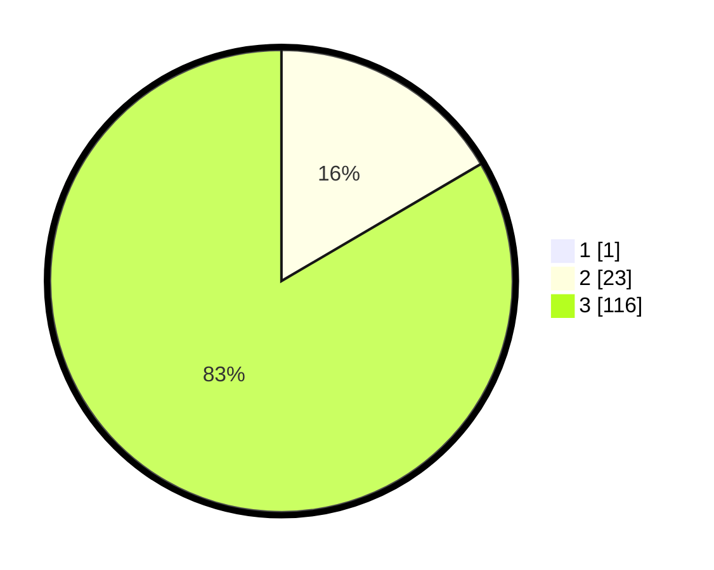

# Hasil

## Grafik

## Tabel

| No. | Nama Paslon    | Suara | Suara (raw) | Persentase |
|:--- |:-------------- | -----:| -----------:| ----------:|
| 1   | ANIES MUHAIMIN | 1     | [1][p-1]    | 0,71       |
| 2   | PRABOWO GIBRAN | 23    | [23][p-2]   | 16,43      |
| 3   | GANJAR MAHFUD  | 116   | [116][p-3]  | 82,86      |

[p-1]: https://github.com/gigit-pemilu/pemilu-2024-51-bali/blob/main/pilpres/hitung-suara/sub/51-bali/sub/02-tabanan/sub/02-selemadeg-timur/sub/2004-mambang/sub/014-tps/sub/paslon-1.txt
[p-2]: https://github.com/gigit-pemilu/pemilu-2024-51-bali/blob/main/pilpres/hitung-suara/sub/51-bali/sub/02-tabanan/sub/02-selemadeg-timur/sub/2004-mambang/sub/014-tps/sub/paslon-2.txt
[p-3]: https://github.com/gigit-pemilu/pemilu-2024-51-bali/blob/main/pilpres/hitung-suara/sub/51-bali/sub/02-tabanan/sub/02-selemadeg-timur/sub/2004-mambang/sub/014-tps/sub/paslon-3.txt

## Foto C Plano

https://sirekap-obj-formc.kpu.go.id/5ca8/pemilu/ppwp/51/02/02/20/04/5102022004014-20240214-213759--0bea7a23-a02d-4482-9be5-18f69d1980f9.jpg

https://sirekap-obj-formc.kpu.go.id/5ca8/pemilu/ppwp/51/02/02/20/04/5102022004014-20240214-195447--f6815291-25db-431c-b0e8-6c42d81c4c27.jpg

https://sirekap-obj-formc.kpu.go.id/5ca8/pemilu/ppwp/51/02/02/20/04/5102022004014-20240214-195632--e797d402-48ce-4fe1-ab09-f84cb9c166ac.jpg

## Metadata

| Key        | Value               |
| ---------- | ------------------- |
| Time Stamp | 2024-02-15 21:30:27 |

