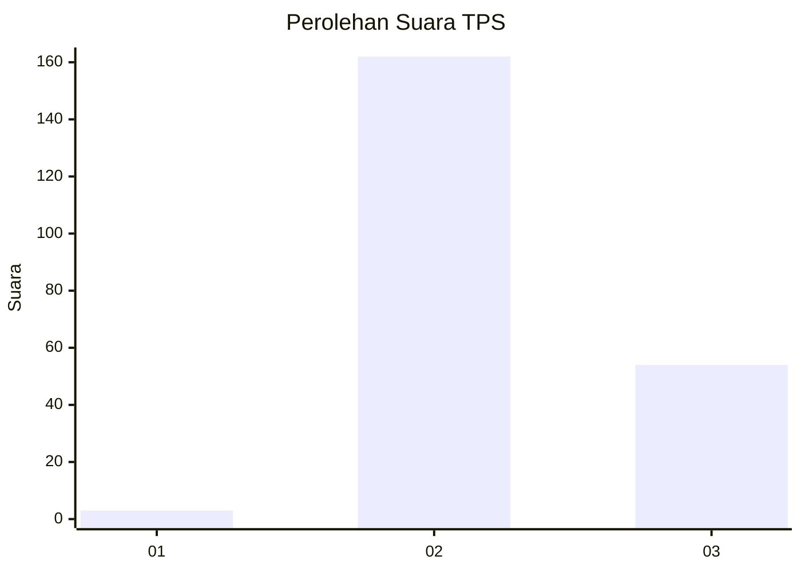
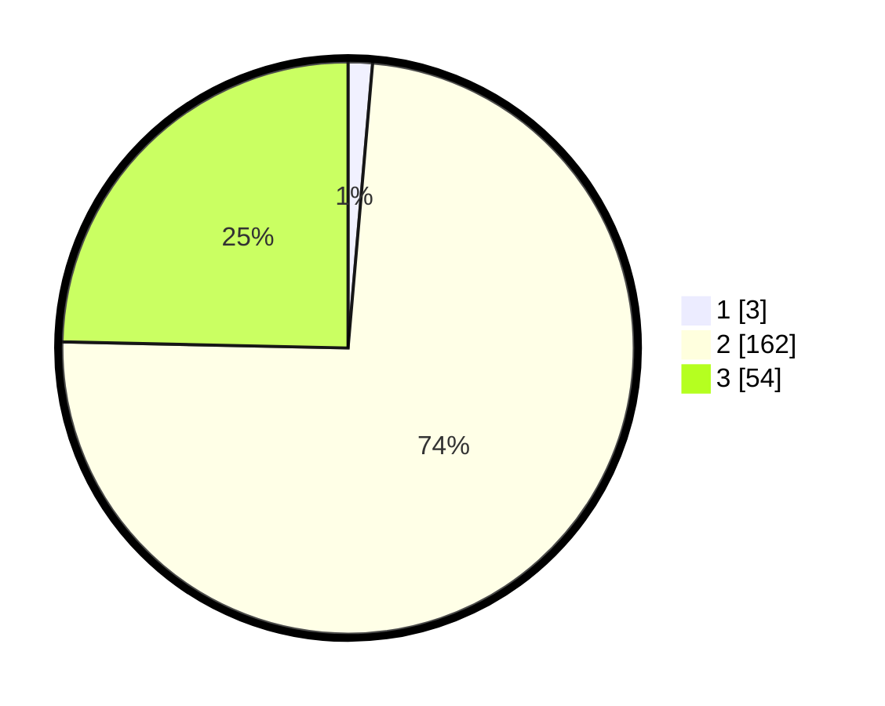

# Hasil

## Grafik

## Tabel

| No. | Nama Paslon    | Suara | Suara (raw) | Persentase |
|:--- |:-------------- | -----:| -----------:| ----------:|
| 1   | ANIES MUHAIMIN | 3     | [3][p-1]    | 1,37       |
| 2   | PRABOWO GIBRAN | 162   | [162][p-2]  | 73,97      |
| 3   | GANJAR MAHFUD  | 54    | [54][p-3]   | 24,66      |

[p-1]: https://github.com/gigit-pemilu/pemilu-2024-51-bali/blob/main/pilpres/hitung-suara/sub/51-bali/sub/02-tabanan/sub/02-selemadeg-timur/sub/2005-megati/sub/002-tps/sub/paslon-1.txt
[p-2]: https://github.com/gigit-pemilu/pemilu-2024-51-bali/blob/main/pilpres/hitung-suara/sub/51-bali/sub/02-tabanan/sub/02-selemadeg-timur/sub/2005-megati/sub/002-tps/sub/paslon-2.txt
[p-3]: https://github.com/gigit-pemilu/pemilu-2024-51-bali/blob/main/pilpres/hitung-suara/sub/51-bali/sub/02-tabanan/sub/02-selemadeg-timur/sub/2005-megati/sub/002-tps/sub/paslon-3.txt

## Foto C Plano

https://sirekap-obj-formc.kpu.go.id/e450/pemilu/ppwp/51/02/02/20/05/5102022005002-20240214-141538--6afa69b3-ea31-4b42-a558-cf6ee949b9e6.jpg

https://sirekap-obj-formc.kpu.go.id/e450/pemilu/ppwp/51/02/02/20/05/5102022005002-20240214-140943--45f85b92-eaca-4dac-a4dd-052bd749373c.jpg

https://sirekap-obj-formc.kpu.go.id/e450/pemilu/ppwp/51/02/02/20/05/5102022005002-20240216-140939--50fe9c32-7879-46b2-9351-65a81edb7e9c.jpg

## Metadata

| Key        | Value               |
| ---------- | ------------------- |
| Time Stamp | 2024-02-16 14:30:33 |

## DATA PEMILIH TETAP

Jumlah pemilih dalam DPT: **253**.
 * L: **121**.
 * P: **132**.

## DATA PENGGUNA HAK PILIH

Jumlah pengguna hak pilih dalam DPT: **220**.
 * L: **105**.
 * P: **115**.

Jumlah pengguna hak pilih dalam DPTb: **0**.
 * L: **0**.
 * P: **0**.

Jumlah pengguna hak pilih dalam DPK: **0**.
 * L: **0**.
 * P: **0**.

Jumlah pengguna hak pilih: **220**.
 * L: **105**.
 * P: **115**.

## JUMLAH SUARA SAH DAN TIDAK SAH

JUMLAH SELURUH SUARA SAH: **219**.

JUMLAH SUARA TIDAK SAH: **1**.

JUMLAH SELURUH SUARA SAH DAN SUARA TIDAK SAH: **220**.

