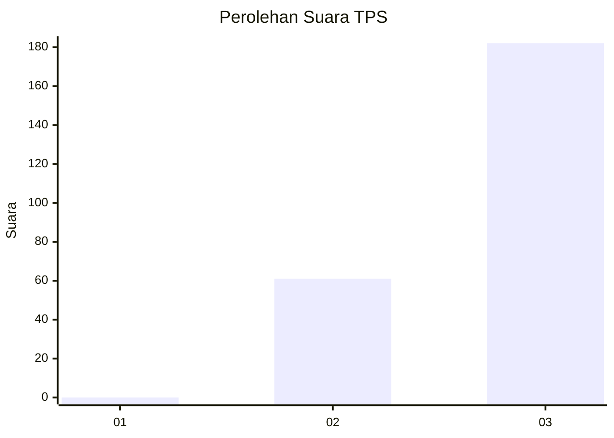
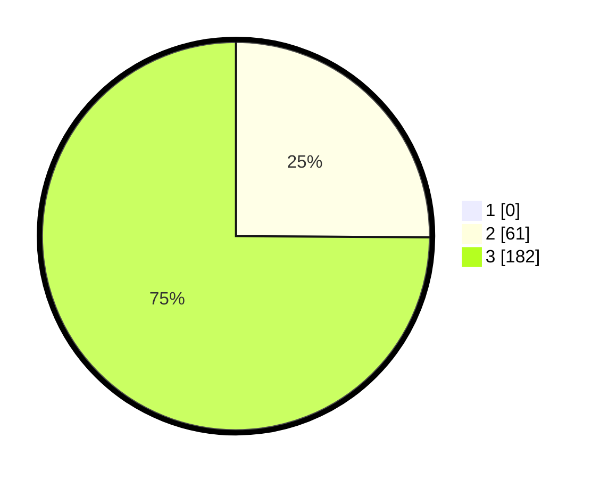

# Hasil

## Grafik

## Tabel

| No. | Nama Paslon    | Suara | Suara (raw) | Persentase |
|:--- |:-------------- | -----:| -----------:| ----------:|
| 1   | ANIES MUHAIMIN | 0     | [0][p-1]    | 0,00       |
| 2   | PRABOWO GIBRAN | 61    | [61][p-2]   | 25,10      |
| 3   | GANJAR MAHFUD  | 182   | [182][p-3]  | 74,90      |

[p-1]: https://github.com/gigit-pemilu/pemilu-2024-51-bali/blob/main/pilpres/hitung-suara/sub/51-bali/sub/02-tabanan/sub/02-selemadeg-timur/sub/2005-megati/sub/003-tps/sub/paslon-1.txt
[p-2]: https://github.com/gigit-pemilu/pemilu-2024-51-bali/blob/main/pilpres/hitung-suara/sub/51-bali/sub/02-tabanan/sub/02-selemadeg-timur/sub/2005-megati/sub/003-tps/sub/paslon-2.txt
[p-3]: https://github.com/gigit-pemilu/pemilu-2024-51-bali/blob/main/pilpres/hitung-suara/sub/51-bali/sub/02-tabanan/sub/02-selemadeg-timur/sub/2005-megati/sub/003-tps/sub/paslon-3.txt

## Foto C Plano

https://sirekap-obj-formc.kpu.go.id/80f2/pemilu/ppwp/51/02/02/20/05/5102022005003-20240214-155251--e4a75884-272f-43e6-ab8b-c232d51e6192.jpg

https://sirekap-obj-formc.kpu.go.id/80f2/pemilu/ppwp/51/02/02/20/05/5102022005003-20240214-155703--2af35d87-e7ae-426a-ba0d-425f24045347.jpg

https://sirekap-obj-formc.kpu.go.id/80f2/pemilu/ppwp/51/02/02/20/05/5102022005003-20240214-155825--350119b2-75b9-49c5-a184-77285c380c7c.jpg

## Metadata

| Key        | Value               |
| ---------- | ------------------- |
| Time Stamp | 2024-02-15 21:30:27 |

## DATA PEMILIH TETAP

Jumlah pemilih dalam DPT: **255**.
 * L: **128**.
 * P: **127**.

## DATA PENGGUNA HAK PILIH

Jumlah pengguna hak pilih dalam DPT: **242**.
 * L: **124**.
 * P: **118**.

Jumlah pengguna hak pilih dalam DPTb: **5**.
 * L: **3**.
 * P: **2**.

Jumlah pengguna hak pilih dalam DPK: **0**.
 * L: **0**.
 * P: **0**.

Jumlah pengguna hak pilih: **247**.
 * L: **127**.
 * P: **120**.

## JUMLAH SUARA SAH DAN TIDAK SAH

JUMLAH SELURUH SUARA SAH: **243**.

JUMLAH SUARA TIDAK SAH: **4**.

JUMLAH SELURUH SUARA SAH DAN SUARA TIDAK SAH: **247**.

