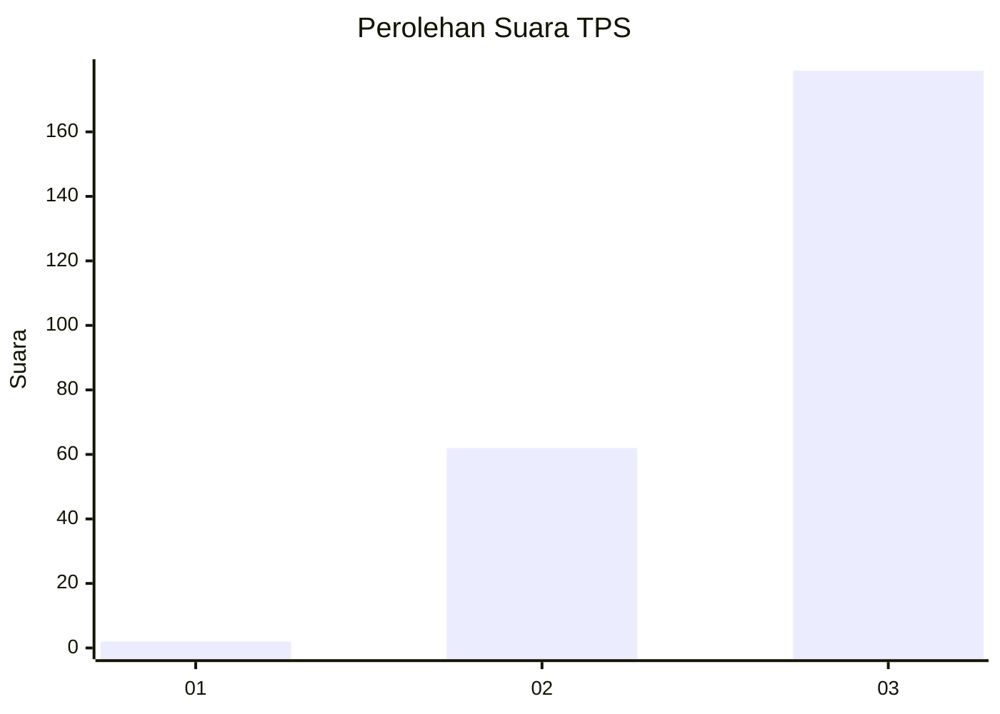
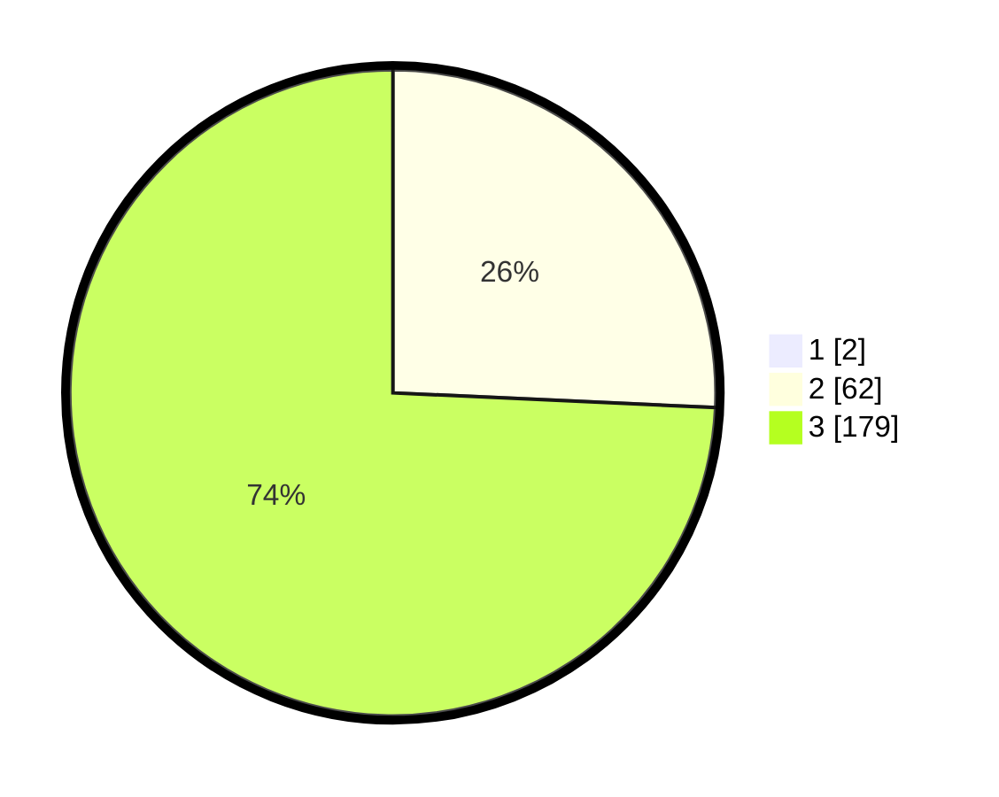

# Hasil

## Grafik

## Tabel

| No. | Nama Paslon    | Suara | Suara (raw) | Persentase |
|:--- |:-------------- | -----:| -----------:| ----------:|
| 1   | ANIES MUHAIMIN | 2     | [2][p-1]    | 0,82       |
| 2   | PRABOWO GIBRAN | 62    | [62][p-2]   | 25,51      |
| 3   | GANJAR MAHFUD  | 179   | [179][p-3]  | 73,66      |

[p-1]: https://github.com/gigit-pemilu/pemilu-2024-51-bali/blob/main/pilpres/hitung-suara/sub/51-bali/sub/02-tabanan/sub/02-selemadeg-timur/sub/2005-megati/sub/004-tps/sub/paslon-1.txt
[p-2]: https://github.com/gigit-pemilu/pemilu-2024-51-bali/blob/main/pilpres/hitung-suara/sub/51-bali/sub/02-tabanan/sub/02-selemadeg-timur/sub/2005-megati/sub/004-tps/sub/paslon-2.txt
[p-3]: https://github.com/gigit-pemilu/pemilu-2024-51-bali/blob/main/pilpres/hitung-suara/sub/51-bali/sub/02-tabanan/sub/02-selemadeg-timur/sub/2005-megati/sub/004-tps/sub/paslon-3.txt

## Foto C Plano

https://sirekap-obj-formc.kpu.go.id/16de/pemilu/ppwp/51/02/02/20/05/5102022005004-20240216-071501--fb2afdad-1dae-40fb-825d-4636933728bb.jpg

https://sirekap-obj-formc.kpu.go.id/16de/pemilu/ppwp/51/02/02/20/05/5102022005004-20240216-071502--aa390041-de19-439b-94c3-da72f3334e8b.jpg

https://sirekap-obj-formc.kpu.go.id/16de/pemilu/ppwp/51/02/02/20/05/5102022005004-20240216-071501--7eead17e-7fd9-4a02-af96-0d0c922890a9.jpg

## Metadata

| Key        | Value               |
| ---------- | ------------------- |
| Time Stamp | 2024-02-16 09:30:28 |

## DATA PEMILIH TETAP

Jumlah pemilih dalam DPT: **258**.
 * L: **122**.
 * P: **136**.

## DATA PENGGUNA HAK PILIH

Jumlah pengguna hak pilih dalam DPT: **244**.
 * L: **116**.
 * P: **128**.

Jumlah pengguna hak pilih dalam DPTb: **6**.
 * L: **1**.
 * P: **5**.

Jumlah pengguna hak pilih dalam DPK: **0**.
 * L: **0**.
 * P: **0**.

Jumlah pengguna hak pilih: **250**.
 * L: **117**.
 * P: **133**.

## JUMLAH SUARA SAH DAN TIDAK SAH

JUMLAH SELURUH SUARA SAH: **243**.

JUMLAH SUARA TIDAK SAH: **7**.

JUMLAH SELURUH SUARA SAH DAN SUARA TIDAK SAH: **250**.

