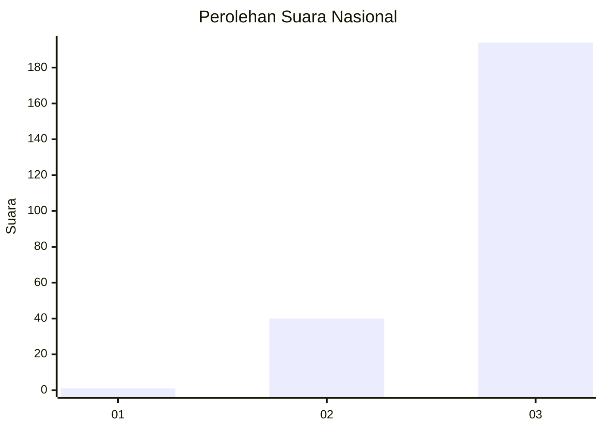
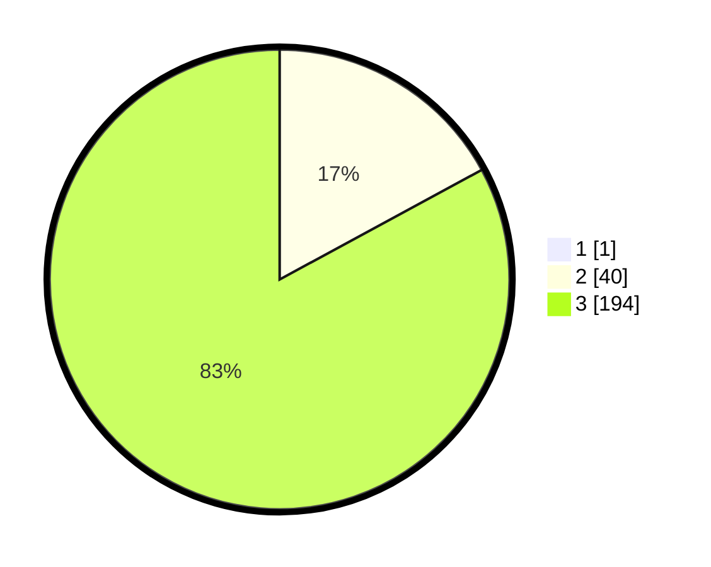

# Hasil

## Grafik

## Tabel

| No. | Nama Paslon    | Suara | Suara (raw) | Persentase |
|:--- |:-------------- | -----:| -----------:| ----------:|
| 1   | ANIES MUHAIMIN | 1     | [1][p-1]    | 0,43       |
| 2   | PRABOWO GIBRAN | 40    | [40][p-2]   | 17,02      |
| 3   | GANJAR MAHFUD  | 194   | [194][p-3]  | 82,55      |

[p-1]: https://github.com/gigit-pemilu/pemilu-2024/blob/main/pilpres/hitung-suara/sub/51-bali/sub/02-tabanan/sub/02-selemadeg-timur/sub/2005-megati/sub/005-tps/sub/paslon-1.txt
[p-2]: https://github.com/gigit-pemilu/pemilu-2024/blob/main/pilpres/hitung-suara/sub/51-bali/sub/02-tabanan/sub/02-selemadeg-timur/sub/2005-megati/sub/005-tps/sub/paslon-2.txt
[p-3]: https://github.com/gigit-pemilu/pemilu-2024/blob/main/pilpres/hitung-suara/sub/51-bali/sub/02-tabanan/sub/02-selemadeg-timur/sub/2005-megati/sub/005-tps/sub/paslon-3.txt

## Foto C Plano

https://sirekap-obj-formc.kpu.go.id/d94a/pemilu/ppwp/51/02/02/20/05/5102022005005-20240215-222419--48502916-c5bc-4da9-a6a9-9d5635960db7.jpg

https://sirekap-obj-formc.kpu.go.id/d94a/pemilu/ppwp/51/02/02/20/05/5102022005005-20240215-222423--d2b3403d-57a2-4f7d-9c63-97d1737f320f.jpg

https://sirekap-obj-formc.kpu.go.id/d94a/pemilu/ppwp/51/02/02/20/05/5102022005005-20240215-222421--b600c805-2128-430d-9ebd-ada3fb1837f0.jpg

## Metadata

| Key        | Value               |
| ---------- | ------------------- |
| Time Stamp | 2024-02-16 09:30:28 |

## DATA PEMILIH TETAP

Jumlah pemilih dalam DPT: **263**.
 * L: **125**.
 * P: **138**.

## DATA PENGGUNA HAK PILIH

Jumlah pengguna hak pilih dalam DPT: **233**.
 * L: **109**.
 * P: **124**.

Jumlah pengguna hak pilih dalam DPTb: **1**.
 * L: **0**.
 * P: **1**.

Jumlah pengguna hak pilih dalam DPK: **1**.
 * L: **1**.
 * P: **0**.

Jumlah pengguna hak pilih: **235**.
 * L: **110**.
 * P: **125**.

## JUMLAH SUARA SAH DAN TIDAK SAH

JUMLAH SELURUH SUARA SAH: **235**.

JUMLAH SUARA TIDAK SAH: **0**.

JUMLAH SELURUH SUARA SAH DAN SUARA TIDAK SAH: **235**.

