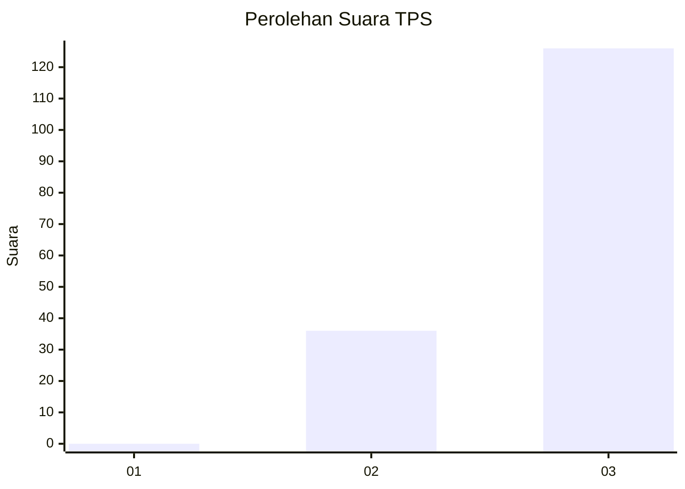
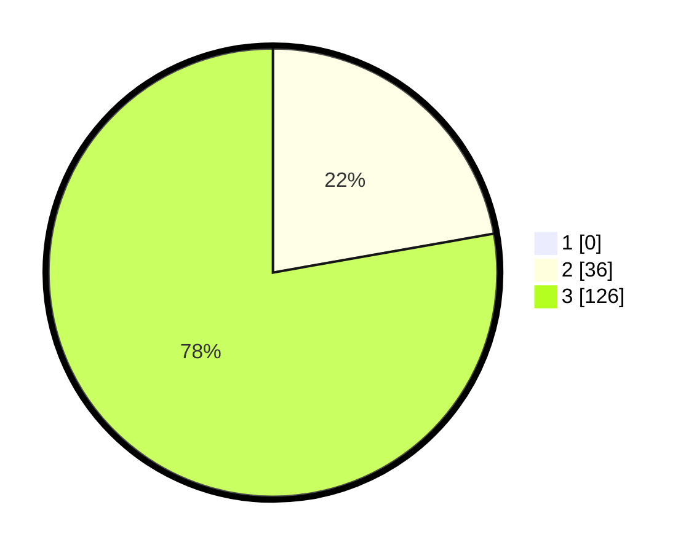

# Hasil

## Grafik

## Tabel

| No. | Nama Paslon    | Suara | Suara (raw) | Persentase |
|:--- |:-------------- | -----:| -----------:| ----------:|
| 1   | ANIES MUHAIMIN | 0     | [0][p-1]    | 0,00       |
| 2   | PRABOWO GIBRAN | 36    | [36][p-2]   | 22,22      |
| 3   | GANJAR MAHFUD  | 126   | [126][p-3]  | 77,78      |

[p-1]: https://github.com/gigit-pemilu/pemilu-2024-51-bali/blob/main/pilpres/hitung-suara/sub/51-bali/sub/02-tabanan/sub/02-selemadeg-timur/sub/2005-megati/sub/006-tps/sub/paslon-1.txt
[p-2]: https://github.com/gigit-pemilu/pemilu-2024-51-bali/blob/main/pilpres/hitung-suara/sub/51-bali/sub/02-tabanan/sub/02-selemadeg-timur/sub/2005-megati/sub/006-tps/sub/paslon-2.txt
[p-3]: https://github.com/gigit-pemilu/pemilu-2024-51-bali/blob/main/pilpres/hitung-suara/sub/51-bali/sub/02-tabanan/sub/02-selemadeg-timur/sub/2005-megati/sub/006-tps/sub/paslon-3.txt

## Foto C Plano

https://sirekap-obj-formc.kpu.go.id/c72f/pemilu/ppwp/51/02/02/20/05/5102022005006-20240216-144643--ab7ad0b3-0a13-4355-918a-6b929b453b9a.jpg

https://sirekap-obj-formc.kpu.go.id/c72f/pemilu/ppwp/51/02/02/20/05/5102022005006-20240216-144644--561cbc8c-518f-4f22-957f-892c61ac4543.jpg

https://sirekap-obj-formc.kpu.go.id/c72f/pemilu/ppwp/51/02/02/20/05/5102022005006-20240216-144643--34668300-ab46-44ff-94c0-335206052d2d.jpg

## Metadata

| Key        | Value               |
| ---------- | ------------------- |
| Time Stamp | 2024-02-21 14:00:00 |

## DATA PEMILIH TETAP

Jumlah pemilih dalam DPT: **175**.
 * L: **89**.
 * P: **86**.

## DATA PENGGUNA HAK PILIH

Jumlah pengguna hak pilih dalam DPT: **162**.
 * L: **81**.
 * P: **81**.

Jumlah pengguna hak pilih dalam DPTb: **1**.
 * L: **0**.
 * P: **1**.

Jumlah pengguna hak pilih dalam DPK: **0**.
 * L: **0**.
 * P: **0**.

Jumlah pengguna hak pilih: **163**.
 * L: **81**.
 * P: **82**.

## JUMLAH SUARA SAH DAN TIDAK SAH

JUMLAH SELURUH SUARA SAH: **162**.

JUMLAH SUARA TIDAK SAH: **1**.

JUMLAH SELURUH SUARA SAH DAN SUARA TIDAK SAH: **163**.

