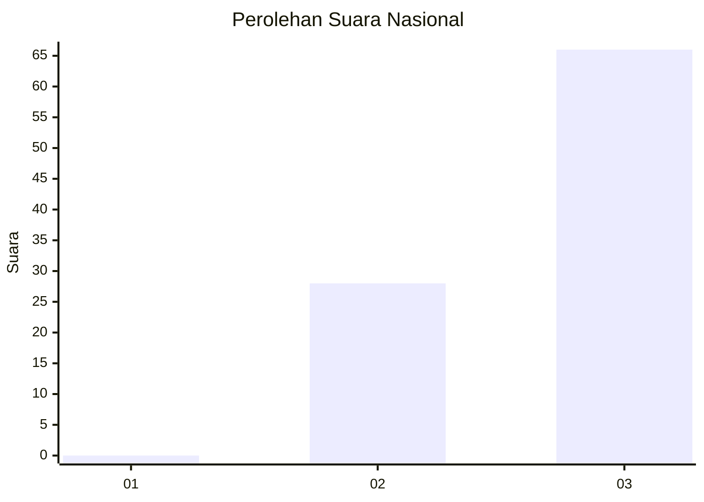
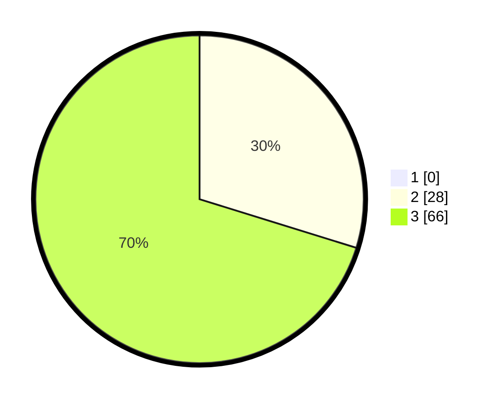

# Hasil

## Grafik

## Tabel

| No. | Nama Paslon    | Suara | Suara (raw) | Persentase |
|:--- |:-------------- | -----:| -----------:| ----------:|
| 1   | ANIES MUHAIMIN | 0     | [0][p-1]    | 0,00       |
| 2   | PRABOWO GIBRAN | 28    | [28][p-2]   | 29,79      |
| 3   | GANJAR MAHFUD  | 66    | [66][p-3]   | 70,21      |

[p-1]: https://github.com/gigit-pemilu/pemilu-2024/blob/main/pilpres/hitung-suara/sub/51-bali/sub/02-tabanan/sub/02-selemadeg-timur/sub/2005-megati/sub/009-tps/sub/paslon-1.txt
[p-2]: https://github.com/gigit-pemilu/pemilu-2024/blob/main/pilpres/hitung-suara/sub/51-bali/sub/02-tabanan/sub/02-selemadeg-timur/sub/2005-megati/sub/009-tps/sub/paslon-2.txt
[p-3]: https://github.com/gigit-pemilu/pemilu-2024/blob/main/pilpres/hitung-suara/sub/51-bali/sub/02-tabanan/sub/02-selemadeg-timur/sub/2005-megati/sub/009-tps/sub/paslon-3.txt

## Foto C Plano

https://sirekap-obj-formc.kpu.go.id/6b0d/pemilu/ppwp/51/02/02/20/05/5102022005009-20240214-133351--cd62d18b-84f4-4723-b4be-9005dff87980.jpg

https://sirekap-obj-formc.kpu.go.id/6b0d/pemilu/ppwp/51/02/02/20/05/5102022005009-20240214-191640--9b102255-cdef-4e69-ace4-a343906bb85d.jpg

https://sirekap-obj-formc.kpu.go.id/6b0d/pemilu/ppwp/51/02/02/20/05/5102022005009-20240214-191631--5c11ef7f-3be9-495a-85f5-68259ea7df37.jpg

## Metadata

| Key        | Value               |
| ---------- | ------------------- |
| Time Stamp | 2024-02-14 21:46:01 |

## DATA PEMILIH TETAP

Jumlah pemilih dalam DPT: **110**.
 * L: **59**.
 * P: **51**.

## DATA PENGGUNA HAK PILIH

Jumlah pengguna hak pilih dalam DPT: **93**.
 * L: **53**.
 * P: **40**.

Jumlah pengguna hak pilih dalam DPTb: **2**.
 * L: **1**.
 * P: **1**.

Jumlah pengguna hak pilih dalam DPK: **0**.
 * L: **0**.
 * P: **0**.

Jumlah pengguna hak pilih: **95**.
 * L: **54**.
 * P: **41**.

## JUMLAH SUARA SAH DAN TIDAK SAH

JUMLAH SELURUH SUARA SAH: **94**.

JUMLAH SUARA TIDAK SAH: **1**.

JUMLAH SELURUH SUARA SAH DAN SUARA TIDAK SAH: **95**.

