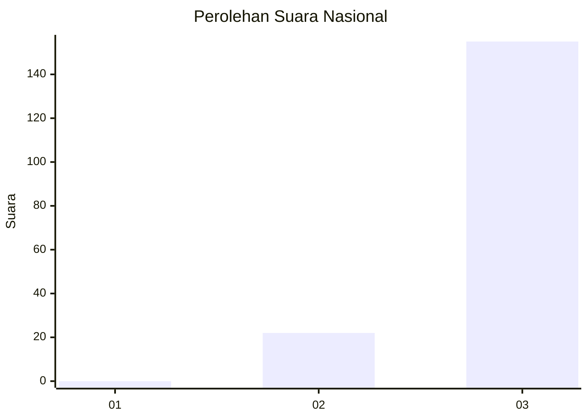
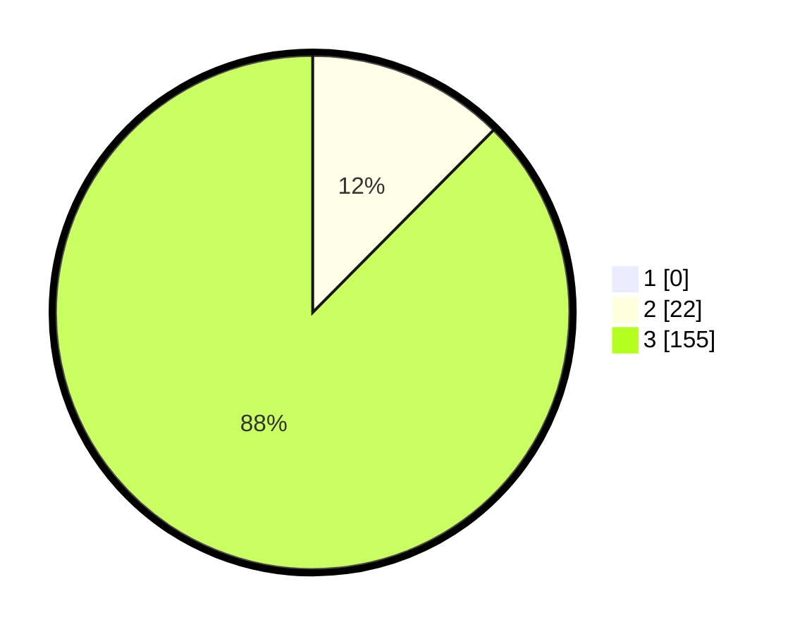

# Hasil

## Grafik

## Tabel

| No. | Nama Paslon    | Suara | Suara (raw) | Persentase |
|:--- |:-------------- | -----:| -----------:| ----------:|
| 1   | ANIES MUHAIMIN | 0     | [0][p-1]    | 0,00       |
| 2   | PRABOWO GIBRAN | 22    | [22][p-2]   | 12,43      |
| 3   | GANJAR MAHFUD  | 155   | [155][p-3]  | 87,57      |

[p-1]: https://github.com/gigit-pemilu/pemilu-2024/blob/main/pilpres/hitung-suara/sub/51-bali/sub/02-tabanan/sub/02-selemadeg-timur/sub/2005-megati/sub/010-tps/sub/paslon-1.txt
[p-2]: https://github.com/gigit-pemilu/pemilu-2024/blob/main/pilpres/hitung-suara/sub/51-bali/sub/02-tabanan/sub/02-selemadeg-timur/sub/2005-megati/sub/010-tps/sub/paslon-2.txt
[p-3]: https://github.com/gigit-pemilu/pemilu-2024/blob/main/pilpres/hitung-suara/sub/51-bali/sub/02-tabanan/sub/02-selemadeg-timur/sub/2005-megati/sub/010-tps/sub/paslon-3.txt

## Foto C Plano

https://sirekap-obj-formc.kpu.go.id/9706/pemilu/ppwp/51/02/02/20/05/5102022005010-20240214-132126--b546740b-f742-43e5-90ef-59b16eca4b8d.jpg

https://sirekap-obj-formc.kpu.go.id/9706/pemilu/ppwp/51/02/02/20/05/5102022005010-20240214-132142--6c2e3ba1-cfc8-4b66-ba4e-f177b5775b97.jpg

https://sirekap-obj-formc.kpu.go.id/9706/pemilu/ppwp/51/02/02/20/05/5102022005010-20240214-132157--6ae1d6d3-477a-4369-9852-2e49d64fe6da.jpg

## Metadata

| Key        | Value               |
| ---------- | ------------------- |
| Time Stamp | 2024-02-14 21:46:01 |

## DATA PEMILIH TETAP

Jumlah pemilih dalam DPT: **190**.
 * L: **92**.
 * P: **98**.

## DATA PENGGUNA HAK PILIH

Jumlah pengguna hak pilih dalam DPT: **176**.
 * L: **87**.
 * P: **89**.

Jumlah pengguna hak pilih dalam DPTb: **0**.
 * L: **0**.
 * P: **0**.

Jumlah pengguna hak pilih dalam DPK: **1**.
 * L: **1**.
 * P: **0**.

Jumlah pengguna hak pilih: **177**.
 * L: **88**.
 * P: **89**.

## JUMLAH SUARA SAH DAN TIDAK SAH

JUMLAH SELURUH SUARA SAH: **177**.

JUMLAH SUARA TIDAK SAH: **0**.

JUMLAH SELURUH SUARA SAH DAN SUARA TIDAK SAH: **177**.

