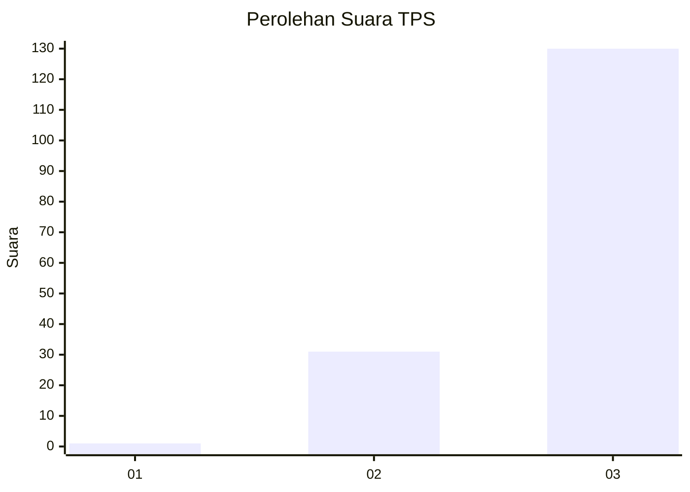
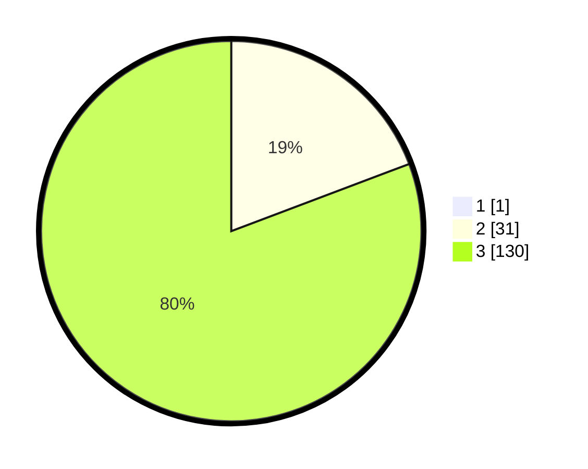

# Hasil

## Grafik

## Tabel

| No. | Nama Paslon    | Suara | Suara (raw) | Persentase |
|:--- |:-------------- | -----:| -----------:| ----------:|
| 1   | ANIES MUHAIMIN | 1     | [1][p-1]    | 0,62       |
| 2   | PRABOWO GIBRAN | 31    | [31][p-2]   | 19,14      |
| 3   | GANJAR MAHFUD  | 130   | [130][p-3]  | 80,25      |

[p-1]: https://github.com/gigit-pemilu/pemilu-2024-51-bali/blob/main/pilpres/hitung-suara/sub/51-bali/sub/02-tabanan/sub/02-selemadeg-timur/sub/2005-megati/sub/011-tps/sub/paslon-1.txt
[p-2]: https://github.com/gigit-pemilu/pemilu-2024-51-bali/blob/main/pilpres/hitung-suara/sub/51-bali/sub/02-tabanan/sub/02-selemadeg-timur/sub/2005-megati/sub/011-tps/sub/paslon-2.txt
[p-3]: https://github.com/gigit-pemilu/pemilu-2024-51-bali/blob/main/pilpres/hitung-suara/sub/51-bali/sub/02-tabanan/sub/02-selemadeg-timur/sub/2005-megati/sub/011-tps/sub/paslon-3.txt

## Foto C Plano

https://sirekap-obj-formc.kpu.go.id/30e3/pemilu/ppwp/51/02/02/20/05/5102022005011-20240215-222331--c49eca66-e74d-4104-9946-f8a7bc0ba668.jpg

https://sirekap-obj-formc.kpu.go.id/30e3/pemilu/ppwp/51/02/02/20/05/5102022005011-20240215-222334--8ee3055e-dab8-40e2-be8f-7e274850bfb2.jpg

https://sirekap-obj-formc.kpu.go.id/30e3/pemilu/ppwp/51/02/02/20/05/5102022005011-20240215-222333--2fc1147f-77a4-4300-8fcd-958cf247b7bc.jpg

## Metadata

| Key        | Value               |
| ---------- | ------------------- |
| Time Stamp | 2024-02-16 09:30:28 |

## DATA PEMILIH TETAP

Jumlah pemilih dalam DPT: **199**.
 * L: **88**.
 * P: **111**.

## DATA PENGGUNA HAK PILIH

Jumlah pengguna hak pilih dalam DPT: **162**.
 * L: **76**.
 * P: **86**.

Jumlah pengguna hak pilih dalam DPTb: **0**.
 * L: **0**.
 * P: **0**.

Jumlah pengguna hak pilih dalam DPK: **1**.
 * L: **1**.
 * P: **0**.

Jumlah pengguna hak pilih: **163**.
 * L: **77**.
 * P: **86**.

## JUMLAH SUARA SAH DAN TIDAK SAH

JUMLAH SELURUH SUARA SAH: **162**.

JUMLAH SUARA TIDAK SAH: **1**.

JUMLAH SELURUH SUARA SAH DAN SUARA TIDAK SAH: **163**.

