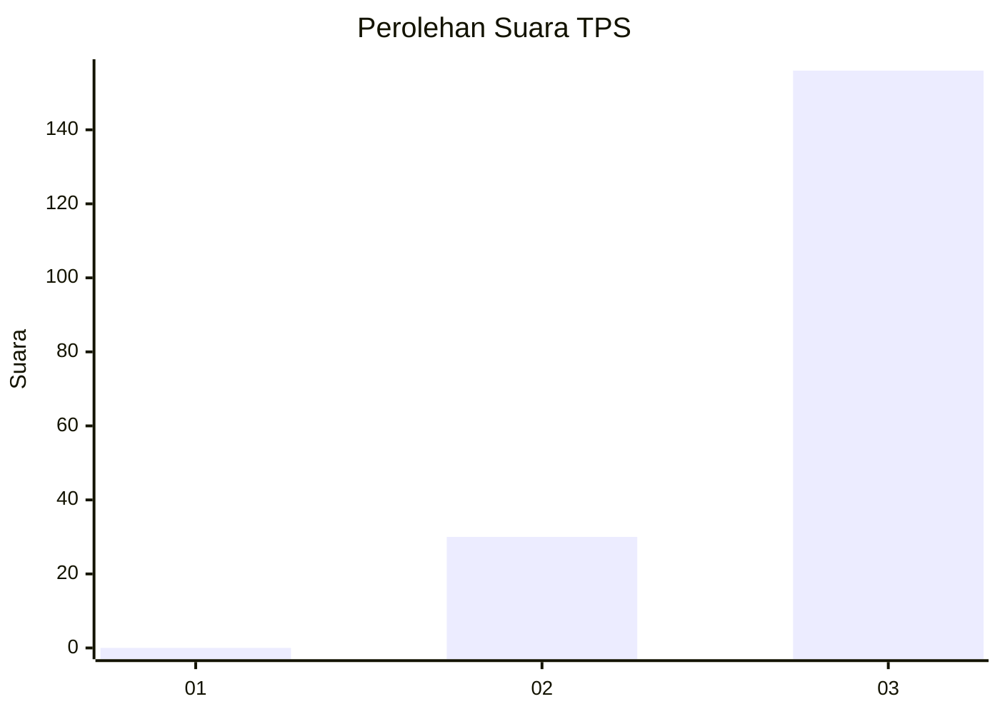
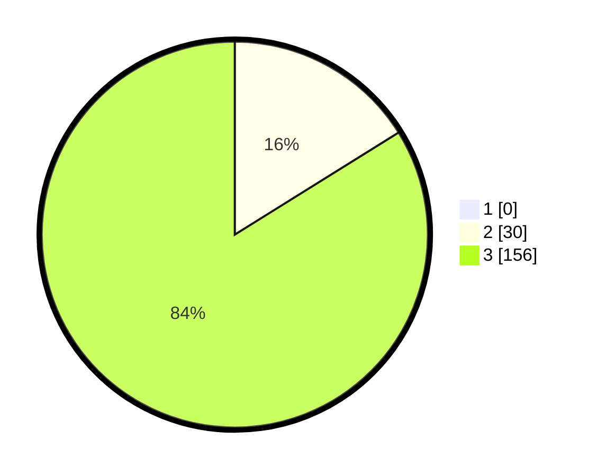

# Hasil

## Grafik

## Tabel

| No. | Nama Paslon    | Suara | Suara (raw) | Persentase |
|:--- |:-------------- | -----:| -----------:| ----------:|
| 1   | ANIES MUHAIMIN | 0     | [0][p-1]    | 0,00       |
| 2   | PRABOWO GIBRAN | 30    | [30][p-2]   | 16,13      |
| 3   | GANJAR MAHFUD  | 156   | [156][p-3]  | 83,87      |

[p-1]: https://github.com/gigit-pemilu/pemilu-2024-51-bali/blob/main/pilpres/hitung-suara/sub/51-bali/sub/02-tabanan/sub/02-selemadeg-timur/sub/2006-tangguntiti/sub/001-tps/sub/paslon-1.txt
[p-2]: https://github.com/gigit-pemilu/pemilu-2024-51-bali/blob/main/pilpres/hitung-suara/sub/51-bali/sub/02-tabanan/sub/02-selemadeg-timur/sub/2006-tangguntiti/sub/001-tps/sub/paslon-2.txt
[p-3]: https://github.com/gigit-pemilu/pemilu-2024-51-bali/blob/main/pilpres/hitung-suara/sub/51-bali/sub/02-tabanan/sub/02-selemadeg-timur/sub/2006-tangguntiti/sub/001-tps/sub/paslon-3.txt

## Foto C Plano

https://sirekap-obj-formc.kpu.go.id/dfeb/pemilu/ppwp/51/02/02/20/06/5102022006001-20240214-125357--372b9aa9-1e8a-430c-84b0-4e4e5ce09b9c.jpg

https://sirekap-obj-formc.kpu.go.id/dfeb/pemilu/ppwp/51/02/02/20/06/5102022006001-20240214-125518--be68cefb-188d-437e-8b43-30f048cc3659.jpg

https://sirekap-obj-formc.kpu.go.id/dfeb/pemilu/ppwp/51/02/02/20/06/5102022006001-20240214-125639--184bd021-9da8-49b2-88c4-6dd25eee7b8d.jpg

## Metadata

| Key        | Value               |
| ---------- | ------------------- |
| Time Stamp | 2024-02-15 00:41:44 |

## DATA PEMILIH TETAP

Jumlah pemilih dalam DPT: **192**.
 * L: **96**.
 * P: **96**.

## DATA PENGGUNA HAK PILIH

Jumlah pengguna hak pilih dalam DPT: **188**.
 * L: **94**.
 * P: **94**.

Jumlah pengguna hak pilih dalam DPTb: **0**.
 * L: **0**.
 * P: **0**.

Jumlah pengguna hak pilih dalam DPK: **0**.
 * L: **0**.
 * P: **0**.

Jumlah pengguna hak pilih: **188**.
 * L: **94**.
 * P: **94**.

## JUMLAH SUARA SAH DAN TIDAK SAH

JUMLAH SELURUH SUARA SAH: **186**.

JUMLAH SUARA TIDAK SAH: **2**.

JUMLAH SELURUH SUARA SAH DAN SUARA TIDAK SAH: **188**.

