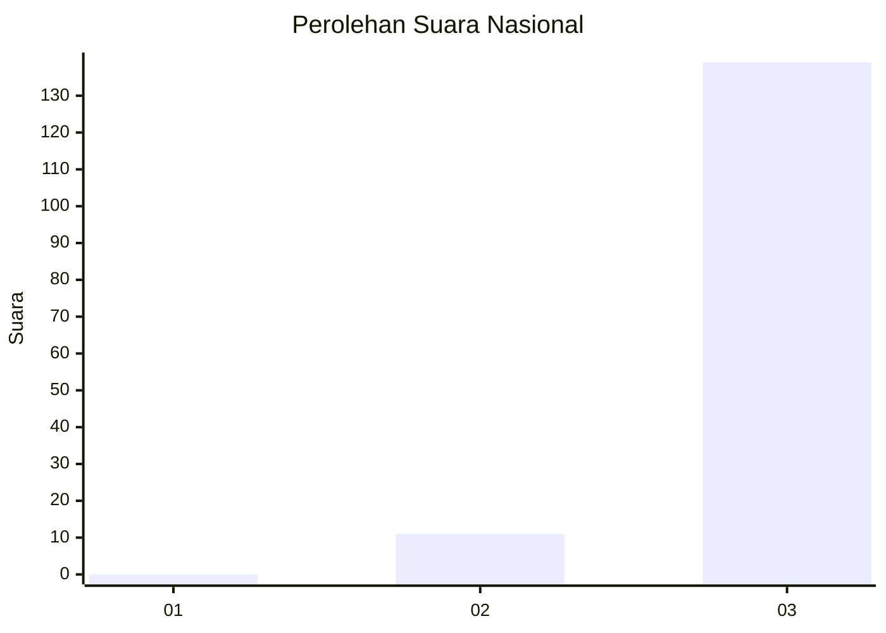
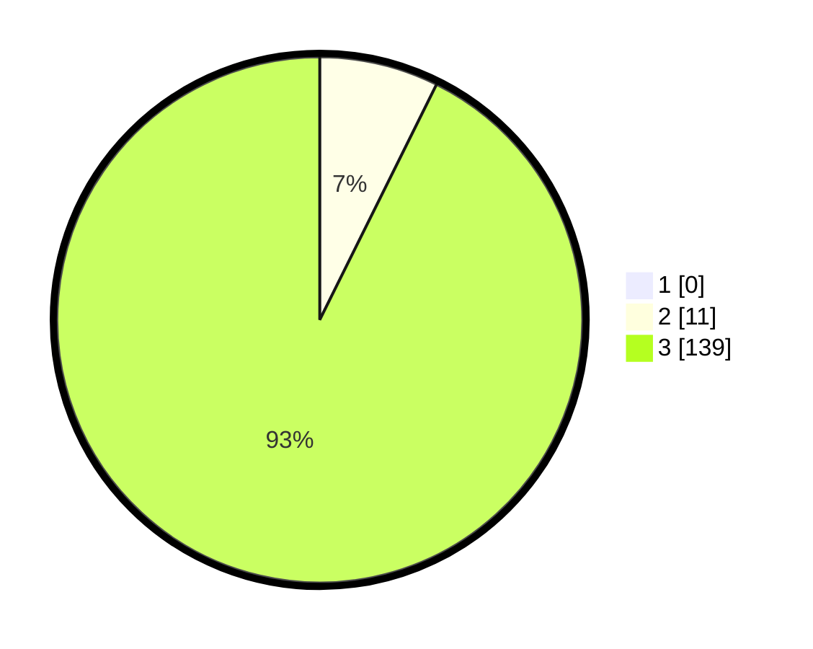

# Hasil

## Grafik

## Tabel

| No. | Nama Paslon    | Suara | Suara (raw) | Persentase |
|:--- |:-------------- | -----:| -----------:| ----------:|
| 1   | ANIES MUHAIMIN | 0     | [0][p-1]    | 0,00       |
| 2   | PRABOWO GIBRAN | 11    | [11][p-2]   | 7,33       |
| 3   | GANJAR MAHFUD  | 139   | [139][p-3]  | 92,67      |

[p-1]: https://github.com/gigit-pemilu/pemilu-2024/blob/main/pilpres/hitung-suara/sub/51-bali/sub/02-tabanan/sub/02-selemadeg-timur/sub/2006-tangguntiti/sub/003-tps/sub/paslon-1.txt
[p-2]: https://github.com/gigit-pemilu/pemilu-2024/blob/main/pilpres/hitung-suara/sub/51-bali/sub/02-tabanan/sub/02-selemadeg-timur/sub/2006-tangguntiti/sub/003-tps/sub/paslon-2.txt
[p-3]: https://github.com/gigit-pemilu/pemilu-2024/blob/main/pilpres/hitung-suara/sub/51-bali/sub/02-tabanan/sub/02-selemadeg-timur/sub/2006-tangguntiti/sub/003-tps/sub/paslon-3.txt

## Foto C Plano

https://sirekap-obj-formc.kpu.go.id/6f32/pemilu/ppwp/51/02/02/20/06/5102022006003-20240216-013645--f6029a40-8621-42ed-95eb-32385f23af05.jpg

https://sirekap-obj-formc.kpu.go.id/6f32/pemilu/ppwp/51/02/02/20/06/5102022006003-20240216-011726--cdd49d56-60f3-4bc5-bd2c-b23e95c65953.jpg

https://sirekap-obj-formc.kpu.go.id/6f32/pemilu/ppwp/51/02/02/20/06/5102022006003-20240216-011723--1d5464e2-07bc-4aa5-8537-8b3f1bcce1de.jpg

## Metadata

| Key        | Value               |
| ---------- | ------------------- |
| Time Stamp | 2024-02-16 09:30:28 |

## DATA PEMILIH TETAP

Jumlah pemilih dalam DPT: **161**.
 * L: **73**.
 * P: **88**.

## DATA PENGGUNA HAK PILIH

Jumlah pengguna hak pilih dalam DPT: **150**.
 * L: **68**.
 * P: **82**.

Jumlah pengguna hak pilih dalam DPTb: **0**.
 * L: **0**.
 * P: **0**.

Jumlah pengguna hak pilih dalam DPK: **1**.
 * L: **0**.
 * P: **1**.

Jumlah pengguna hak pilih: **151**.
 * L: **68**.
 * P: **83**.

## JUMLAH SUARA SAH DAN TIDAK SAH

JUMLAH SELURUH SUARA SAH: **150**.

JUMLAH SUARA TIDAK SAH: **1**.

JUMLAH SELURUH SUARA SAH DAN SUARA TIDAK SAH: **151**.

