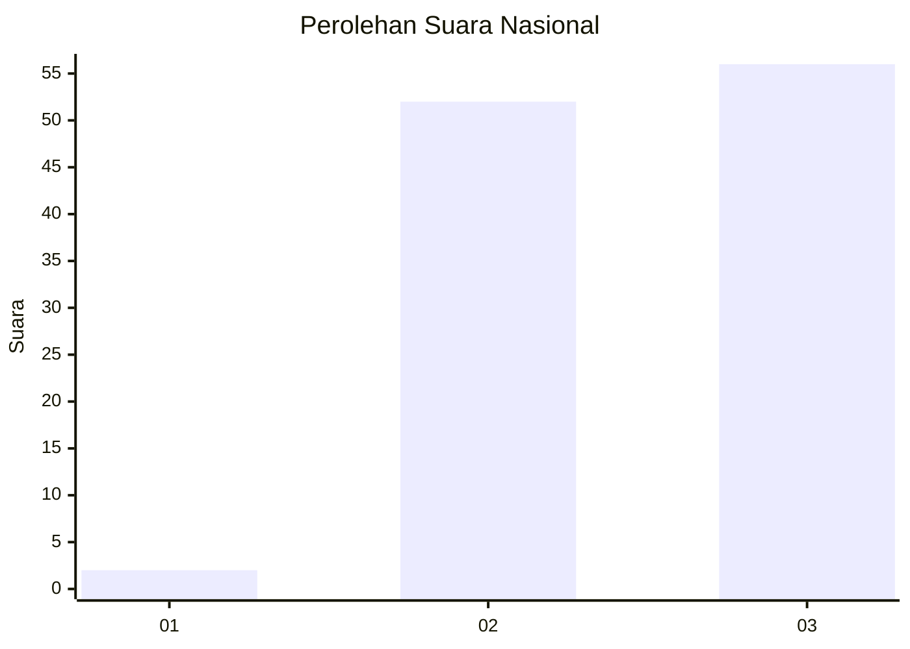
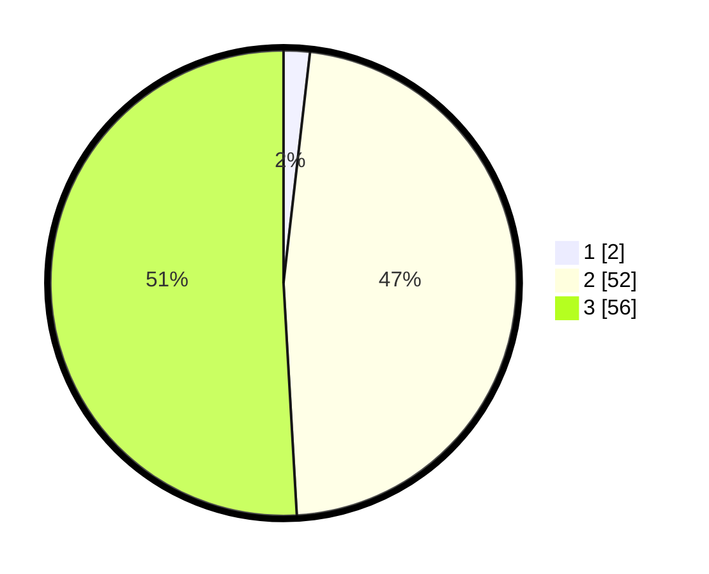

# Hasil

## Grafik

## Tabel

| No. | Nama Paslon    | Suara | Suara (raw) | Persentase |
|:--- |:-------------- | -----:| -----------:| ----------:|
| 1   | ANIES MUHAIMIN | 2     | [2][p-1]    | 1,82       |
| 2   | PRABOWO GIBRAN | 52    | [52][p-2]   | 47,27      |
| 3   | GANJAR MAHFUD  | 56    | [56][p-3]   | 50,91      |

[p-1]: https://github.com/gigit-pemilu/pemilu-2024/blob/main/pilpres/hitung-suara/sub/51-bali/sub/02-tabanan/sub/02-selemadeg-timur/sub/2006-tangguntiti/sub/004-tps/sub/paslon-1.txt
[p-2]: https://github.com/gigit-pemilu/pemilu-2024/blob/main/pilpres/hitung-suara/sub/51-bali/sub/02-tabanan/sub/02-selemadeg-timur/sub/2006-tangguntiti/sub/004-tps/sub/paslon-2.txt
[p-3]: https://github.com/gigit-pemilu/pemilu-2024/blob/main/pilpres/hitung-suara/sub/51-bali/sub/02-tabanan/sub/02-selemadeg-timur/sub/2006-tangguntiti/sub/004-tps/sub/paslon-3.txt

## Foto C Plano

https://sirekap-obj-formc.kpu.go.id/aa04/pemilu/ppwp/51/02/02/20/06/5102022006004-20240215-055940--595571c0-52a7-4fcf-bc51-b1f8912a173a.jpg

https://sirekap-obj-formc.kpu.go.id/aa04/pemilu/ppwp/51/02/02/20/06/5102022006004-20240215-060008--fd4c913d-9a39-414a-b9bb-d4940f0a3a60.jpg

https://sirekap-obj-formc.kpu.go.id/aa04/pemilu/ppwp/51/02/02/20/06/5102022006004-20240215-055957--2cc1e188-eba4-4dfb-a38f-71645d995cff.jpg

## Metadata

| Key        | Value               |
| ---------- | ------------------- |
| Time Stamp | 2024-02-15 21:30:27 |

## DATA PEMILIH TETAP

Jumlah pemilih dalam DPT: **119**.
 * L: **60**.
 * P: **59**.

## DATA PENGGUNA HAK PILIH

Jumlah pengguna hak pilih dalam DPT: **119**.
 * L: **60**.
 * P: **59**.

Jumlah pengguna hak pilih dalam DPTb: **0**.
 * L: **0**.
 * P: **0**.

Jumlah pengguna hak pilih dalam DPK: **2**.
 * L: **0**.
 * P: **2**.

Jumlah pengguna hak pilih: **121**.
 * L: **60**.
 * P: **61**.

## JUMLAH SUARA SAH DAN TIDAK SAH

JUMLAH SELURUH SUARA SAH: **110**.

JUMLAH SUARA TIDAK SAH: **0**.

JUMLAH SELURUH SUARA SAH DAN SUARA TIDAK SAH: **110**.

