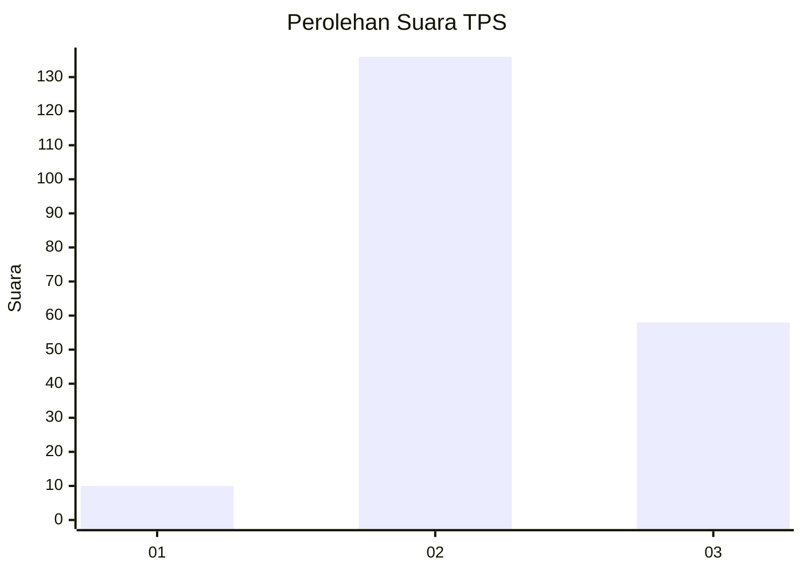
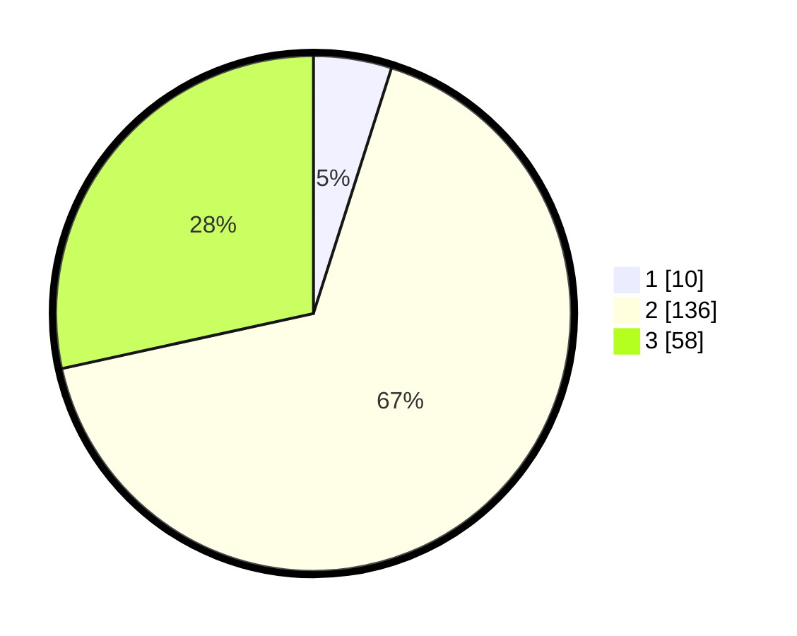

# Hasil

## Grafik

## Tabel

| No. | Nama Paslon    | Suara | Suara (raw) | Persentase |
|:--- |:-------------- | -----:| -----------:| ----------:|
| 1   | ANIES MUHAIMIN | 10    | [10][p-1]   | 4,90       |
| 2   | PRABOWO GIBRAN | 136   | [136][p-2]  | 66,67      |
| 3   | GANJAR MAHFUD  | 58    | [58][p-3]   | 28,43      |

[p-1]: https://github.com/gigit-pemilu/pemilu-2024-51-bali/blob/main/pilpres/hitung-suara/sub/51-bali/sub/02-tabanan/sub/02-selemadeg-timur/sub/2006-tangguntiti/sub/005-tps/sub/paslon-1.txt
[p-2]: https://github.com/gigit-pemilu/pemilu-2024-51-bali/blob/main/pilpres/hitung-suara/sub/51-bali/sub/02-tabanan/sub/02-selemadeg-timur/sub/2006-tangguntiti/sub/005-tps/sub/paslon-2.txt
[p-3]: https://github.com/gigit-pemilu/pemilu-2024-51-bali/blob/main/pilpres/hitung-suara/sub/51-bali/sub/02-tabanan/sub/02-selemadeg-timur/sub/2006-tangguntiti/sub/005-tps/sub/paslon-3.txt

## Foto C Plano

https://sirekap-obj-formc.kpu.go.id/071a/pemilu/ppwp/51/02/02/20/06/5102022006005-20240216-140204--9a43821b-7c28-4156-85e0-f5c29042ecdd.jpg

https://sirekap-obj-formc.kpu.go.id/071a/pemilu/ppwp/51/02/02/20/06/5102022006005-20240216-140205--f60797bd-2ec4-4f03-bce2-7f881934f0e4.jpg

https://sirekap-obj-formc.kpu.go.id/071a/pemilu/ppwp/51/02/02/20/06/5102022006005-20240216-140204--54971c4d-9003-4d9b-9e8b-248ea7a3df32.jpg

## Metadata

| Key        | Value               |
| ---------- | ------------------- |
| Time Stamp | 2024-02-16 14:30:33 |

## DATA PEMILIH TETAP

Jumlah pemilih dalam DPT: **232**.
 * L: **111**.
 * P: **121**.

## DATA PENGGUNA HAK PILIH

Jumlah pengguna hak pilih dalam DPT: **211**.
 * L: **105**.
 * P: **106**.

Jumlah pengguna hak pilih dalam DPTb: **0**.
 * L: **0**.
 * P: **0**.

Jumlah pengguna hak pilih dalam DPK: **0**.
 * L: **0**.
 * P: **0**.

Jumlah pengguna hak pilih: **211**.
 * L: **105**.
 * P: **106**.

## JUMLAH SUARA SAH DAN TIDAK SAH

JUMLAH SELURUH SUARA SAH: **204**.

JUMLAH SUARA TIDAK SAH: **7**.

JUMLAH SELURUH SUARA SAH DAN SUARA TIDAK SAH: **211**.

