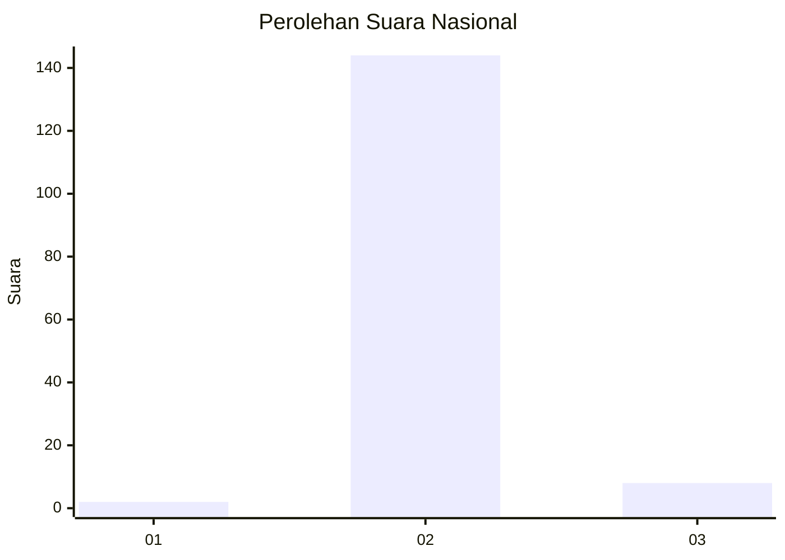
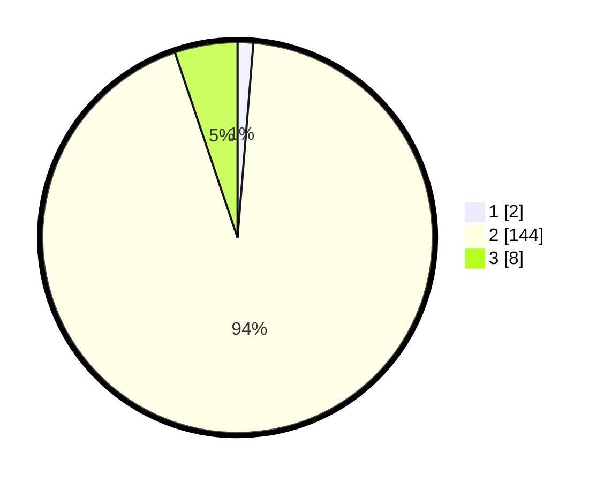

# Hasil

## Grafik

## Tabel

| No. | Nama Paslon    | Suara | Suara (raw) | Persentase |
|:--- |:-------------- | -----:| -----------:| ----------:|
| 1   | ANIES MUHAIMIN | 2     | [2][p-1]    | 1,30       |
| 2   | PRABOWO GIBRAN | 144   | [144][p-2]  | 93,51      |
| 3   | GANJAR MAHFUD  | 8     | [8][p-3]    | 5,19       |

[p-1]: https://github.com/gigit-pemilu/pemilu-2024/blob/main/pilpres/hitung-suara/sub/51-bali/sub/02-tabanan/sub/02-selemadeg-timur/sub/2006-tangguntiti/sub/006-tps/sub/paslon-1.txt
[p-2]: https://github.com/gigit-pemilu/pemilu-2024/blob/main/pilpres/hitung-suara/sub/51-bali/sub/02-tabanan/sub/02-selemadeg-timur/sub/2006-tangguntiti/sub/006-tps/sub/paslon-2.txt
[p-3]: https://github.com/gigit-pemilu/pemilu-2024/blob/main/pilpres/hitung-suara/sub/51-bali/sub/02-tabanan/sub/02-selemadeg-timur/sub/2006-tangguntiti/sub/006-tps/sub/paslon-3.txt

## Foto C Plano

https://sirekap-obj-formc.kpu.go.id/deae/pemilu/ppwp/51/02/02/20/06/5102022006006-20240216-020237--ee940db4-1bcd-4d5b-b1d8-6627e2937f76.jpg

https://sirekap-obj-formc.kpu.go.id/deae/pemilu/ppwp/51/02/02/20/06/5102022006006-20240216-020240--7deebda3-a0ec-4268-8c87-33598d2b2d38.jpg

https://sirekap-obj-formc.kpu.go.id/deae/pemilu/ppwp/51/02/02/20/06/5102022006006-20240216-020238--e99ff15d-a12e-4075-8e3e-0e609f2be26a.jpg

## Metadata

| Key        | Value               |
| ---------- | ------------------- |
| Time Stamp | 2024-02-16 09:30:28 |

## DATA PEMILIH TETAP

Jumlah pemilih dalam DPT: **157**.
 * L: **76**.
 * P: **81**.

## DATA PENGGUNA HAK PILIH

Jumlah pengguna hak pilih dalam DPT: **155**.
 * L: **75**.
 * P: **80**.

Jumlah pengguna hak pilih dalam DPTb: **0**.
 * L: **0**.
 * P: **0**.

Jumlah pengguna hak pilih dalam DPK: **0**.
 * L: **0**.
 * P: **0**.

Jumlah pengguna hak pilih: **155**.
 * L: **75**.
 * P: **80**.

## JUMLAH SUARA SAH DAN TIDAK SAH

JUMLAH SELURUH SUARA SAH: **154**.

JUMLAH SUARA TIDAK SAH: **1**.

JUMLAH SELURUH SUARA SAH DAN SUARA TIDAK SAH: **155**.

