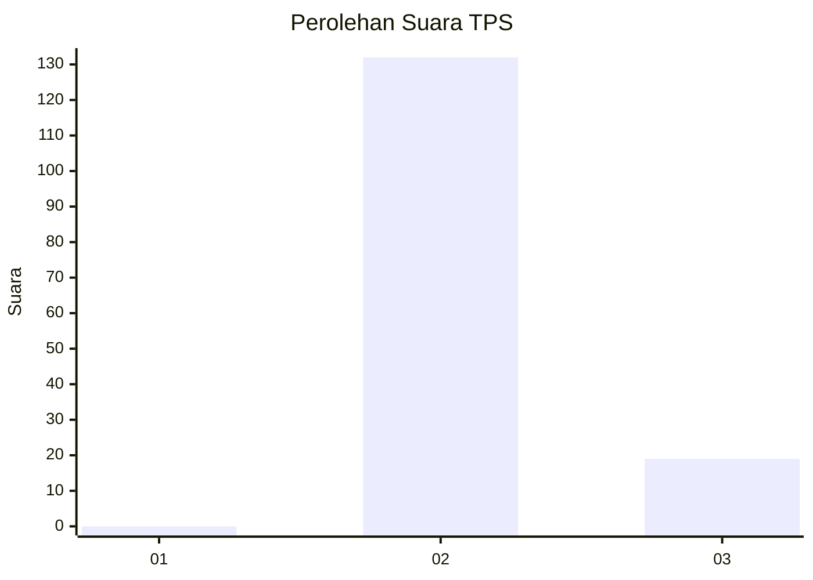
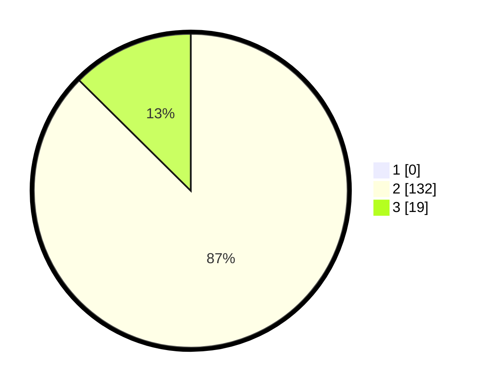

# Hasil

## Grafik

## Tabel

| No. | Nama Paslon    | Suara | Suara (raw) | Persentase |
|:--- |:-------------- | -----:| -----------:| ----------:|
| 1   | ANIES MUHAIMIN | 0     | [0][p-1]    | 0,00       |
| 2   | PRABOWO GIBRAN | 132   | [132][p-2]  | 87,42      |
| 3   | GANJAR MAHFUD  | 19    | [19][p-3]   | 12,58      |

[p-1]: https://github.com/gigit-pemilu/pemilu-2024-51-bali/blob/main/pilpres/hitung-suara/sub/51-bali/sub/02-tabanan/sub/02-selemadeg-timur/sub/2006-tangguntiti/sub/007-tps/sub/paslon-1.txt
[p-2]: https://github.com/gigit-pemilu/pemilu-2024-51-bali/blob/main/pilpres/hitung-suara/sub/51-bali/sub/02-tabanan/sub/02-selemadeg-timur/sub/2006-tangguntiti/sub/007-tps/sub/paslon-2.txt
[p-3]: https://github.com/gigit-pemilu/pemilu-2024-51-bali/blob/main/pilpres/hitung-suara/sub/51-bali/sub/02-tabanan/sub/02-selemadeg-timur/sub/2006-tangguntiti/sub/007-tps/sub/paslon-3.txt

## Foto C Plano

https://sirekap-obj-formc.kpu.go.id/507d/pemilu/ppwp/51/02/02/20/06/5102022006007-20240214-141354--f5fb42e6-97fd-4dd4-83b4-8f357d62fb3f.jpg

https://sirekap-obj-formc.kpu.go.id/507d/pemilu/ppwp/51/02/02/20/06/5102022006007-20240214-130432--202c7c2d-fbc6-483a-abe5-f89087862a86.jpg

https://sirekap-obj-formc.kpu.go.id/507d/pemilu/ppwp/51/02/02/20/06/5102022006007-20240214-141503--2c437c97-b56d-4a19-81f1-6001e1e31f9e.jpg

## Metadata

| Key        | Value               |
| ---------- | ------------------- |
| Time Stamp | 2024-02-14 21:46:01 |

## DATA PEMILIH TETAP

Jumlah pemilih dalam DPT: **151**.
 * L: **73**.
 * P: **78**.

## DATA PENGGUNA HAK PILIH

Jumlah pengguna hak pilih dalam DPT: **150**.
 * L: **73**.
 * P: **77**.

Jumlah pengguna hak pilih dalam DPTb: **1**.
 * L: **0**.
 * P: **1**.

Jumlah pengguna hak pilih dalam DPK: **1**.
 * L: **1**.
 * P: **0**.

Jumlah pengguna hak pilih: **152**.
 * L: **74**.
 * P: **78**.

## JUMLAH SUARA SAH DAN TIDAK SAH

JUMLAH SELURUH SUARA SAH: **151**.

JUMLAH SUARA TIDAK SAH: **1**.

JUMLAH SELURUH SUARA SAH DAN SUARA TIDAK SAH: **152**.

