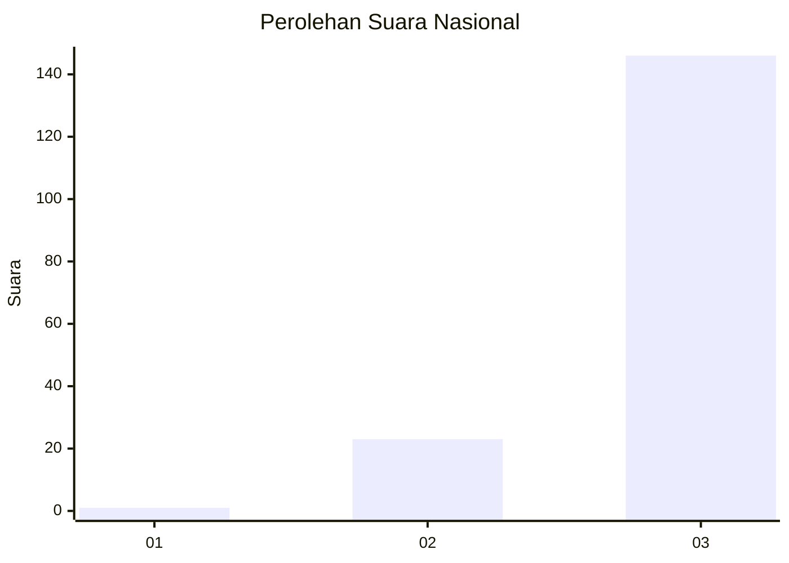
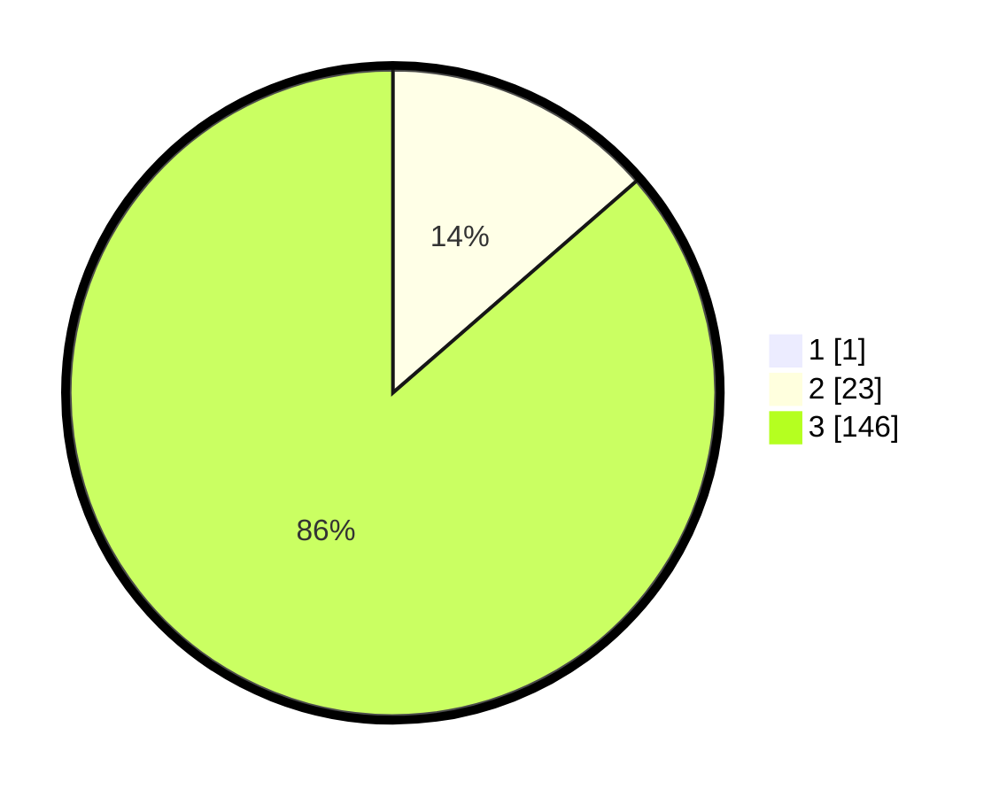

# Hasil

## Grafik

## Tabel

| No. | Nama Paslon    | Suara | Suara (raw) | Persentase |
|:--- |:-------------- | -----:| -----------:| ----------:|
| 1   | ANIES MUHAIMIN | 1     | [1][p-1]    | 0,59       |
| 2   | PRABOWO GIBRAN | 23    | [23][p-2]   | 13,53      |
| 3   | GANJAR MAHFUD  | 146   | [146][p-3]  | 85,88      |

[p-1]: https://github.com/gigit-pemilu/pemilu-2024/blob/main/pilpres/hitung-suara/sub/51-bali/sub/02-tabanan/sub/02-selemadeg-timur/sub/2006-tangguntiti/sub/008-tps/sub/paslon-1.txt
[p-2]: https://github.com/gigit-pemilu/pemilu-2024/blob/main/pilpres/hitung-suara/sub/51-bali/sub/02-tabanan/sub/02-selemadeg-timur/sub/2006-tangguntiti/sub/008-tps/sub/paslon-2.txt
[p-3]: https://github.com/gigit-pemilu/pemilu-2024/blob/main/pilpres/hitung-suara/sub/51-bali/sub/02-tabanan/sub/02-selemadeg-timur/sub/2006-tangguntiti/sub/008-tps/sub/paslon-3.txt

## Foto C Plano

https://sirekap-obj-formc.kpu.go.id/a96e/pemilu/ppwp/51/02/02/20/06/5102022006008-20240215-190610--8a560aeb-61a9-4d10-9fc5-835f011db666.jpg

https://sirekap-obj-formc.kpu.go.id/a96e/pemilu/ppwp/51/02/02/20/06/5102022006008-20240215-190632--4a7c005f-7baf-442b-a6c7-ef48dcdb85bc.jpg

https://sirekap-obj-formc.kpu.go.id/a96e/pemilu/ppwp/51/02/02/20/06/5102022006008-20240215-190621--b3134a45-2fea-4a6f-bfc0-33bae06ac897.jpg

## Metadata

| Key        | Value               |
| ---------- | ------------------- |
| Time Stamp | 2024-02-15 21:30:27 |

## DATA PEMILIH TETAP

Jumlah pemilih dalam DPT: **178**.
 * L: **89**.
 * P: **89**.

## DATA PENGGUNA HAK PILIH

Jumlah pengguna hak pilih dalam DPT: **169**.
 * L: **83**.
 * P: **86**.

Jumlah pengguna hak pilih dalam DPTb: **2**.
 * L: **0**.
 * P: **2**.

Jumlah pengguna hak pilih dalam DPK: **0**.
 * L: **0**.
 * P: **0**.

Jumlah pengguna hak pilih: **171**.
 * L: **83**.
 * P: **88**.

## JUMLAH SUARA SAH DAN TIDAK SAH

JUMLAH SELURUH SUARA SAH: **170**.

JUMLAH SUARA TIDAK SAH: **1**.

JUMLAH SELURUH SUARA SAH DAN SUARA TIDAK SAH: **171**.

