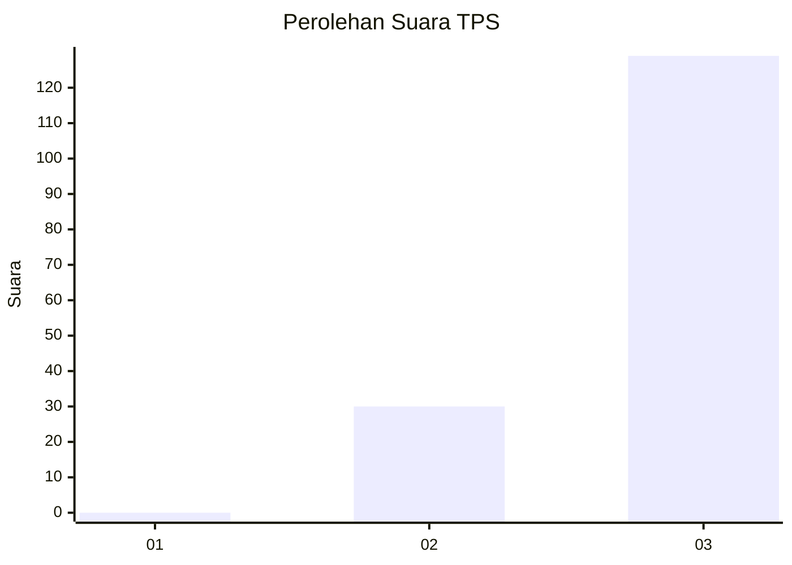
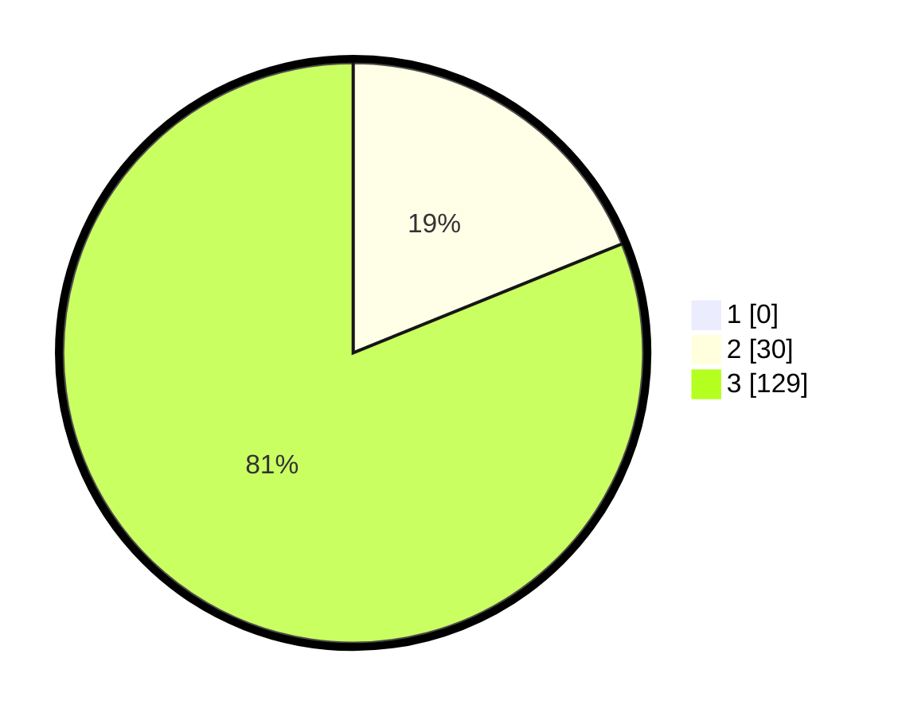

# Hasil

## Grafik

## Tabel

| No. | Nama Paslon    | Suara | Suara (raw) | Persentase |
|:--- |:-------------- | -----:| -----------:| ----------:|
| 1   | ANIES MUHAIMIN | 0     | [0][p-1]    | 0,00       |
| 2   | PRABOWO GIBRAN | 30    | [30][p-2]   | 18,87      |
| 3   | GANJAR MAHFUD  | 129   | [129][p-3]  | 81,13      |

[p-1]: https://github.com/gigit-pemilu/pemilu-2024-51-bali/blob/main/pilpres/hitung-suara/sub/51-bali/sub/02-tabanan/sub/02-selemadeg-timur/sub/2006-tangguntiti/sub/009-tps/sub/paslon-1.txt
[p-2]: https://github.com/gigit-pemilu/pemilu-2024-51-bali/blob/main/pilpres/hitung-suara/sub/51-bali/sub/02-tabanan/sub/02-selemadeg-timur/sub/2006-tangguntiti/sub/009-tps/sub/paslon-2.txt
[p-3]: https://github.com/gigit-pemilu/pemilu-2024-51-bali/blob/main/pilpres/hitung-suara/sub/51-bali/sub/02-tabanan/sub/02-selemadeg-timur/sub/2006-tangguntiti/sub/009-tps/sub/paslon-3.txt

## Foto C Plano

https://sirekap-obj-formc.kpu.go.id/0eae/pemilu/ppwp/51/02/02/20/06/5102022006009-20240215-212520--65937132-931a-468d-ae8c-9811bca28b9a.jpg

https://sirekap-obj-formc.kpu.go.id/0eae/pemilu/ppwp/51/02/02/20/06/5102022006009-20240215-212522--adeea05e-88a4-4656-a0e9-882196fc2951.jpg

https://sirekap-obj-formc.kpu.go.id/0eae/pemilu/ppwp/51/02/02/20/06/5102022006009-20240215-212521--e71cc83f-4bc6-4922-ba2d-9ea2c6f08581.jpg

## Metadata

| Key        | Value               |
| ---------- | ------------------- |
| Time Stamp | 2024-02-15 22:00:27 |

## DATA PEMILIH TETAP

Jumlah pemilih dalam DPT: **167**.
 * L: **83**.
 * P: **84**.

## DATA PENGGUNA HAK PILIH

Jumlah pengguna hak pilih dalam DPT: **160**.
 * L: **81**.
 * P: **79**.

Jumlah pengguna hak pilih dalam DPTb: **2**.
 * L: **0**.
 * P: **2**.

Jumlah pengguna hak pilih dalam DPK: **0**.
 * L: **0**.
 * P: **0**.

Jumlah pengguna hak pilih: **162**.
 * L: **81**.
 * P: **81**.

## JUMLAH SUARA SAH DAN TIDAK SAH

JUMLAH SELURUH SUARA SAH: **159**.

JUMLAH SUARA TIDAK SAH: **3**.

JUMLAH SELURUH SUARA SAH DAN SUARA TIDAK SAH: **162**.

