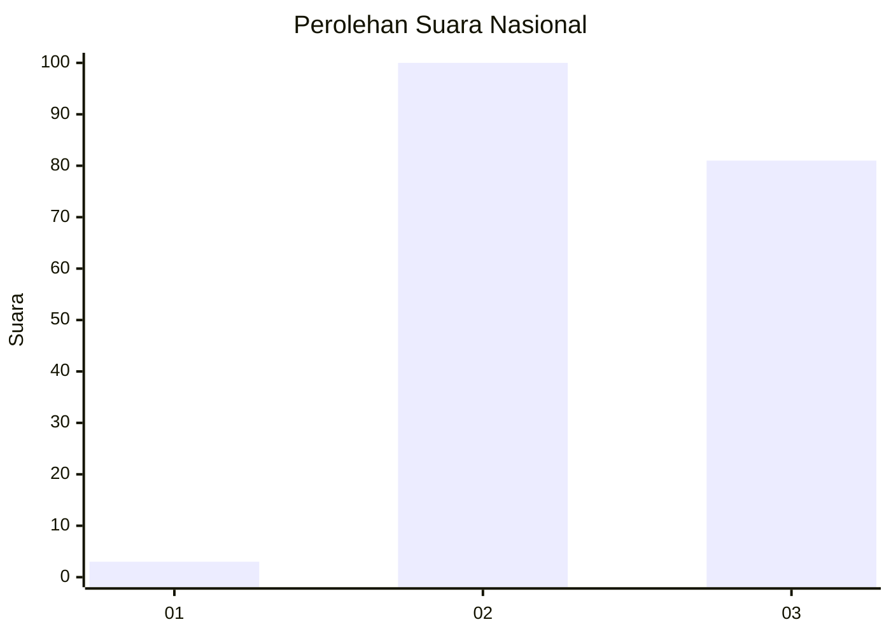
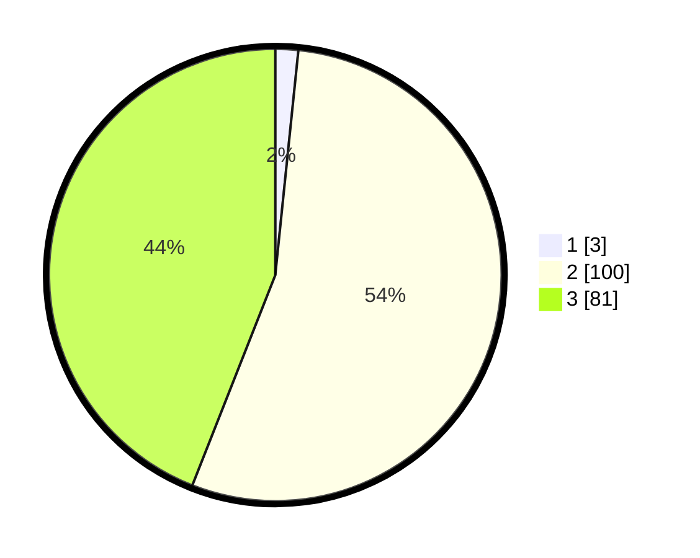

# Hasil

## Grafik

## Tabel

| No. | Nama Paslon    | Suara | Suara (raw) | Persentase |
|:--- |:-------------- | -----:| -----------:| ----------:|
| 1   | ANIES MUHAIMIN | 3     | [3][p-1]    | 1,63       |
| 2   | PRABOWO GIBRAN | 100   | [100][p-2]  | 54,35      |
| 3   | GANJAR MAHFUD  | 81    | [81][p-3]   | 44,02      |

[p-1]: https://github.com/gigit-pemilu/pemilu-2024/blob/main/pilpres/hitung-suara/sub/51-bali/sub/02-tabanan/sub/02-selemadeg-timur/sub/2006-tangguntiti/sub/010-tps/sub/paslon-1.txt
[p-2]: https://github.com/gigit-pemilu/pemilu-2024/blob/main/pilpres/hitung-suara/sub/51-bali/sub/02-tabanan/sub/02-selemadeg-timur/sub/2006-tangguntiti/sub/010-tps/sub/paslon-2.txt
[p-3]: https://github.com/gigit-pemilu/pemilu-2024/blob/main/pilpres/hitung-suara/sub/51-bali/sub/02-tabanan/sub/02-selemadeg-timur/sub/2006-tangguntiti/sub/010-tps/sub/paslon-3.txt

## Foto C Plano

https://sirekap-obj-formc.kpu.go.id/d5cc/pemilu/ppwp/51/02/02/20/06/5102022006010-20240216-025155--43af2972-cf94-4f15-ab18-1af840204c81.jpg

https://sirekap-obj-formc.kpu.go.id/d5cc/pemilu/ppwp/51/02/02/20/06/5102022006010-20240216-025156--bb066103-609b-45f1-bcac-22da303c628d.jpg

https://sirekap-obj-formc.kpu.go.id/d5cc/pemilu/ppwp/51/02/02/20/06/5102022006010-20240216-025155--ccd3d467-6905-4140-8d66-aaeed9045873.jpg

## Metadata

| Key        | Value               |
| ---------- | ------------------- |
| Time Stamp | 2024-02-16 09:30:28 |

## DATA PEMILIH TETAP

Jumlah pemilih dalam DPT: **184**.
 * L: **84**.
 * P: **100**.

## DATA PENGGUNA HAK PILIH

Jumlah pengguna hak pilih dalam DPT: **182**.
 * L: **84**.
 * P: **98**.

Jumlah pengguna hak pilih dalam DPTb: **2**.
 * L: **0**.
 * P: **2**.

Jumlah pengguna hak pilih dalam DPK: **0**.
 * L: **0**.
 * P: **0**.

Jumlah pengguna hak pilih: **0**.
 * L: **0**.
 * P: **0**.

## JUMLAH SUARA SAH DAN TIDAK SAH

JUMLAH SELURUH SUARA SAH: **184**.

JUMLAH SUARA TIDAK SAH: **0**.

JUMLAH SELURUH SUARA SAH DAN SUARA TIDAK SAH: **184**.

