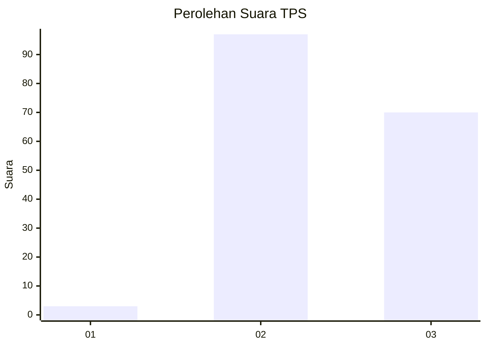
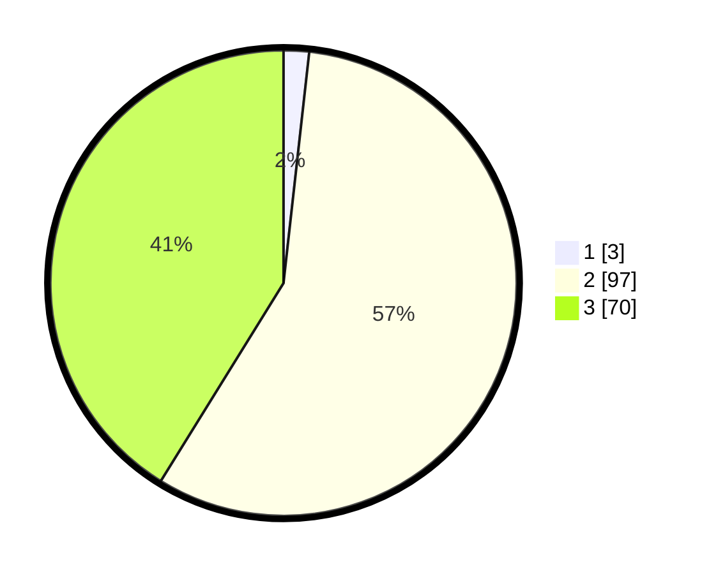

# Hasil

## Grafik

## Tabel

| No. | Nama Paslon    | Suara | Suara (raw) | Persentase |
|:--- |:-------------- | -----:| -----------:| ----------:|
| 1   | ANIES MUHAIMIN | 3     | [3][p-1]    | 1,76       |
| 2   | PRABOWO GIBRAN | 97    | [97][p-2]   | 57,06      |
| 3   | GANJAR MAHFUD  | 70    | [70][p-3]   | 41,18      |

[p-1]: https://github.com/gigit-pemilu/pemilu-2024-51-bali/blob/main/pilpres/hitung-suara/sub/51-bali/sub/02-tabanan/sub/02-selemadeg-timur/sub/2006-tangguntiti/sub/011-tps/sub/paslon-1.txt
[p-2]: https://github.com/gigit-pemilu/pemilu-2024-51-bali/blob/main/pilpres/hitung-suara/sub/51-bali/sub/02-tabanan/sub/02-selemadeg-timur/sub/2006-tangguntiti/sub/011-tps/sub/paslon-2.txt
[p-3]: https://github.com/gigit-pemilu/pemilu-2024-51-bali/blob/main/pilpres/hitung-suara/sub/51-bali/sub/02-tabanan/sub/02-selemadeg-timur/sub/2006-tangguntiti/sub/011-tps/sub/paslon-3.txt

## Foto C Plano

https://sirekap-obj-formc.kpu.go.id/06f5/pemilu/ppwp/51/02/02/20/06/5102022006011-20240216-134310--b50bf0f0-dd6e-4bcf-a0fa-6054964a597a.jpg

https://sirekap-obj-formc.kpu.go.id/06f5/pemilu/ppwp/51/02/02/20/06/5102022006011-20240216-134311--a9ec388b-4551-45ce-882c-663268208af4.jpg

https://sirekap-obj-formc.kpu.go.id/06f5/pemilu/ppwp/51/02/02/20/06/5102022006011-20240216-134311--28efec5e-1202-43fb-9e1f-c29b609bd8c0.jpg

## Metadata

| Key        | Value               |
| ---------- | ------------------- |
| Time Stamp | 2024-02-16 14:00:34 |

## DATA PEMILIH TETAP

Jumlah pemilih dalam DPT: **181**.
 * L: **85**.
 * P: **96**.

## DATA PENGGUNA HAK PILIH

Jumlah pengguna hak pilih dalam DPT: **173**.
 * L: **80**.
 * P: **93**.

Jumlah pengguna hak pilih dalam DPTb: **3**.
 * L: **1**.
 * P: **2**.

Jumlah pengguna hak pilih dalam DPK: **0**.
 * L: **0**.
 * P: **0**.

Jumlah pengguna hak pilih: **176**.
 * L: **81**.
 * P: **95**.

## JUMLAH SUARA SAH DAN TIDAK SAH

JUMLAH SELURUH SUARA SAH: **170**.

JUMLAH SUARA TIDAK SAH: **6**.

JUMLAH SELURUH SUARA SAH DAN SUARA TIDAK SAH: **176**.

