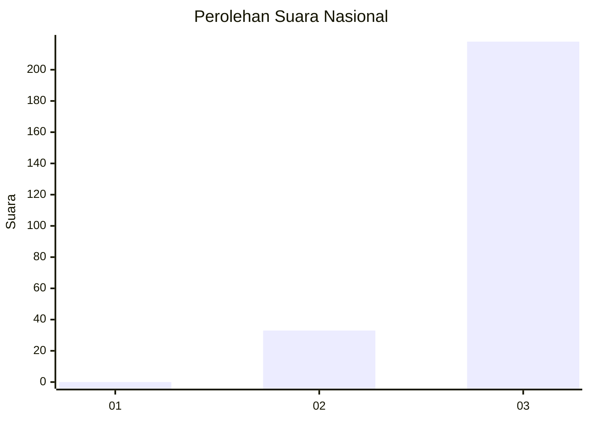
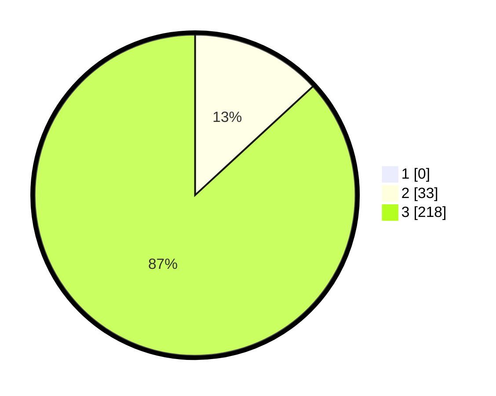

# Hasil

## Grafik

## Tabel

| No. | Nama Paslon    | Suara | Suara (raw) | Persentase |
|:--- |:-------------- | -----:| -----------:| ----------:|
| 1   | ANIES MUHAIMIN | 0     | [0][p-1]    | 0,00       |
| 2   | PRABOWO GIBRAN | 33    | [33][p-2]   | 13,15      |
| 3   | GANJAR MAHFUD  | 218   | [218][p-3]  | 86,85      |

[p-1]: https://github.com/gigit-pemilu/pemilu-2024/blob/main/pilpres/hitung-suara/sub/51-bali/sub/02-tabanan/sub/02-selemadeg-timur/sub/2007-beraban/sub/001-tps/sub/paslon-1.txt
[p-2]: https://github.com/gigit-pemilu/pemilu-2024/blob/main/pilpres/hitung-suara/sub/51-bali/sub/02-tabanan/sub/02-selemadeg-timur/sub/2007-beraban/sub/001-tps/sub/paslon-2.txt
[p-3]: https://github.com/gigit-pemilu/pemilu-2024/blob/main/pilpres/hitung-suara/sub/51-bali/sub/02-tabanan/sub/02-selemadeg-timur/sub/2007-beraban/sub/001-tps/sub/paslon-3.txt

## Foto C Plano

https://sirekap-obj-formc.kpu.go.id/d2b7/pemilu/ppwp/51/02/02/20/07/5102022007001-20240214-125358--d9262223-6000-4b99-b249-68aabf81b9d3.jpg

https://sirekap-obj-formc.kpu.go.id/d2b7/pemilu/ppwp/51/02/02/20/07/5102022007001-20240214-125445--a982f9bc-bde0-4ba0-9a87-9f8c9c7f2aa3.jpg

https://sirekap-obj-formc.kpu.go.id/d2b7/pemilu/ppwp/51/02/02/20/07/5102022007001-20240214-125608--e7d52e29-6201-4b55-95e3-c6651cd630c2.jpg

## Metadata

| Key        | Value               |
| ---------- | ------------------- |
| Time Stamp | 2024-02-14 21:46:01 |

## DATA PEMILIH TETAP

Jumlah pemilih dalam DPT: **253**.
 * L: **118**.
 * P: **135**.

## DATA PENGGUNA HAK PILIH

Jumlah pengguna hak pilih dalam DPT: **248**.
 * L: **115**.
 * P: **133**.

Jumlah pengguna hak pilih dalam DPTb: **0**.
 * L: **0**.
 * P: **0**.

Jumlah pengguna hak pilih dalam DPK: **3**.
 * L: **3**.
 * P: **0**.

Jumlah pengguna hak pilih: **251**.
 * L: **118**.
 * P: **133**.

## JUMLAH SUARA SAH DAN TIDAK SAH

JUMLAH SELURUH SUARA SAH: **251**.

JUMLAH SUARA TIDAK SAH: **0**.

JUMLAH SELURUH SUARA SAH DAN SUARA TIDAK SAH: **251**.

