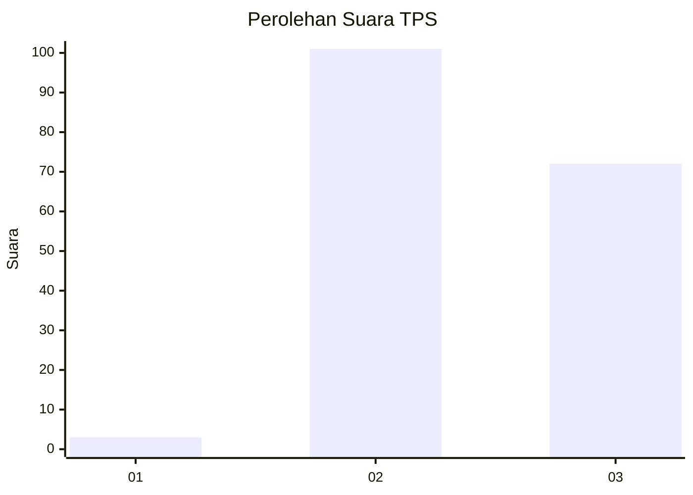
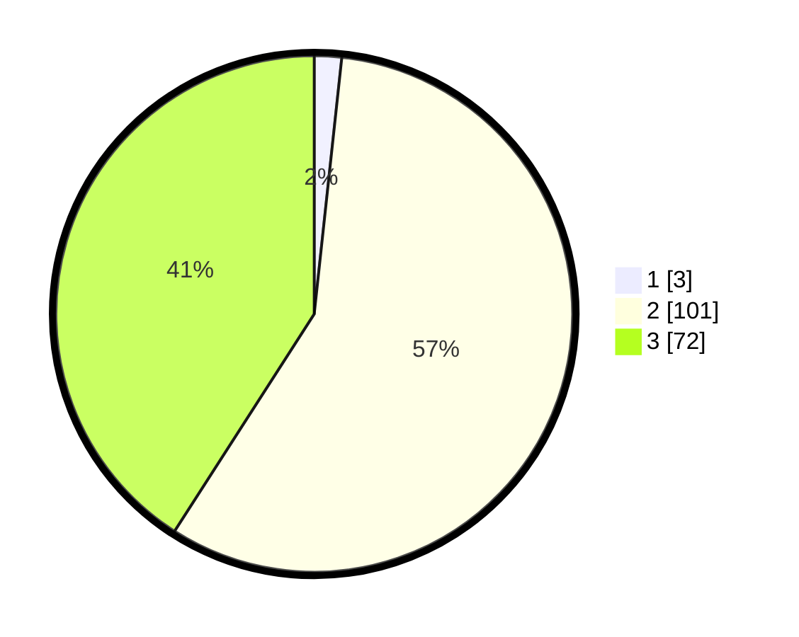

# Hasil

## Grafik

## Tabel

| No. | Nama Paslon    | Suara | Suara (raw) | Persentase |
|:--- |:-------------- | -----:| -----------:| ----------:|
| 1   | ANIES MUHAIMIN | 3     | [3][p-1]    | 1,70       |
| 2   | PRABOWO GIBRAN | 101   | [101][p-2]  | 57,39      |
| 3   | GANJAR MAHFUD  | 72    | [72][p-3]   | 40,91      |

[p-1]: https://github.com/gigit-pemilu/pemilu-2024-51-bali/blob/main/pilpres/hitung-suara/sub/51-bali/sub/02-tabanan/sub/02-selemadeg-timur/sub/2007-beraban/sub/002-tps/sub/paslon-1.txt
[p-2]: https://github.com/gigit-pemilu/pemilu-2024-51-bali/blob/main/pilpres/hitung-suara/sub/51-bali/sub/02-tabanan/sub/02-selemadeg-timur/sub/2007-beraban/sub/002-tps/sub/paslon-2.txt
[p-3]: https://github.com/gigit-pemilu/pemilu-2024-51-bali/blob/main/pilpres/hitung-suara/sub/51-bali/sub/02-tabanan/sub/02-selemadeg-timur/sub/2007-beraban/sub/002-tps/sub/paslon-3.txt

## Foto C Plano

https://sirekap-obj-formc.kpu.go.id/0efd/pemilu/ppwp/51/02/02/20/07/5102022007002-20240216-040728--c7599ee2-f07d-4936-9dbe-4862e42dfd04.jpg

https://sirekap-obj-formc.kpu.go.id/0efd/pemilu/ppwp/51/02/02/20/07/5102022007002-20240216-040743--58feafe0-dbac-4c53-9e84-89b5cbfaf36a.jpg

https://sirekap-obj-formc.kpu.go.id/0efd/pemilu/ppwp/51/02/02/20/07/5102022007002-20240216-044048--0fb0327b-bb18-4ee7-87ab-0ec3def47e75.jpg

## Metadata

| Key        | Value               |
| ---------- | ------------------- |
| Time Stamp | 2024-02-16 09:30:28 |

## DATA PEMILIH TETAP

Jumlah pemilih dalam DPT: **188**.
 * L: **89**.
 * P: **99**.

## DATA PENGGUNA HAK PILIH

Jumlah pengguna hak pilih dalam DPT: **175**.
 * L: **80**.
 * P: **95**.

Jumlah pengguna hak pilih dalam DPTb: **1**.
 * L: **0**.
 * P: **1**.

Jumlah pengguna hak pilih dalam DPK: **1**.
 * L: **0**.
 * P: **1**.

Jumlah pengguna hak pilih: **177**.
 * L: **80**.
 * P: **97**.

## JUMLAH SUARA SAH DAN TIDAK SAH

JUMLAH SELURUH SUARA SAH: **176**.

JUMLAH SUARA TIDAK SAH: **1**.

JUMLAH SELURUH SUARA SAH DAN SUARA TIDAK SAH: **177**.

