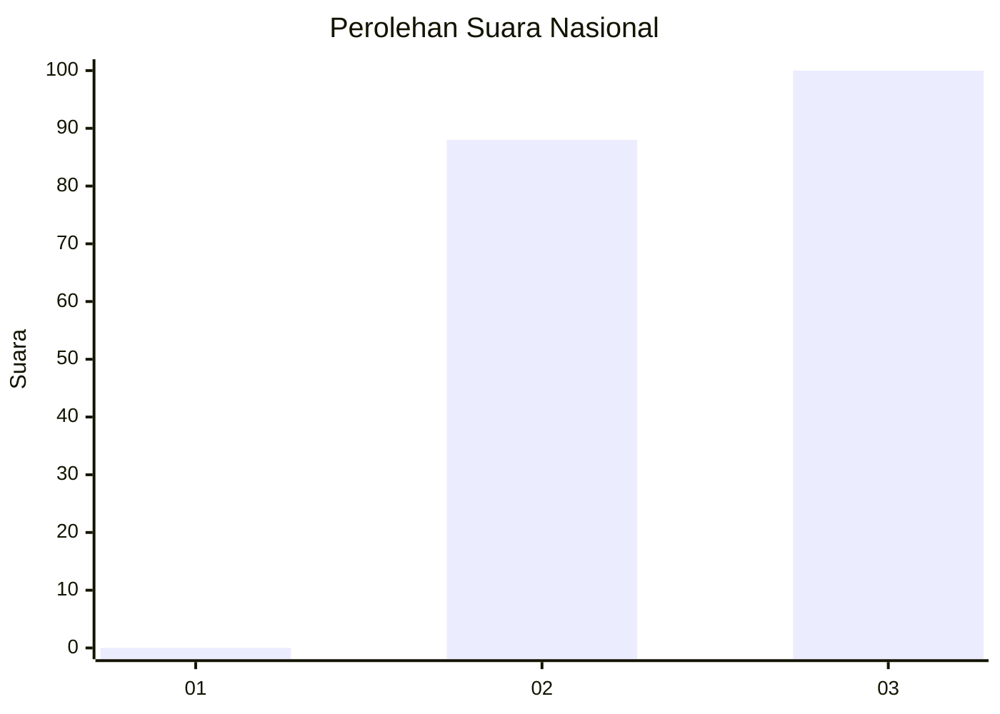
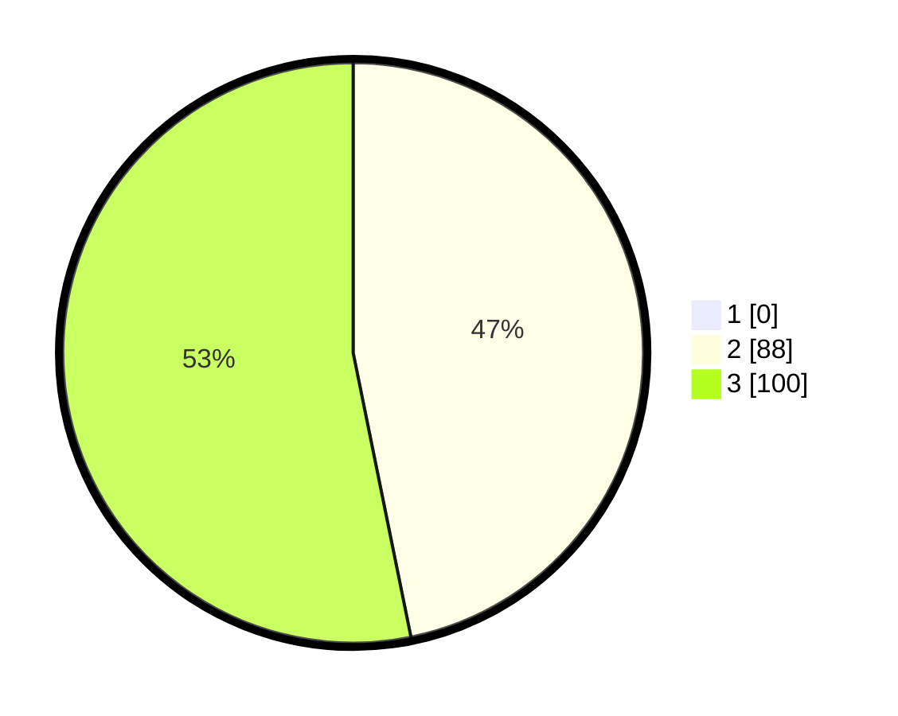

# Hasil

## Grafik

## Tabel

| No. | Nama Paslon    | Suara | Suara (raw) | Persentase |
|:--- |:-------------- | -----:| -----------:| ----------:|
| 1   | ANIES MUHAIMIN | 0     | [0][p-1]    | 0,00       |
| 2   | PRABOWO GIBRAN | 88    | [88][p-2]   | 46,81      |
| 3   | GANJAR MAHFUD  | 100   | [100][p-3]  | 53,19      |

[p-1]: https://github.com/gigit-pemilu/pemilu-2024/blob/main/pilpres/hitung-suara/sub/51-bali/sub/02-tabanan/sub/02-selemadeg-timur/sub/2007-beraban/sub/003-tps/sub/paslon-1.txt
[p-2]: https://github.com/gigit-pemilu/pemilu-2024/blob/main/pilpres/hitung-suara/sub/51-bali/sub/02-tabanan/sub/02-selemadeg-timur/sub/2007-beraban/sub/003-tps/sub/paslon-2.txt
[p-3]: https://github.com/gigit-pemilu/pemilu-2024/blob/main/pilpres/hitung-suara/sub/51-bali/sub/02-tabanan/sub/02-selemadeg-timur/sub/2007-beraban/sub/003-tps/sub/paslon-3.txt

## Foto C Plano

https://sirekap-obj-formc.kpu.go.id/d0f8/pemilu/ppwp/51/02/02/20/07/5102022007003-20240214-125755--47db750b-f10f-40c5-9cd7-dff6649c563f.jpg

https://sirekap-obj-formc.kpu.go.id/d0f8/pemilu/ppwp/51/02/02/20/07/5102022007003-20240214-125830--57cbd582-2e91-499e-b960-a9800f10d8ba.jpg

https://sirekap-obj-formc.kpu.go.id/d0f8/pemilu/ppwp/51/02/02/20/07/5102022007003-20240214-125909--869ab0d1-f458-4995-8c78-94a09f725e79.jpg

## Metadata

| Key        | Value               |
| ---------- | ------------------- |
| Time Stamp | 2024-02-14 21:46:01 |

## DATA PEMILIH TETAP

Jumlah pemilih dalam DPT: **195**.
 * L: **88**.
 * P: **107**.

## DATA PENGGUNA HAK PILIH

Jumlah pengguna hak pilih dalam DPT: **188**.
 * L: **83**.
 * P: **105**.

Jumlah pengguna hak pilih dalam DPTb: **0**.
 * L: **0**.
 * P: **0**.

Jumlah pengguna hak pilih dalam DPK: **0**.
 * L: **0**.
 * P: **0**.

Jumlah pengguna hak pilih: **188**.
 * L: **83**.
 * P: **105**.

## JUMLAH SUARA SAH DAN TIDAK SAH

JUMLAH SELURUH SUARA SAH: **188**.

JUMLAH SUARA TIDAK SAH: **0**.

JUMLAH SELURUH SUARA SAH DAN SUARA TIDAK SAH: **188**.

