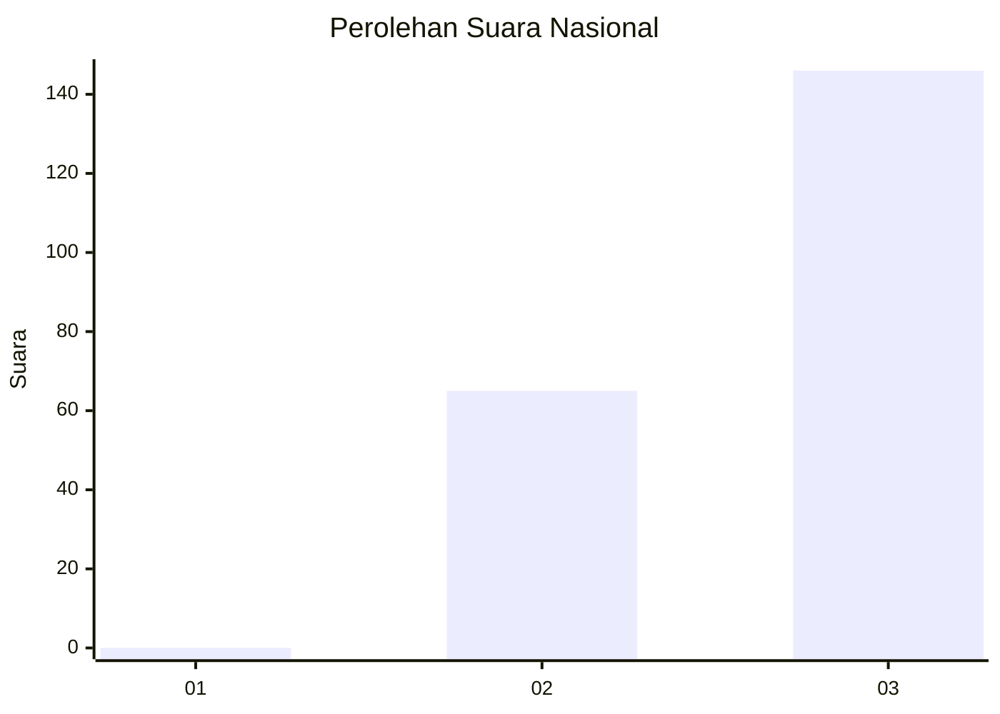
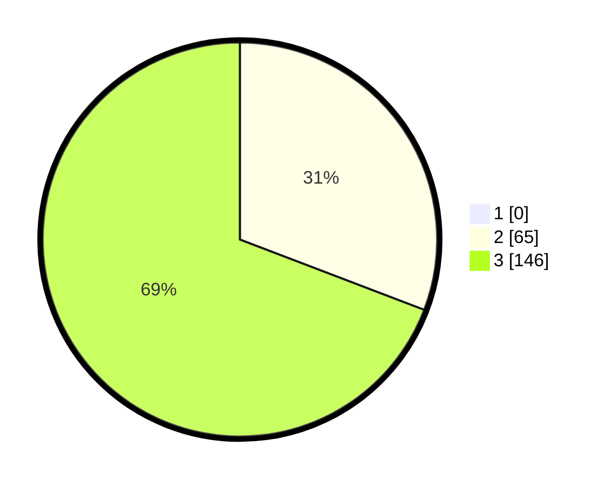

# Hasil

## Grafik

## Tabel

| No. | Nama Paslon    | Suara | Suara (raw) | Persentase |
|:--- |:-------------- | -----:| -----------:| ----------:|
| 1   | ANIES MUHAIMIN | 0     | [0][p-1]    | 0,00       |
| 2   | PRABOWO GIBRAN | 65    | [65][p-2]   | 30,81      |
| 3   | GANJAR MAHFUD  | 146   | [146][p-3]  | 69,19      |

[p-1]: https://github.com/gigit-pemilu/pemilu-2024/blob/main/pilpres/hitung-suara/sub/51-bali/sub/02-tabanan/sub/02-selemadeg-timur/sub/2007-beraban/sub/004-tps/sub/paslon-1.txt
[p-2]: https://github.com/gigit-pemilu/pemilu-2024/blob/main/pilpres/hitung-suara/sub/51-bali/sub/02-tabanan/sub/02-selemadeg-timur/sub/2007-beraban/sub/004-tps/sub/paslon-2.txt
[p-3]: https://github.com/gigit-pemilu/pemilu-2024/blob/main/pilpres/hitung-suara/sub/51-bali/sub/02-tabanan/sub/02-selemadeg-timur/sub/2007-beraban/sub/004-tps/sub/paslon-3.txt

## Foto C Plano

https://sirekap-obj-formc.kpu.go.id/8c5b/pemilu/ppwp/51/02/02/20/07/5102022007004-20240215-213307--9d143ece-5ce9-41bb-a005-8e0546686b19.jpg

https://sirekap-obj-formc.kpu.go.id/8c5b/pemilu/ppwp/51/02/02/20/07/5102022007004-20240215-213310--29d29d4e-043c-4a5f-be3c-e53c9123a2a2.jpg

https://sirekap-obj-formc.kpu.go.id/8c5b/pemilu/ppwp/51/02/02/20/07/5102022007004-20240215-213308--764c1c52-884e-44db-a0e7-2493a4f9bb92.jpg

## Metadata

| Key        | Value               |
| ---------- | ------------------- |
| Time Stamp | 2024-02-15 22:00:27 |

## DATA PEMILIH TETAP

Jumlah pemilih dalam DPT: **217**.
 * L: **98**.
 * P: **119**.

## DATA PENGGUNA HAK PILIH

Jumlah pengguna hak pilih dalam DPT: **211**.
 * L: **94**.
 * P: **117**.

Jumlah pengguna hak pilih dalam DPTb: **0**.
 * L: **0**.
 * P: **0**.

Jumlah pengguna hak pilih dalam DPK: **0**.
 * L: **0**.
 * P: **0**.

Jumlah pengguna hak pilih: **211**.
 * L: **94**.
 * P: **117**.

## JUMLAH SUARA SAH DAN TIDAK SAH

JUMLAH SELURUH SUARA SAH: **211**.

JUMLAH SUARA TIDAK SAH: **0**.

JUMLAH SELURUH SUARA SAH DAN SUARA TIDAK SAH: **211**.

