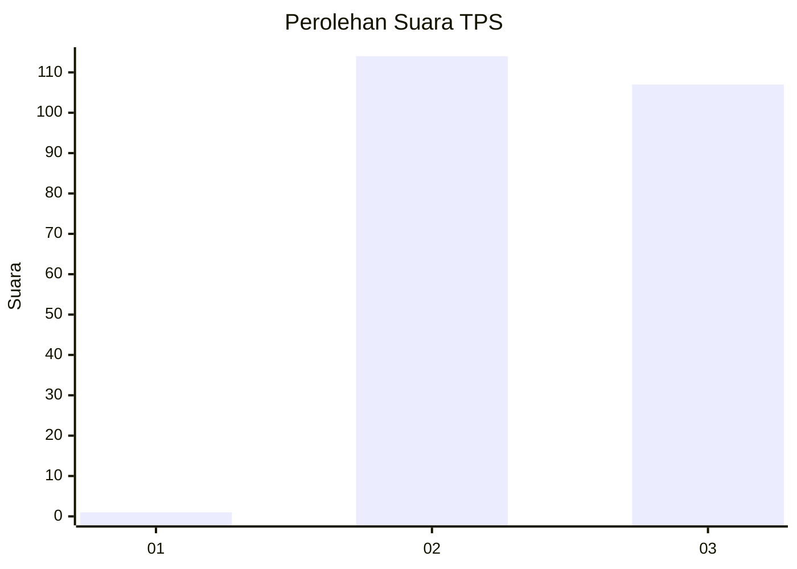
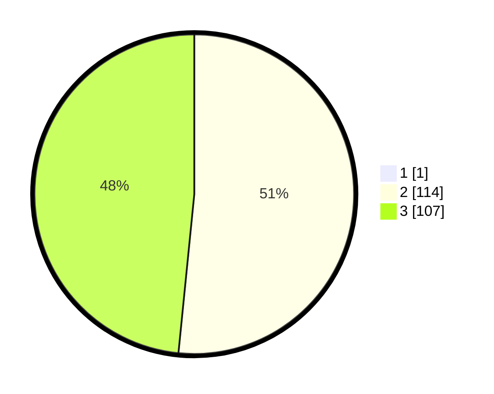

# Hasil

## Grafik

## Tabel

| No. | Nama Paslon    | Suara | Suara (raw) | Persentase |
|:--- |:-------------- | -----:| -----------:| ----------:|
| 1   | ANIES MUHAIMIN | 1     | [1][p-1]    | 0,45       |
| 2   | PRABOWO GIBRAN | 114   | [114][p-2]  | 51,35      |
| 3   | GANJAR MAHFUD  | 107   | [107][p-3]  | 48,20      |

[p-1]: https://github.com/gigit-pemilu/pemilu-2024-51-bali/blob/main/pilpres/hitung-suara/sub/51-bali/sub/02-tabanan/sub/02-selemadeg-timur/sub/2007-beraban/sub/005-tps/sub/paslon-1.txt
[p-2]: https://github.com/gigit-pemilu/pemilu-2024-51-bali/blob/main/pilpres/hitung-suara/sub/51-bali/sub/02-tabanan/sub/02-selemadeg-timur/sub/2007-beraban/sub/005-tps/sub/paslon-2.txt
[p-3]: https://github.com/gigit-pemilu/pemilu-2024-51-bali/blob/main/pilpres/hitung-suara/sub/51-bali/sub/02-tabanan/sub/02-selemadeg-timur/sub/2007-beraban/sub/005-tps/sub/paslon-3.txt

## Foto C Plano

https://sirekap-obj-formc.kpu.go.id/5872/pemilu/ppwp/51/02/02/20/07/5102022007005-20240216-153022--82a2f1da-1fe3-437b-9953-6fa0f031dc45.jpg

https://sirekap-obj-formc.kpu.go.id/5872/pemilu/ppwp/51/02/02/20/07/5102022007005-20240216-153023--5e706c95-ea05-4217-be55-d3ae1fc729be.jpg

https://sirekap-obj-formc.kpu.go.id/5872/pemilu/ppwp/51/02/02/20/07/5102022007005-20240216-153022--2af9e1f0-6208-4c98-be1a-fafffd72ad22.jpg

## Metadata

| Key        | Value               |
| ---------- | ------------------- |
| Time Stamp | 2024-02-21 16:00:00 |

## DATA PEMILIH TETAP

Jumlah pemilih dalam DPT: **230**.
 * L: **111**.
 * P: **119**.

## DATA PENGGUNA HAK PILIH

Jumlah pengguna hak pilih dalam DPT: **218**.
 * L: **104**.
 * P: **114**.

Jumlah pengguna hak pilih dalam DPTb: **3**.
 * L: **0**.
 * P: **3**.

Jumlah pengguna hak pilih dalam DPK: **1**.
 * L: **0**.
 * P: **1**.

Jumlah pengguna hak pilih: **222**.
 * L: **104**.
 * P: **118**.

## JUMLAH SUARA SAH DAN TIDAK SAH

JUMLAH SELURUH SUARA SAH: **222**.

JUMLAH SUARA TIDAK SAH: **0**.

JUMLAH SELURUH SUARA SAH DAN SUARA TIDAK SAH: **222**.

