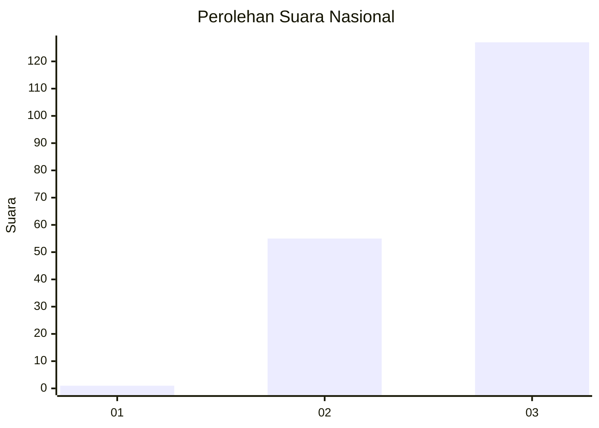
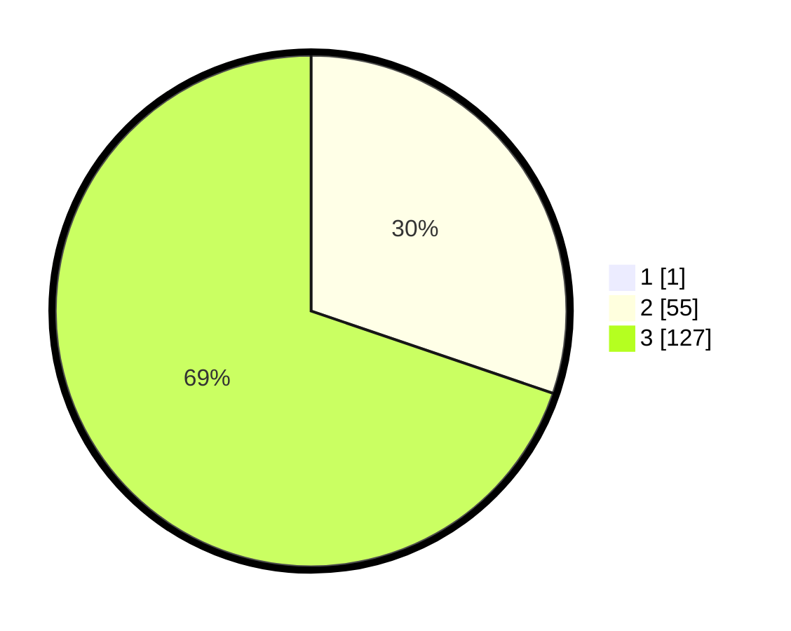

# Hasil

## Grafik

## Tabel

| No. | Nama Paslon    | Suara | Suara (raw) | Persentase |
|:--- |:-------------- | -----:| -----------:| ----------:|
| 1   | ANIES MUHAIMIN | 1     | [1][p-1]    | 0,55       |
| 2   | PRABOWO GIBRAN | 55    | [55][p-2]   | 30,05      |
| 3   | GANJAR MAHFUD  | 127   | [127][p-3]  | 69,40      |

[p-1]: https://github.com/gigit-pemilu/pemilu-2024/blob/main/pilpres/hitung-suara/sub/51-bali/sub/02-tabanan/sub/02-selemadeg-timur/sub/2008-tegal-mengkeb/sub/003-tps/sub/paslon-1.txt
[p-2]: https://github.com/gigit-pemilu/pemilu-2024/blob/main/pilpres/hitung-suara/sub/51-bali/sub/02-tabanan/sub/02-selemadeg-timur/sub/2008-tegal-mengkeb/sub/003-tps/sub/paslon-2.txt
[p-3]: https://github.com/gigit-pemilu/pemilu-2024/blob/main/pilpres/hitung-suara/sub/51-bali/sub/02-tabanan/sub/02-selemadeg-timur/sub/2008-tegal-mengkeb/sub/003-tps/sub/paslon-3.txt

## Foto C Plano

https://sirekap-obj-formc.kpu.go.id/3511/pemilu/ppwp/51/02/02/20/08/5102022008003-20240214-223914--4f9606c9-0d44-4644-b928-182230fb6dcd.jpg

https://sirekap-obj-formc.kpu.go.id/3511/pemilu/ppwp/51/02/02/20/08/5102022008003-20240215-215640--68f817c5-5431-4865-8ee1-9afc13890370.jpg

https://sirekap-obj-formc.kpu.go.id/3511/pemilu/ppwp/51/02/02/20/08/5102022008003-20240215-214931--cd3d8d70-e240-4dc1-8501-1c95f8ba4063.jpg

## Metadata

| Key        | Value               |
| ---------- | ------------------- |
| Time Stamp | 2024-02-16 10:00:28 |

## DATA PEMILIH TETAP

Jumlah pemilih dalam DPT: **208**.
 * L: **97**.
 * P: **111**.

## DATA PENGGUNA HAK PILIH

Jumlah pengguna hak pilih dalam DPT: **185**.
 * L: **91**.
 * P: **94**.

Jumlah pengguna hak pilih dalam DPTb: **0**.
 * L: **0**.
 * P: **0**.

Jumlah pengguna hak pilih dalam DPK: **0**.
 * L: **0**.
 * P: **0**.

Jumlah pengguna hak pilih: **185**.
 * L: **91**.
 * P: **94**.

## JUMLAH SUARA SAH DAN TIDAK SAH

JUMLAH SELURUH SUARA SAH: **183**.

JUMLAH SUARA TIDAK SAH: **2**.

JUMLAH SELURUH SUARA SAH DAN SUARA TIDAK SAH: **185**.

