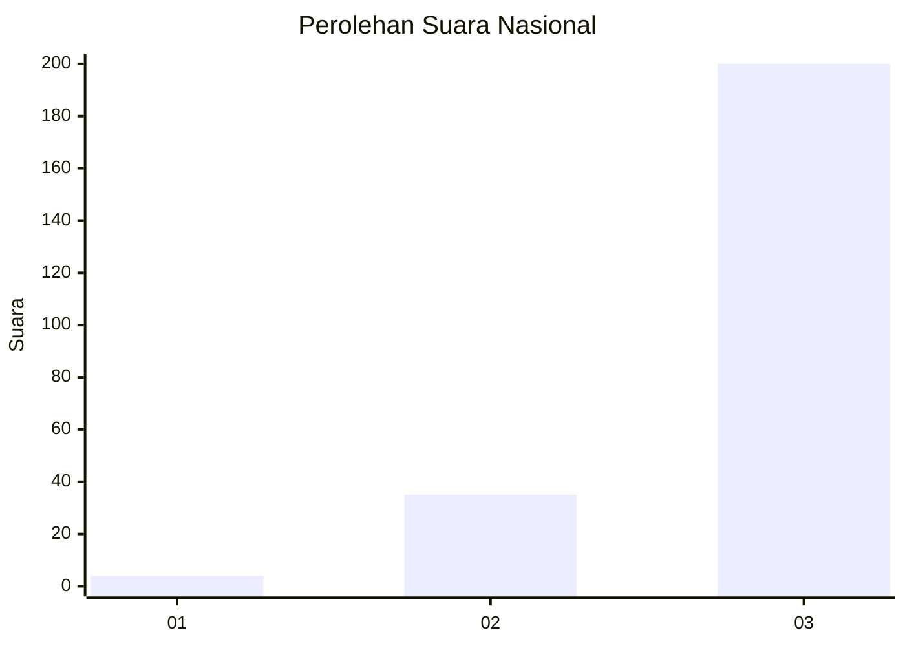
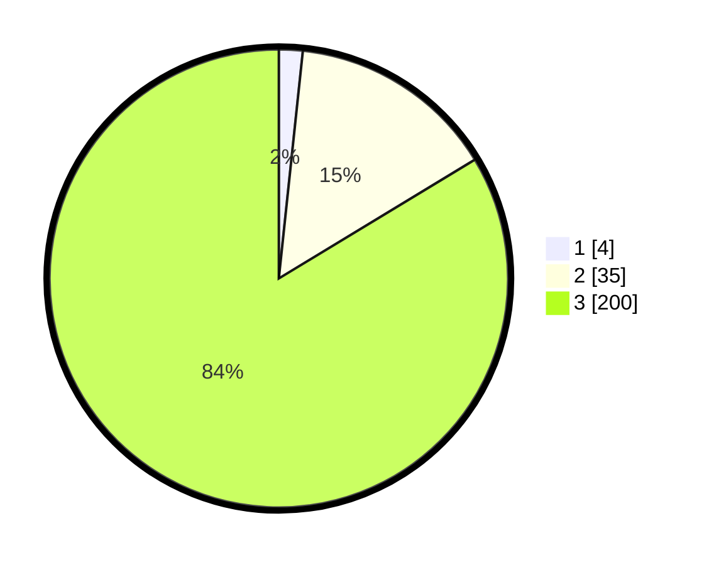

# Hasil

## Grafik

## Tabel

| No. | Nama Paslon    | Suara | Suara (raw) | Persentase |
|:--- |:-------------- | -----:| -----------:| ----------:|
| 1   | ANIES MUHAIMIN | 4     | [4][p-1]    | 1,67       |
| 2   | PRABOWO GIBRAN | 35    | [35][p-2]   | 14,64      |
| 3   | GANJAR MAHFUD  | 200   | [200][p-3]  | 83,68      |

[p-1]: https://github.com/gigit-pemilu/pemilu-2024/blob/main/pilpres/hitung-suara/sub/51-bali/sub/02-tabanan/sub/02-selemadeg-timur/sub/2008-tegal-mengkeb/sub/004-tps/sub/paslon-1.txt
[p-2]: https://github.com/gigit-pemilu/pemilu-2024/blob/main/pilpres/hitung-suara/sub/51-bali/sub/02-tabanan/sub/02-selemadeg-timur/sub/2008-tegal-mengkeb/sub/004-tps/sub/paslon-2.txt
[p-3]: https://github.com/gigit-pemilu/pemilu-2024/blob/main/pilpres/hitung-suara/sub/51-bali/sub/02-tabanan/sub/02-selemadeg-timur/sub/2008-tegal-mengkeb/sub/004-tps/sub/paslon-3.txt

## Foto C Plano

https://sirekap-obj-formc.kpu.go.id/a6cd/pemilu/ppwp/51/02/02/20/08/5102022008004-20240216-150241--477230d5-29e7-4d38-8603-159abf157848.jpg

https://sirekap-obj-formc.kpu.go.id/a6cd/pemilu/ppwp/51/02/02/20/08/5102022008004-20240216-150242--846a5e9c-7cf5-4607-a2b2-888265366dd1.jpg

https://sirekap-obj-formc.kpu.go.id/a6cd/pemilu/ppwp/51/02/02/20/08/5102022008004-20240216-150241--48ff4c1b-da55-447b-8e58-5d79b342ac0e.jpg

## Metadata

| Key        | Value               |
| ---------- | ------------------- |
| Time Stamp | 2024-02-21 10:00:00 |

## DATA PEMILIH TETAP

Jumlah pemilih dalam DPT: **260**.
 * L: **125**.
 * P: **135**.

## DATA PENGGUNA HAK PILIH

Jumlah pengguna hak pilih dalam DPT: **237**.
 * L: **117**.
 * P: **120**.

Jumlah pengguna hak pilih dalam DPTb: **3**.
 * L: **0**.
 * P: **3**.

Jumlah pengguna hak pilih dalam DPK: **0**.
 * L: **0**.
 * P: **0**.

Jumlah pengguna hak pilih: **240**.
 * L: **117**.
 * P: **123**.

## JUMLAH SUARA SAH DAN TIDAK SAH

JUMLAH SELURUH SUARA SAH: **239**.

JUMLAH SUARA TIDAK SAH: **1**.

JUMLAH SELURUH SUARA SAH DAN SUARA TIDAK SAH: **240**.

