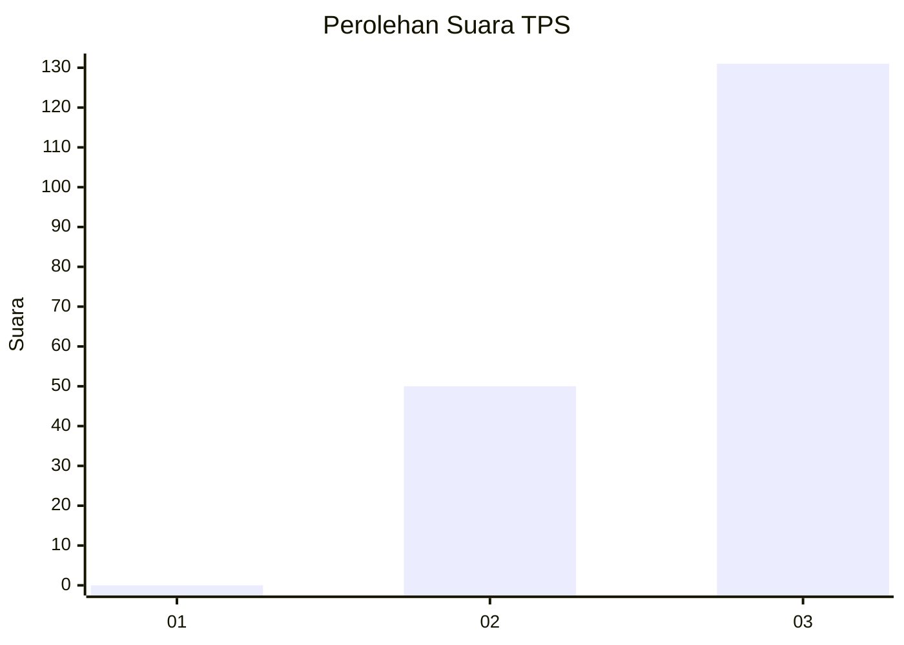
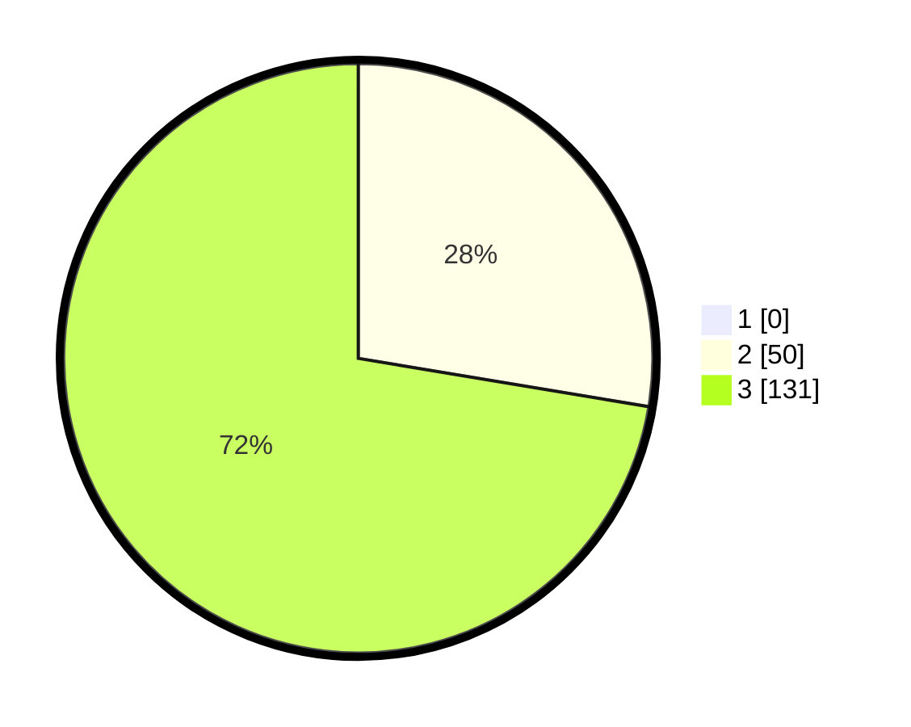

# Hasil

## Grafik

## Tabel

| No. | Nama Paslon    | Suara | Suara (raw) | Persentase |
|:--- |:-------------- | -----:| -----------:| ----------:|
| 1   | ANIES MUHAIMIN | 0     | [0][p-1]    | 0,00       |
| 2   | PRABOWO GIBRAN | 50    | [50][p-2]   | 27,62      |
| 3   | GANJAR MAHFUD  | 131   | [131][p-3]  | 72,38      |

[p-1]: https://github.com/gigit-pemilu/pemilu-2024-51-bali/blob/main/pilpres/hitung-suara/sub/51-bali/sub/02-tabanan/sub/02-selemadeg-timur/sub/2008-tegal-mengkeb/sub/005-tps/sub/paslon-1.txt
[p-2]: https://github.com/gigit-pemilu/pemilu-2024-51-bali/blob/main/pilpres/hitung-suara/sub/51-bali/sub/02-tabanan/sub/02-selemadeg-timur/sub/2008-tegal-mengkeb/sub/005-tps/sub/paslon-2.txt
[p-3]: https://github.com/gigit-pemilu/pemilu-2024-51-bali/blob/main/pilpres/hitung-suara/sub/51-bali/sub/02-tabanan/sub/02-selemadeg-timur/sub/2008-tegal-mengkeb/sub/005-tps/sub/paslon-3.txt

## Foto C Plano

https://sirekap-obj-formc.kpu.go.id/cedf/pemilu/ppwp/51/02/02/20/08/5102022008005-20240216-134051--05a1b83c-5e7f-4f97-ae3a-ee1f3b98ae9b.jpg

https://sirekap-obj-formc.kpu.go.id/cedf/pemilu/ppwp/51/02/02/20/08/5102022008005-20240216-134052--2531ca97-2b0b-49ad-8ba4-25140f7eb51c.jpg

https://sirekap-obj-formc.kpu.go.id/cedf/pemilu/ppwp/51/02/02/20/08/5102022008005-20240216-134052--46968418-c911-4d67-ad9c-6f05cb2c05b9.jpg

## Metadata

| Key        | Value               |
| ---------- | ------------------- |
| Time Stamp | 2024-02-16 14:00:34 |

## DATA PEMILIH TETAP

Jumlah pemilih dalam DPT: **187**.
 * L: **91**.
 * P: **96**.

## DATA PENGGUNA HAK PILIH

Jumlah pengguna hak pilih dalam DPT: **180**.
 * L: **89**.
 * P: **91**.

Jumlah pengguna hak pilih dalam DPTb: **1**.
 * L: **1**.
 * P: **0**.

Jumlah pengguna hak pilih dalam DPK: **0**.
 * L: **0**.
 * P: **0**.

Jumlah pengguna hak pilih: **181**.
 * L: **90**.
 * P: **91**.

## JUMLAH SUARA SAH DAN TIDAK SAH

JUMLAH SELURUH SUARA SAH: **181**.

JUMLAH SUARA TIDAK SAH: **0**.

JUMLAH SELURUH SUARA SAH DAN SUARA TIDAK SAH: **181**.

