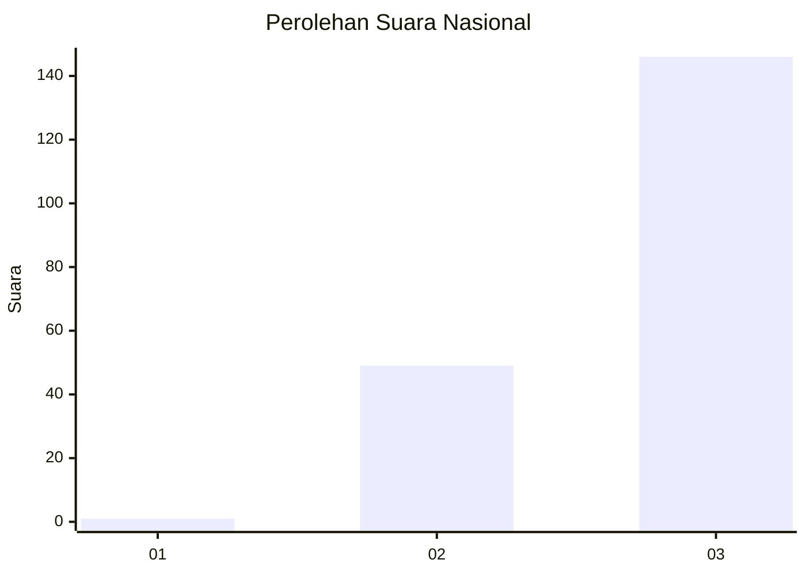
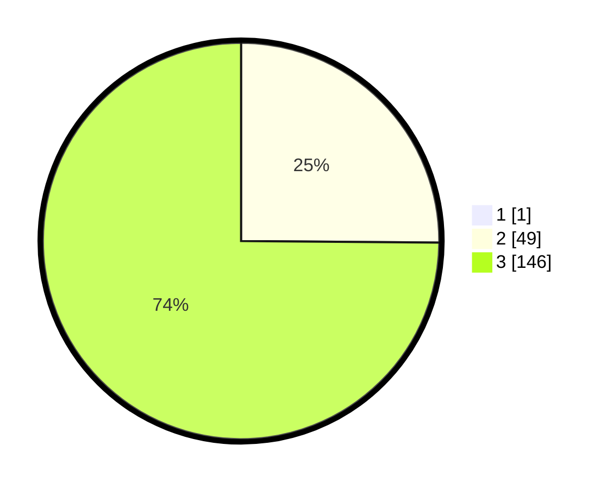

# Hasil

## Grafik

## Tabel

| No. | Nama Paslon    | Suara | Suara (raw) | Persentase |
|:--- |:-------------- | -----:| -----------:| ----------:|
| 1   | ANIES MUHAIMIN | 1     | [1][p-1]    | 0,51       |
| 2   | PRABOWO GIBRAN | 49    | [49][p-2]   | 25,00      |
| 3   | GANJAR MAHFUD  | 146   | [146][p-3]  | 74,49      |

[p-1]: https://github.com/gigit-pemilu/pemilu-2024/blob/main/pilpres/hitung-suara/sub/51-bali/sub/02-tabanan/sub/02-selemadeg-timur/sub/2008-tegal-mengkeb/sub/006-tps/sub/paslon-1.txt
[p-2]: https://github.com/gigit-pemilu/pemilu-2024/blob/main/pilpres/hitung-suara/sub/51-bali/sub/02-tabanan/sub/02-selemadeg-timur/sub/2008-tegal-mengkeb/sub/006-tps/sub/paslon-2.txt
[p-3]: https://github.com/gigit-pemilu/pemilu-2024/blob/main/pilpres/hitung-suara/sub/51-bali/sub/02-tabanan/sub/02-selemadeg-timur/sub/2008-tegal-mengkeb/sub/006-tps/sub/paslon-3.txt

## Foto C Plano

https://sirekap-obj-formc.kpu.go.id/3393/pemilu/ppwp/51/02/02/20/08/5102022008006-20240216-133935--213c9fe4-e9ed-4c4c-aeda-05e8e66cbfb8.jpg

https://sirekap-obj-formc.kpu.go.id/3393/pemilu/ppwp/51/02/02/20/08/5102022008006-20240216-133936--01e44f81-1db4-4347-99be-fa922f832340.jpg

https://sirekap-obj-formc.kpu.go.id/3393/pemilu/ppwp/51/02/02/20/08/5102022008006-20240216-133936--902de2a8-83a1-4052-8e6a-f05423be0afe.jpg

## Metadata

| Key        | Value               |
| ---------- | ------------------- |
| Time Stamp | 2024-02-16 14:00:34 |

## DATA PEMILIH TETAP

Jumlah pemilih dalam DPT: **230**.
 * L: **121**.
 * P: **109**.

## DATA PENGGUNA HAK PILIH

Jumlah pengguna hak pilih dalam DPT: **202**.
 * L: **106**.
 * P: **96**.

Jumlah pengguna hak pilih dalam DPTb: **0**.
 * L: **0**.
 * P: **0**.

Jumlah pengguna hak pilih dalam DPK: **0**.
 * L: **0**.
 * P: **0**.

Jumlah pengguna hak pilih: **202**.
 * L: **106**.
 * P: **96**.

## JUMLAH SUARA SAH DAN TIDAK SAH

JUMLAH SELURUH SUARA SAH: **196**.

JUMLAH SUARA TIDAK SAH: **6**.

JUMLAH SELURUH SUARA SAH DAN SUARA TIDAK SAH: **202**.

