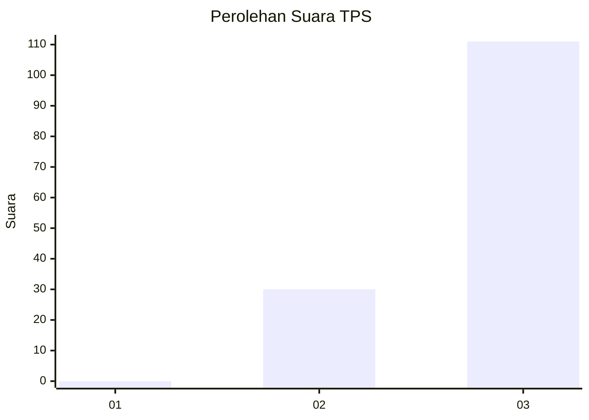
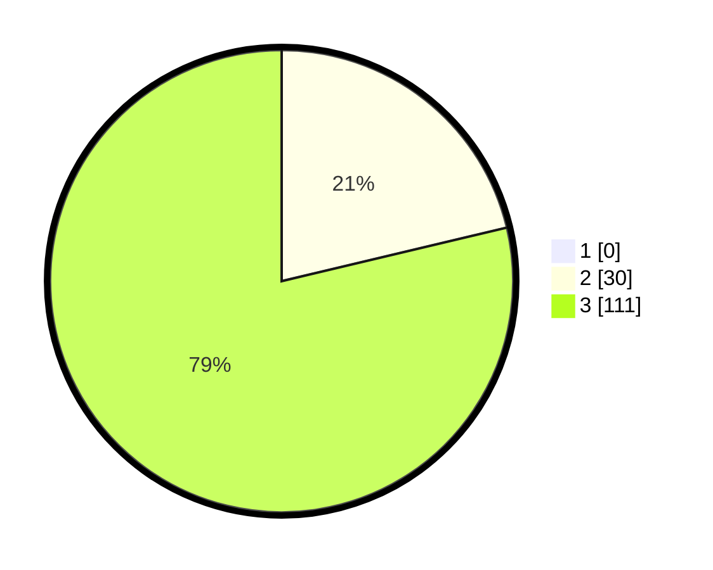

# Hasil

## Grafik

## Tabel

| No. | Nama Paslon    | Suara | Suara (raw) | Persentase |
|:--- |:-------------- | -----:| -----------:| ----------:|
| 1   | ANIES MUHAIMIN | 0     | [0][p-1]    | 0,00       |
| 2   | PRABOWO GIBRAN | 30    | [30][p-2]   | 21,28      |
| 3   | GANJAR MAHFUD  | 111   | [111][p-3]  | 78,72      |

[p-1]: https://github.com/gigit-pemilu/pemilu-2024-51-bali/blob/main/pilpres/hitung-suara/sub/51-bali/sub/02-tabanan/sub/02-selemadeg-timur/sub/2008-tegal-mengkeb/sub/008-tps/sub/paslon-1.txt
[p-2]: https://github.com/gigit-pemilu/pemilu-2024-51-bali/blob/main/pilpres/hitung-suara/sub/51-bali/sub/02-tabanan/sub/02-selemadeg-timur/sub/2008-tegal-mengkeb/sub/008-tps/sub/paslon-2.txt
[p-3]: https://github.com/gigit-pemilu/pemilu-2024-51-bali/blob/main/pilpres/hitung-suara/sub/51-bali/sub/02-tabanan/sub/02-selemadeg-timur/sub/2008-tegal-mengkeb/sub/008-tps/sub/paslon-3.txt

## Foto C Plano

https://sirekap-obj-formc.kpu.go.id/4e1c/pemilu/ppwp/51/02/02/20/08/5102022008008-20240214-225822--a5cb9fb4-ee9c-4cf4-813c-38939bdfc787.jpg

https://sirekap-obj-formc.kpu.go.id/4e1c/pemilu/ppwp/51/02/02/20/08/5102022008008-20240214-191300--07b7d452-acf3-471a-9eb9-54b3180a6b23.jpg

https://sirekap-obj-formc.kpu.go.id/4e1c/pemilu/ppwp/51/02/02/20/08/5102022008008-20240214-193626--01272ecc-2a20-4dfd-9c8e-b8aef76e8727.jpg

## Metadata

| Key        | Value               |
| ---------- | ------------------- |
| Time Stamp | 2024-02-15 22:00:27 |

## DATA PEMILIH TETAP

Jumlah pemilih dalam DPT: **153**.
 * L: **73**.
 * P: **80**.

## DATA PENGGUNA HAK PILIH

Jumlah pengguna hak pilih dalam DPT: **145**.
 * L: **71**.
 * P: **74**.

Jumlah pengguna hak pilih dalam DPTb: **0**.
 * L: **0**.
 * P: **0**.

Jumlah pengguna hak pilih dalam DPK: **0**.
 * L: **0**.
 * P: **0**.

Jumlah pengguna hak pilih: **145**.
 * L: **71**.
 * P: **74**.

## JUMLAH SUARA SAH DAN TIDAK SAH

JUMLAH SELURUH SUARA SAH: **141**.

JUMLAH SUARA TIDAK SAH: **4**.

JUMLAH SELURUH SUARA SAH DAN SUARA TIDAK SAH: **145**.

