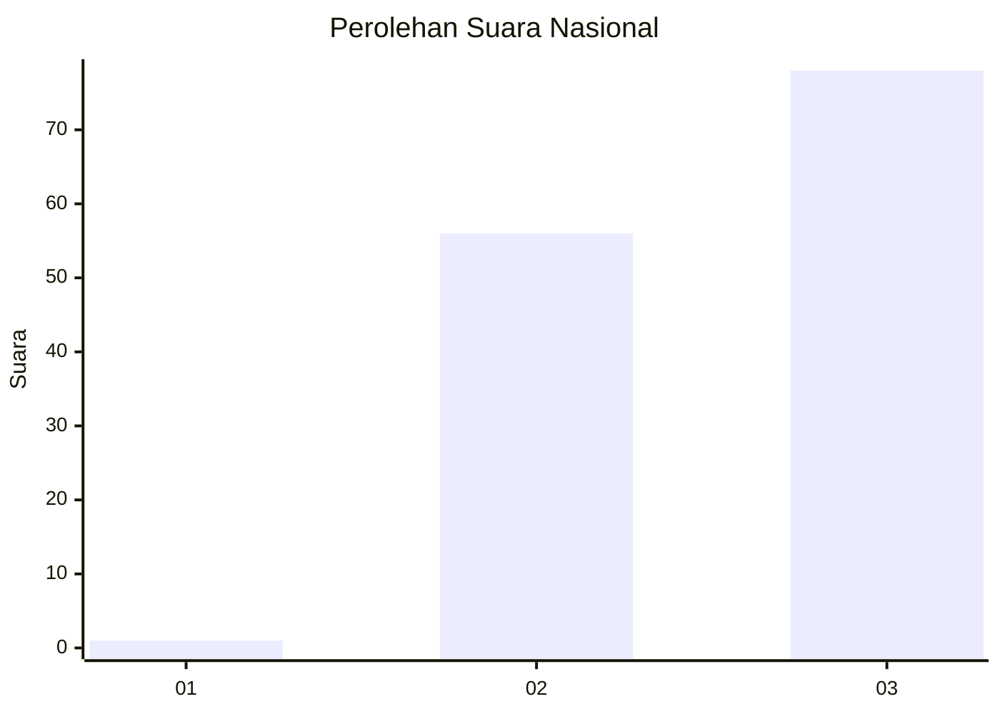
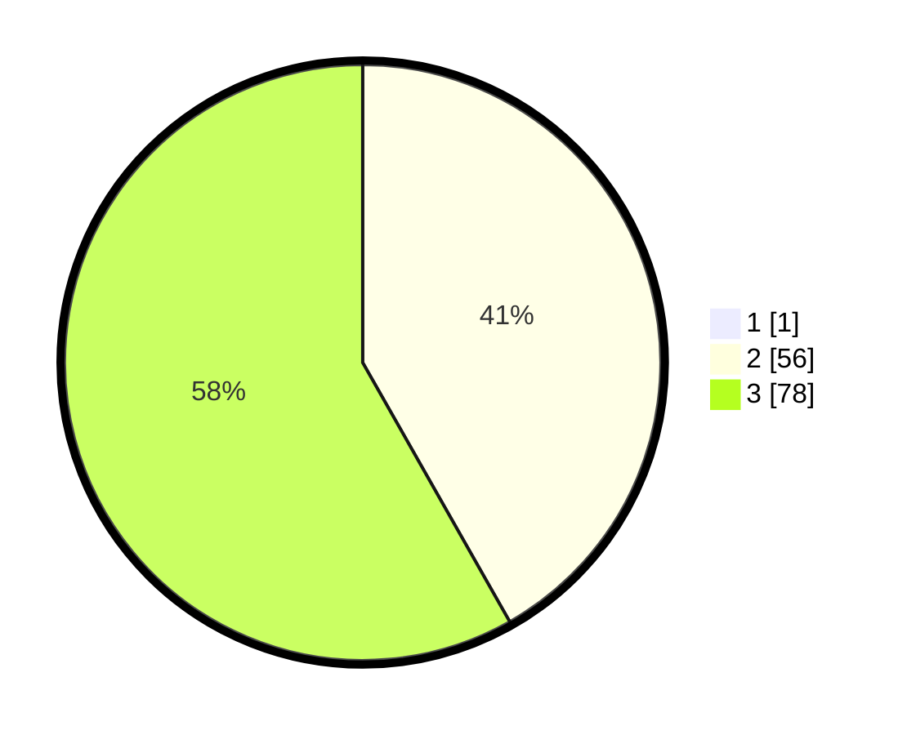

# Hasil

## Grafik

## Tabel

| No. | Nama Paslon    | Suara | Suara (raw) | Persentase |
|:--- |:-------------- | -----:| -----------:| ----------:|
| 1   | ANIES MUHAIMIN | 1     | [1][p-1]    | 0,74       |
| 2   | PRABOWO GIBRAN | 56    | [56][p-2]   | 41,48      |
| 3   | GANJAR MAHFUD  | 78    | [78][p-3]   | 57,78      |

[p-1]: https://github.com/gigit-pemilu/pemilu-2024/blob/main/pilpres/hitung-suara/sub/51-bali/sub/02-tabanan/sub/02-selemadeg-timur/sub/2008-tegal-mengkeb/sub/009-tps/sub/paslon-1.txt
[p-2]: https://github.com/gigit-pemilu/pemilu-2024/blob/main/pilpres/hitung-suara/sub/51-bali/sub/02-tabanan/sub/02-selemadeg-timur/sub/2008-tegal-mengkeb/sub/009-tps/sub/paslon-2.txt
[p-3]: https://github.com/gigit-pemilu/pemilu-2024/blob/main/pilpres/hitung-suara/sub/51-bali/sub/02-tabanan/sub/02-selemadeg-timur/sub/2008-tegal-mengkeb/sub/009-tps/sub/paslon-3.txt

## Foto C Plano

https://sirekap-obj-formc.kpu.go.id/595c/pemilu/ppwp/51/02/02/20/08/5102022008009-20240216-134706--3863d75e-20ef-4c9a-b473-717d788f0d5d.jpg

https://sirekap-obj-formc.kpu.go.id/595c/pemilu/ppwp/51/02/02/20/08/5102022008009-20240216-134707--46abc62d-ae51-4589-b349-f810482dd415.jpg

https://sirekap-obj-formc.kpu.go.id/595c/pemilu/ppwp/51/02/02/20/08/5102022008009-20240216-134707--97c886f9-8ee4-4dda-a3cd-418f551bc2da.jpg

## Metadata

| Key        | Value               |
| ---------- | ------------------- |
| Time Stamp | 2024-02-16 14:30:33 |

## DATA PEMILIH TETAP

Jumlah pemilih dalam DPT: **156**.
 * L: **73**.
 * P: **83**.

## DATA PENGGUNA HAK PILIH

Jumlah pengguna hak pilih dalam DPT: **136**.
 * L: **66**.
 * P: **70**.

Jumlah pengguna hak pilih dalam DPTb: **0**.
 * L: **0**.
 * P: **0**.

Jumlah pengguna hak pilih dalam DPK: **0**.
 * L: **0**.
 * P: **0**.

Jumlah pengguna hak pilih: **136**.
 * L: **66**.
 * P: **70**.

## JUMLAH SUARA SAH DAN TIDAK SAH

JUMLAH SELURUH SUARA SAH: **135**.

JUMLAH SUARA TIDAK SAH: **1**.

JUMLAH SELURUH SUARA SAH DAN SUARA TIDAK SAH: **136**.

