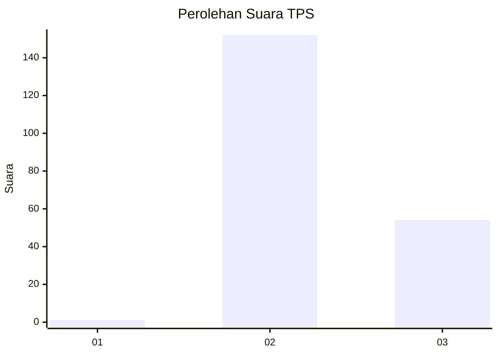
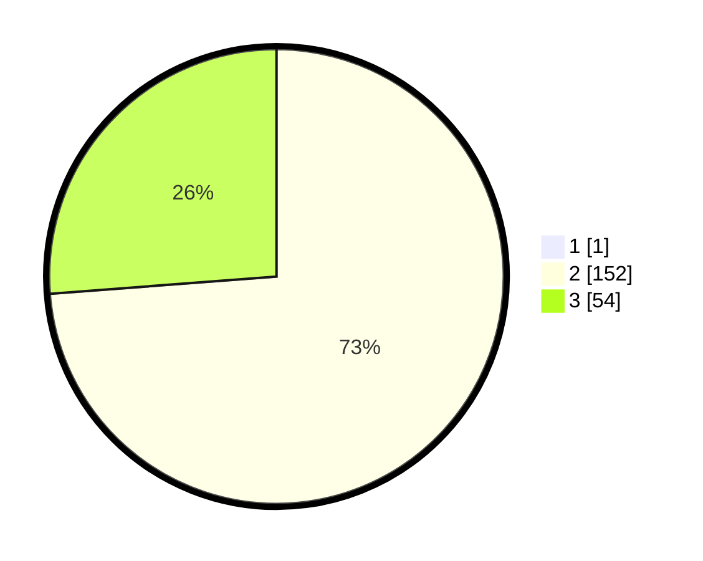

# Hasil

## Grafik

## Tabel

| No. | Nama Paslon    | Suara | Suara (raw) | Persentase |
|:--- |:-------------- | -----:| -----------:| ----------:|
| 1   | ANIES MUHAIMIN | 1     | [1][p-1]    | 0,48       |
| 2   | PRABOWO GIBRAN | 152   | [152][p-2]  | 73,43      |
| 3   | GANJAR MAHFUD  | 54    | [54][p-3]   | 26,09      |

[p-1]: https://github.com/gigit-pemilu/pemilu-2024-51-bali/blob/main/pilpres/hitung-suara/sub/51-bali/sub/02-tabanan/sub/02-selemadeg-timur/sub/2009-dalang/sub/001-tps/sub/paslon-1.txt
[p-2]: https://github.com/gigit-pemilu/pemilu-2024-51-bali/blob/main/pilpres/hitung-suara/sub/51-bali/sub/02-tabanan/sub/02-selemadeg-timur/sub/2009-dalang/sub/001-tps/sub/paslon-2.txt
[p-3]: https://github.com/gigit-pemilu/pemilu-2024-51-bali/blob/main/pilpres/hitung-suara/sub/51-bali/sub/02-tabanan/sub/02-selemadeg-timur/sub/2009-dalang/sub/001-tps/sub/paslon-3.txt

## Foto C Plano

https://sirekap-obj-formc.kpu.go.id/05c9/pemilu/ppwp/51/02/02/20/09/5102022009001-20240216-142450--f5c02602-9610-4837-85b7-c49eb74f2c22.jpg

https://sirekap-obj-formc.kpu.go.id/05c9/pemilu/ppwp/51/02/02/20/09/5102022009001-20240216-142451--87b28bcf-2891-448b-a89c-b497414a3299.jpg

https://sirekap-obj-formc.kpu.go.id/05c9/pemilu/ppwp/51/02/02/20/09/5102022009001-20240216-142450--665e3e35-4e4a-4020-9ea3-f6c6d4b4d3dd.jpg

## Metadata

| Key        | Value               |
| ---------- | ------------------- |
| Time Stamp | 2024-02-21 00:00:00 |

## DATA PEMILIH TETAP

Jumlah pemilih dalam DPT: **237**.
 * L: **121**.
 * P: **116**.

## DATA PENGGUNA HAK PILIH

Jumlah pengguna hak pilih dalam DPT: **202**.
 * L: **106**.
 * P: **96**.

Jumlah pengguna hak pilih dalam DPTb: **5**.
 * L: **0**.
 * P: **5**.

Jumlah pengguna hak pilih dalam DPK: **1**.
 * L: **0**.
 * P: **1**.

Jumlah pengguna hak pilih: **208**.
 * L: **106**.
 * P: **102**.

## JUMLAH SUARA SAH DAN TIDAK SAH

JUMLAH SELURUH SUARA SAH: **207**.

JUMLAH SUARA TIDAK SAH: **1**.

JUMLAH SELURUH SUARA SAH DAN SUARA TIDAK SAH: **208**.

