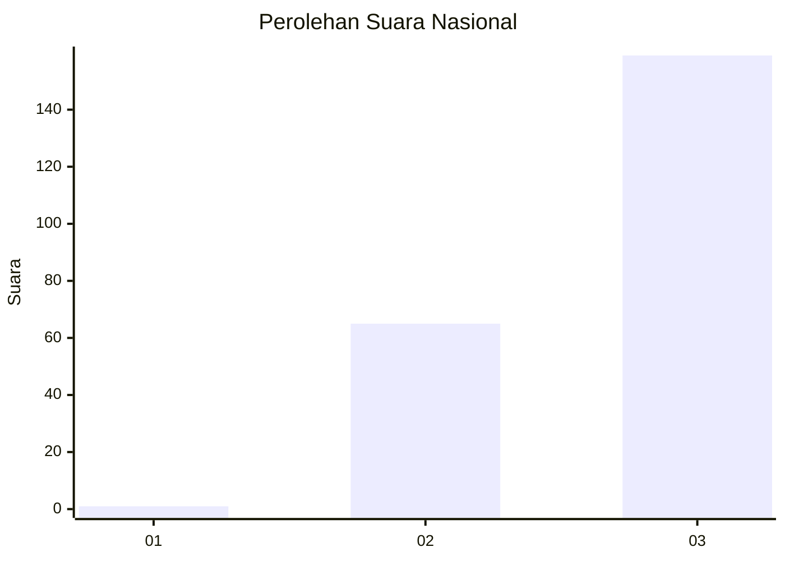
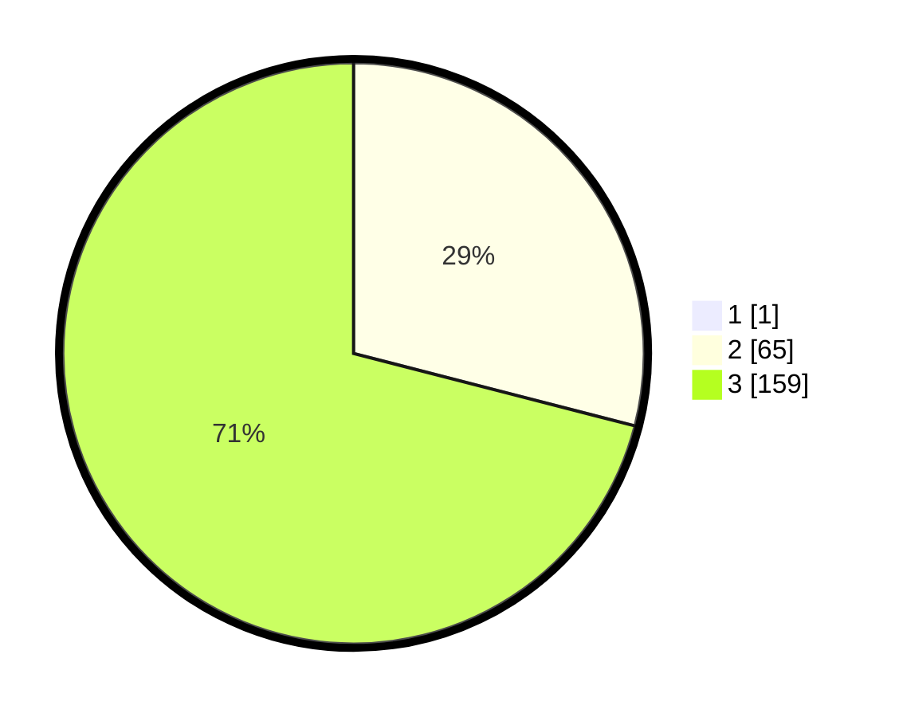

# Hasil

## Grafik

## Tabel

| No. | Nama Paslon    | Suara | Suara (raw) | Persentase |
|:--- |:-------------- | -----:| -----------:| ----------:|
| 1   | ANIES MUHAIMIN | 1     | [1][p-1]    | 0,44       |
| 2   | PRABOWO GIBRAN | 65    | [65][p-2]   | 28,89      |
| 3   | GANJAR MAHFUD  | 159   | [159][p-3]  | 70,67      |

[p-1]: https://github.com/gigit-pemilu/pemilu-2024/blob/main/pilpres/hitung-suara/sub/51-bali/sub/02-tabanan/sub/02-selemadeg-timur/sub/2009-dalang/sub/002-tps/sub/paslon-1.txt
[p-2]: https://github.com/gigit-pemilu/pemilu-2024/blob/main/pilpres/hitung-suara/sub/51-bali/sub/02-tabanan/sub/02-selemadeg-timur/sub/2009-dalang/sub/002-tps/sub/paslon-2.txt
[p-3]: https://github.com/gigit-pemilu/pemilu-2024/blob/main/pilpres/hitung-suara/sub/51-bali/sub/02-tabanan/sub/02-selemadeg-timur/sub/2009-dalang/sub/002-tps/sub/paslon-3.txt

## Foto C Plano

https://sirekap-obj-formc.kpu.go.id/c876/pemilu/ppwp/51/02/02/20/09/5102022009002-20240215-014441--c90500aa-fa06-4e29-a89b-c08577652511.jpg

https://sirekap-obj-formc.kpu.go.id/c876/pemilu/ppwp/51/02/02/20/09/5102022009002-20240215-014602--f3c7b190-5691-4061-a148-c79e06ab7a80.jpg

https://sirekap-obj-formc.kpu.go.id/c876/pemilu/ppwp/51/02/02/20/09/5102022009002-20240215-014800--1770a415-1905-4822-ac7a-dc93217df58c.jpg

## Metadata

| Key        | Value               |
| ---------- | ------------------- |
| Time Stamp | 2024-02-15 23:29:50 |

