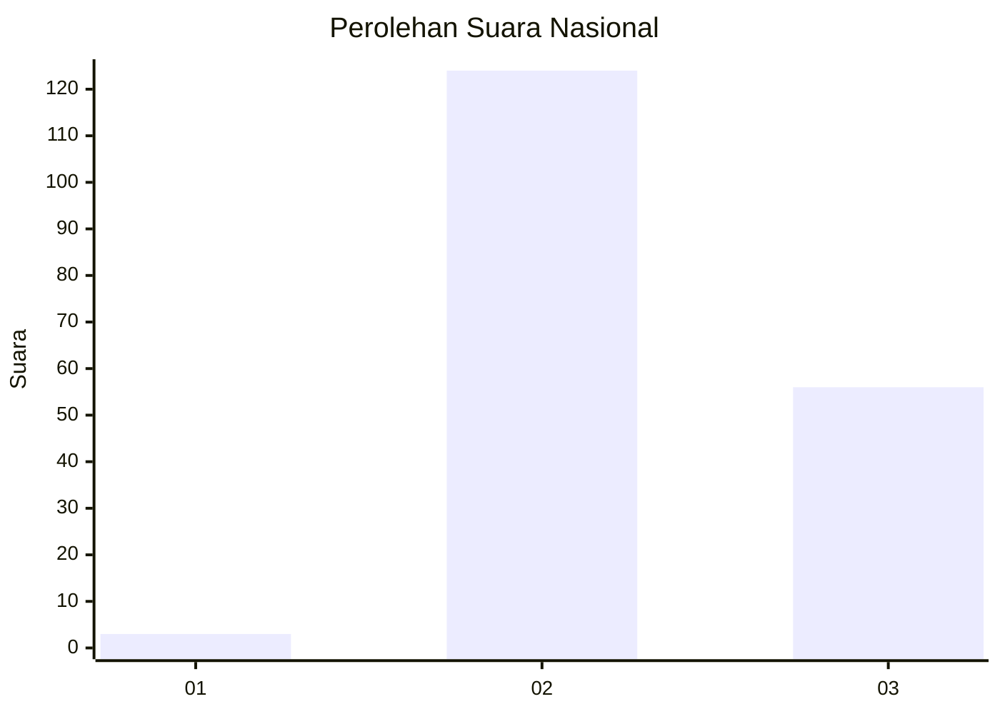
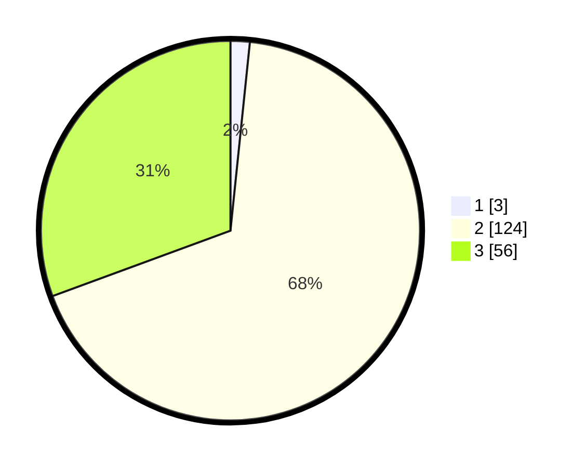

# Hasil

## Grafik

## Tabel

| No. | Nama Paslon    | Suara | Suara (raw) | Persentase |
|:--- |:-------------- | -----:| -----------:| ----------:|
| 1   | ANIES MUHAIMIN | 3     | [3][p-1]    | 1,64       |
| 2   | PRABOWO GIBRAN | 124   | [124][p-2]  | 67,76      |
| 3   | GANJAR MAHFUD  | 56    | [56][p-3]   | 30,60      |

[p-1]: https://github.com/gigit-pemilu/pemilu-2024/blob/main/pilpres/hitung-suara/sub/51-bali/sub/02-tabanan/sub/02-selemadeg-timur/sub/2009-dalang/sub/003-tps/sub/paslon-1.txt
[p-2]: https://github.com/gigit-pemilu/pemilu-2024/blob/main/pilpres/hitung-suara/sub/51-bali/sub/02-tabanan/sub/02-selemadeg-timur/sub/2009-dalang/sub/003-tps/sub/paslon-2.txt
[p-3]: https://github.com/gigit-pemilu/pemilu-2024/blob/main/pilpres/hitung-suara/sub/51-bali/sub/02-tabanan/sub/02-selemadeg-timur/sub/2009-dalang/sub/003-tps/sub/paslon-3.txt

## Foto C Plano

https://sirekap-obj-formc.kpu.go.id/4200/pemilu/ppwp/51/02/02/20/09/5102022009003-20240216-190424--4c97f6c4-48a0-44d3-84dc-f799bd499ec5.jpg

https://sirekap-obj-formc.kpu.go.id/4200/pemilu/ppwp/51/02/02/20/09/5102022009003-20240216-190426--7c2e48f9-395c-48cf-b49d-ccb5978c9954.jpg

https://sirekap-obj-formc.kpu.go.id/4200/pemilu/ppwp/51/02/02/20/09/5102022009003-20240216-190424--2b1daafa-db8c-423d-b1fa-c6679e75e6d8.jpg

## Metadata

| Key        | Value               |
| ---------- | ------------------- |
| Time Stamp | 2024-02-21 15:00:00 |

## DATA PEMILIH TETAP

Jumlah pemilih dalam DPT: **237**.
 * L: **111**.
 * P: **126**.

## DATA PENGGUNA HAK PILIH

Jumlah pengguna hak pilih dalam DPT: **185**.
 * L: **85**.
 * P: **100**.

Jumlah pengguna hak pilih dalam DPTb: **0**.
 * L: **0**.
 * P: **0**.

Jumlah pengguna hak pilih dalam DPK: **0**.
 * L: **0**.
 * P: **0**.

Jumlah pengguna hak pilih: **185**.
 * L: **85**.
 * P: **100**.

## JUMLAH SUARA SAH DAN TIDAK SAH

JUMLAH SELURUH SUARA SAH: **183**.

JUMLAH SUARA TIDAK SAH: **2**.

JUMLAH SELURUH SUARA SAH DAN SUARA TIDAK SAH: **185**.

