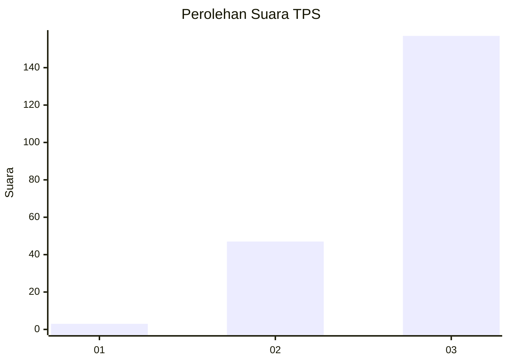
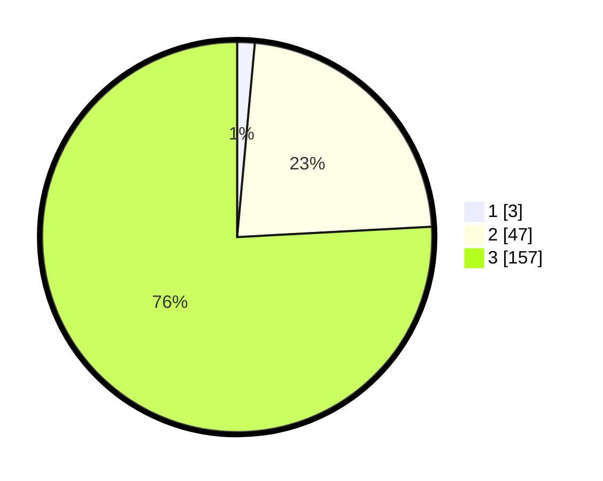

# Hasil

## Grafik

## Tabel

| No. | Nama Paslon    | Suara | Suara (raw) | Persentase |
|:--- |:-------------- | -----:| -----------:| ----------:|
| 1   | ANIES MUHAIMIN | 3     | [3][p-1]    | 1,45       |
| 2   | PRABOWO GIBRAN | 47    | [47][p-2]   | 22,71      |
| 3   | GANJAR MAHFUD  | 157   | [157][p-3]  | 75,85      |

[p-1]: https://github.com/gigit-pemilu/pemilu-2024-51-bali/blob/main/pilpres/hitung-suara/sub/51-bali/sub/02-tabanan/sub/02-selemadeg-timur/sub/2009-dalang/sub/004-tps/sub/paslon-1.txt
[p-2]: https://github.com/gigit-pemilu/pemilu-2024-51-bali/blob/main/pilpres/hitung-suara/sub/51-bali/sub/02-tabanan/sub/02-selemadeg-timur/sub/2009-dalang/sub/004-tps/sub/paslon-2.txt
[p-3]: https://github.com/gigit-pemilu/pemilu-2024-51-bali/blob/main/pilpres/hitung-suara/sub/51-bali/sub/02-tabanan/sub/02-selemadeg-timur/sub/2009-dalang/sub/004-tps/sub/paslon-3.txt

## Foto C Plano

https://sirekap-obj-formc.kpu.go.id/4857/pemilu/ppwp/51/02/02/20/09/5102022009004-20240214-193122--2758f865-cbd1-4414-992c-6a40565ce9d4.jpg

https://sirekap-obj-formc.kpu.go.id/4857/pemilu/ppwp/51/02/02/20/09/5102022009004-20240214-193255--bd262b35-8dde-46f7-8ebe-0bd3fd7b85b0.jpg

https://sirekap-obj-formc.kpu.go.id/4857/pemilu/ppwp/51/02/02/20/09/5102022009004-20240214-193441--63b09ad8-fdfc-4e99-9584-6a6f2ae467a6.jpg

## Metadata

| Key        | Value               |
| ---------- | ------------------- |
| Time Stamp | 2024-02-14 21:46:01 |

## DATA PEMILIH TETAP

Jumlah pemilih dalam DPT: **226**.
 * L: **114**.
 * P: **112**.

## DATA PENGGUNA HAK PILIH

Jumlah pengguna hak pilih dalam DPT: **208**.
 * L: **108**.
 * P: **100**.

Jumlah pengguna hak pilih dalam DPTb: **0**.
 * L: **0**.
 * P: **0**.

Jumlah pengguna hak pilih dalam DPK: **0**.
 * L: **0**.
 * P: **0**.

Jumlah pengguna hak pilih: **208**.
 * L: **108**.
 * P: **100**.

## JUMLAH SUARA SAH DAN TIDAK SAH

JUMLAH SELURUH SUARA SAH: **207**.

JUMLAH SUARA TIDAK SAH: **1**.

JUMLAH SELURUH SUARA SAH DAN SUARA TIDAK SAH: **208**.

