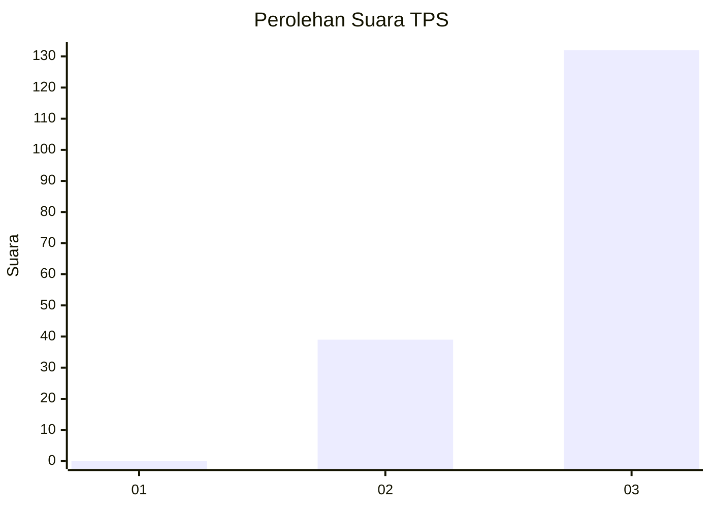
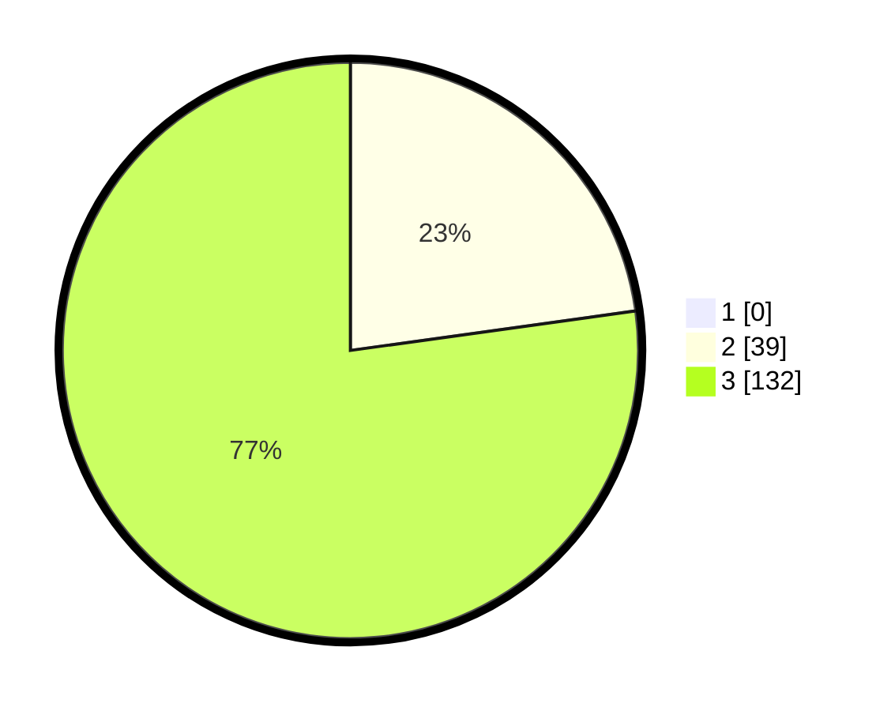

# Hasil

## Grafik

## Tabel

| No. | Nama Paslon    | Suara | Suara (raw) | Persentase |
|:--- |:-------------- | -----:| -----------:| ----------:|
| 1   | ANIES MUHAIMIN | 0     | [0][p-1]    | 0,00       |
| 2   | PRABOWO GIBRAN | 39    | [39][p-2]   | 22,81      |
| 3   | GANJAR MAHFUD  | 132   | [132][p-3]  | 77,19      |

[p-1]: https://github.com/gigit-pemilu/pemilu-2024-51-bali/blob/main/pilpres/hitung-suara/sub/51-bali/sub/02-tabanan/sub/02-selemadeg-timur/sub/2009-dalang/sub/005-tps/sub/paslon-1.txt
[p-2]: https://github.com/gigit-pemilu/pemilu-2024-51-bali/blob/main/pilpres/hitung-suara/sub/51-bali/sub/02-tabanan/sub/02-selemadeg-timur/sub/2009-dalang/sub/005-tps/sub/paslon-2.txt
[p-3]: https://github.com/gigit-pemilu/pemilu-2024-51-bali/blob/main/pilpres/hitung-suara/sub/51-bali/sub/02-tabanan/sub/02-selemadeg-timur/sub/2009-dalang/sub/005-tps/sub/paslon-3.txt

## Foto C Plano

https://sirekap-obj-formc.kpu.go.id/082e/pemilu/ppwp/51/02/02/20/09/5102022009005-20240216-031458--135ea6d9-e19e-4bf6-b99f-86f1c9334f12.jpg

https://sirekap-obj-formc.kpu.go.id/082e/pemilu/ppwp/51/02/02/20/09/5102022009005-20240216-031516--3695b6e9-e2e7-4ca1-abb4-5c6f1e5c094e.jpg

https://sirekap-obj-formc.kpu.go.id/082e/pemilu/ppwp/51/02/02/20/09/5102022009005-20240216-031507--9830b628-2ef3-4dad-83af-026982a4b685.jpg

## Metadata

| Key        | Value               |
| ---------- | ------------------- |
| Time Stamp | 2024-02-16 09:30:28 |

## DATA PEMILIH TETAP

Jumlah pemilih dalam DPT: **204**.
 * L: **103**.
 * P: **101**.

## DATA PENGGUNA HAK PILIH

Jumlah pengguna hak pilih dalam DPT: **173**.
 * L: **87**.
 * P: **86**.

Jumlah pengguna hak pilih dalam DPTb: **0**.
 * L: **0**.
 * P: **0**.

Jumlah pengguna hak pilih dalam DPK: **0**.
 * L: **0**.
 * P: **0**.

Jumlah pengguna hak pilih: **173**.
 * L: **87**.
 * P: **86**.

## JUMLAH SUARA SAH DAN TIDAK SAH

JUMLAH SELURUH SUARA SAH: **171**.

JUMLAH SUARA TIDAK SAH: **2**.

JUMLAH SELURUH SUARA SAH DAN SUARA TIDAK SAH: **173**.

