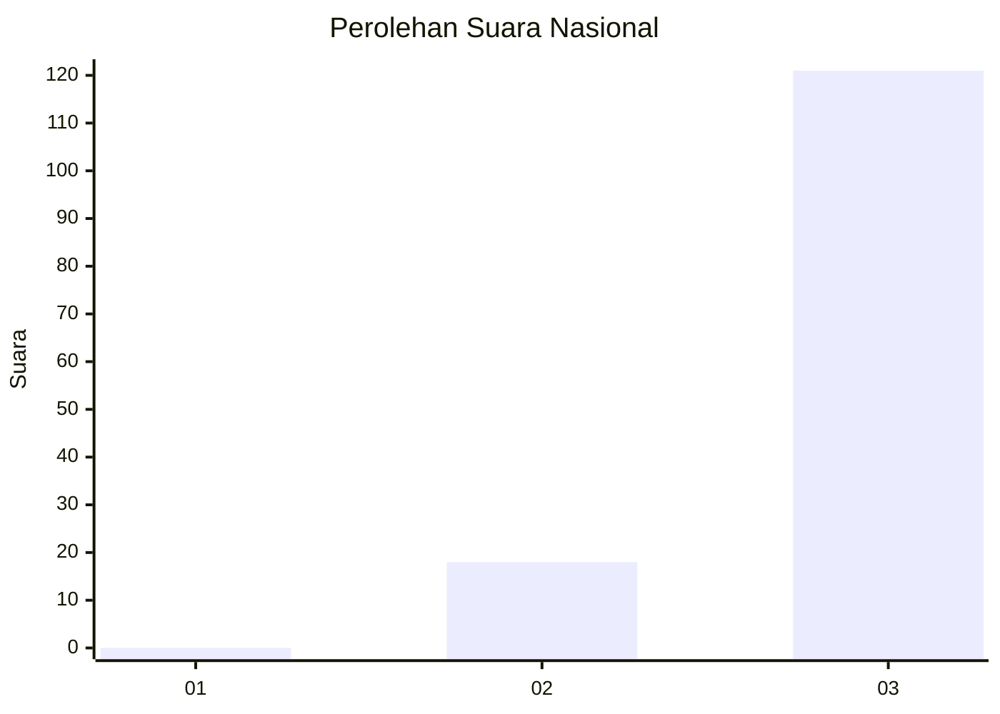
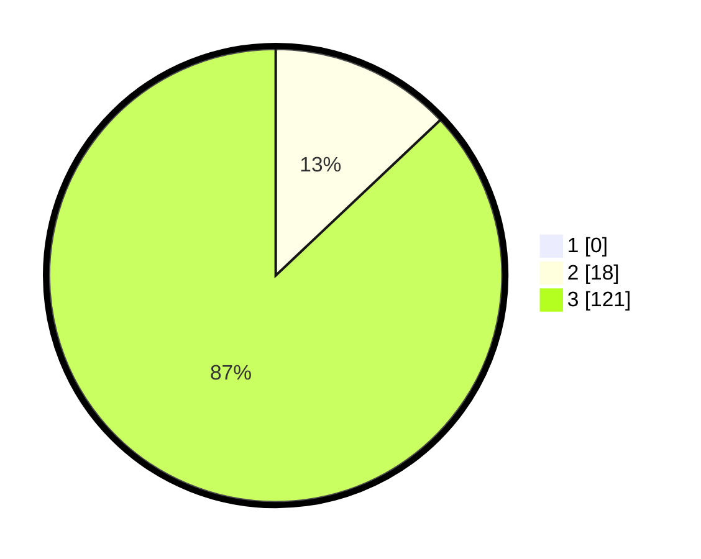

# Hasil

## Grafik

## Tabel

| No. | Nama Paslon    | Suara | Suara (raw) | Persentase |
|:--- |:-------------- | -----:| -----------:| ----------:|
| 1   | ANIES MUHAIMIN | 0     | [0][p-1]    | 0,00       |
| 2   | PRABOWO GIBRAN | 18    | [18][p-2]   | 12,95      |
| 3   | GANJAR MAHFUD  | 121   | [121][p-3]  | 87,05      |

[p-1]: https://github.com/gigit-pemilu/pemilu-2024/blob/main/pilpres/hitung-suara/sub/51-bali/sub/02-tabanan/sub/02-selemadeg-timur/sub/2009-dalang/sub/007-tps/sub/paslon-1.txt
[p-2]: https://github.com/gigit-pemilu/pemilu-2024/blob/main/pilpres/hitung-suara/sub/51-bali/sub/02-tabanan/sub/02-selemadeg-timur/sub/2009-dalang/sub/007-tps/sub/paslon-2.txt
[p-3]: https://github.com/gigit-pemilu/pemilu-2024/blob/main/pilpres/hitung-suara/sub/51-bali/sub/02-tabanan/sub/02-selemadeg-timur/sub/2009-dalang/sub/007-tps/sub/paslon-3.txt

## Foto C Plano

https://sirekap-obj-formc.kpu.go.id/444e/pemilu/ppwp/51/02/02/20/09/5102022009007-20240214-225643--059b415e-77b4-4f81-ae0d-ed6e1d4477c0.jpg

https://sirekap-obj-formc.kpu.go.id/444e/pemilu/ppwp/51/02/02/20/09/5102022009007-20240214-225815--ba39e15b-22f2-4536-b515-f1e7e5f2f625.jpg

https://sirekap-obj-formc.kpu.go.id/444e/pemilu/ppwp/51/02/02/20/09/5102022009007-20240214-225952--6c8a6e9b-12b7-4f5e-9e7c-301fcd2ded7d.jpg

## Metadata

| Key        | Value               |
| ---------- | ------------------- |
| Time Stamp | 2024-02-15 17:00:25 |

## DATA PEMILIH TETAP

Jumlah pemilih dalam DPT: **147**.
 * L: **72**.
 * P: **75**.

## DATA PENGGUNA HAK PILIH

Jumlah pengguna hak pilih dalam DPT: **140**.
 * L: **69**.
 * P: **71**.

Jumlah pengguna hak pilih dalam DPTb: **0**.
 * L: **0**.
 * P: **0**.

Jumlah pengguna hak pilih dalam DPK: **0**.
 * L: **0**.
 * P: **0**.

Jumlah pengguna hak pilih: **140**.
 * L: **69**.
 * P: **71**.

## JUMLAH SUARA SAH DAN TIDAK SAH

JUMLAH SELURUH SUARA SAH: **139**.

JUMLAH SUARA TIDAK SAH: **1**.

JUMLAH SELURUH SUARA SAH DAN SUARA TIDAK SAH: **140**.

