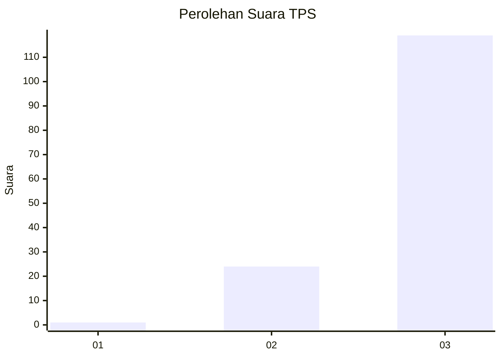
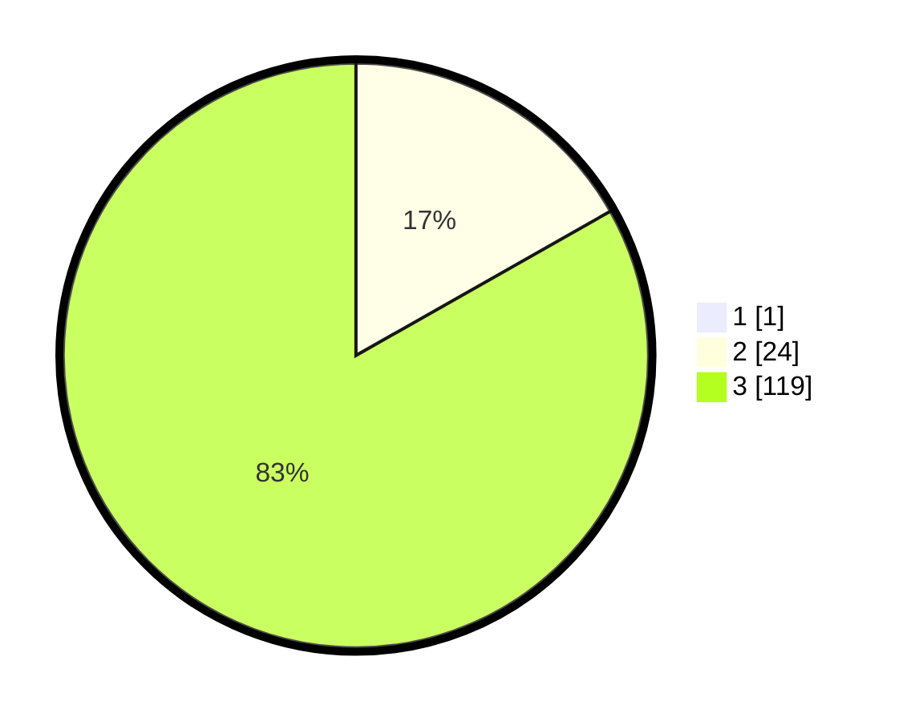

# Hasil

## Grafik

## Tabel

| No. | Nama Paslon    | Suara | Suara (raw) | Persentase |
|:--- |:-------------- | -----:| -----------:| ----------:|
| 1   | ANIES MUHAIMIN | 1     | [1][p-1]    | 0,69       |
| 2   | PRABOWO GIBRAN | 24    | [24][p-2]   | 16,67      |
| 3   | GANJAR MAHFUD  | 119   | [119][p-3]  | 82,64      |

[p-1]: https://github.com/gigit-pemilu/pemilu-2024-51-bali/blob/main/pilpres/hitung-suara/sub/51-bali/sub/02-tabanan/sub/02-selemadeg-timur/sub/2009-dalang/sub/008-tps/sub/paslon-1.txt
[p-2]: https://github.com/gigit-pemilu/pemilu-2024-51-bali/blob/main/pilpres/hitung-suara/sub/51-bali/sub/02-tabanan/sub/02-selemadeg-timur/sub/2009-dalang/sub/008-tps/sub/paslon-2.txt
[p-3]: https://github.com/gigit-pemilu/pemilu-2024-51-bali/blob/main/pilpres/hitung-suara/sub/51-bali/sub/02-tabanan/sub/02-selemadeg-timur/sub/2009-dalang/sub/008-tps/sub/paslon-3.txt

## Foto C Plano

https://sirekap-obj-formc.kpu.go.id/718e/pemilu/ppwp/51/02/02/20/09/5102022009008-20240216-153149--0c28356c-5b2d-4482-861d-9fc751deb50e.jpg

https://sirekap-obj-formc.kpu.go.id/718e/pemilu/ppwp/51/02/02/20/09/5102022009008-20240216-153150--8e250a69-eed3-40ee-b223-9386adcc239a.jpg

https://sirekap-obj-formc.kpu.go.id/718e/pemilu/ppwp/51/02/02/20/09/5102022009008-20240216-153149--c2a19609-5d00-4a17-ac36-af6e2c1d1936.jpg

## Metadata

| Key        | Value               |
| ---------- | ------------------- |
| Time Stamp | 2024-02-21 10:00:00 |

## DATA PEMILIH TETAP

Jumlah pemilih dalam DPT: **163**.
 * L: **72**.
 * P: **91**.

## DATA PENGGUNA HAK PILIH

Jumlah pengguna hak pilih dalam DPT: **144**.
 * L: **69**.
 * P: **75**.

Jumlah pengguna hak pilih dalam DPTb: **0**.
 * L: **0**.
 * P: **0**.

Jumlah pengguna hak pilih dalam DPK: **0**.
 * L: **0**.
 * P: **0**.

Jumlah pengguna hak pilih: **144**.
 * L: **69**.
 * P: **75**.

## JUMLAH SUARA SAH DAN TIDAK SAH

JUMLAH SELURUH SUARA SAH: **144**.

JUMLAH SUARA TIDAK SAH: **0**.

JUMLAH SELURUH SUARA SAH DAN SUARA TIDAK SAH: **144**.

