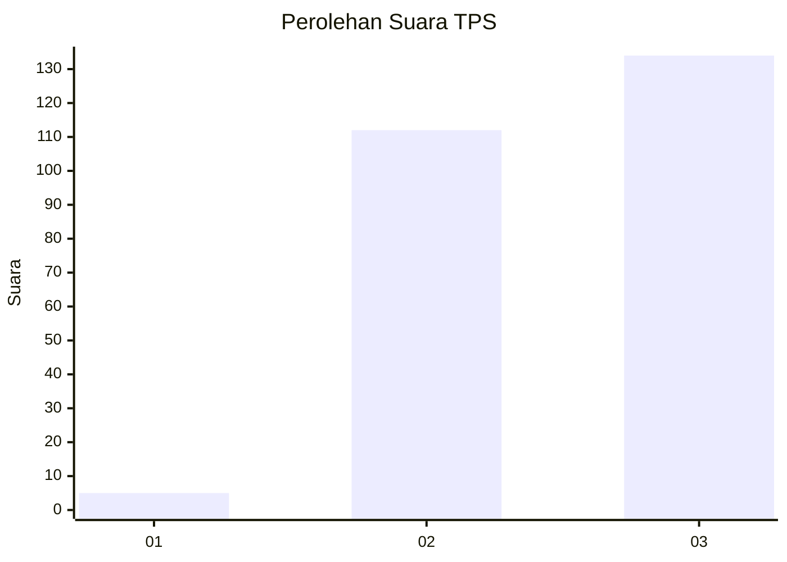
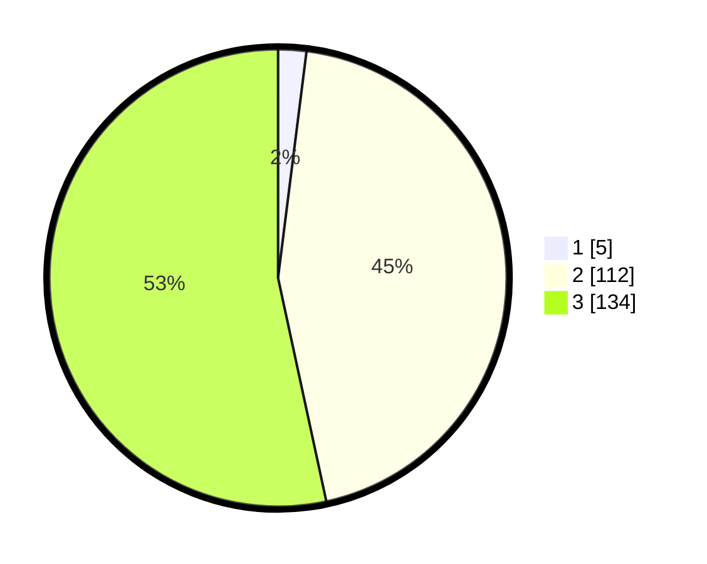

# Hasil

## Grafik

## Tabel

| No. | Nama Paslon    | Suara | Suara (raw) | Persentase |
|:--- |:-------------- | -----:| -----------:| ----------:|
| 1   | ANIES MUHAIMIN | 5     | [5][p-1]    | 1,99       |
| 2   | PRABOWO GIBRAN | 112   | [112][p-2]  | 44,62      |
| 3   | GANJAR MAHFUD  | 134   | [134][p-3]  | 53,39      |

[p-1]: https://github.com/gigit-pemilu/pemilu-2024-51-bali/blob/main/pilpres/hitung-suara/sub/51-bali/sub/02-tabanan/sub/02-selemadeg-timur/sub/2010-gadungsari/sub/001-tps/sub/paslon-1.txt
[p-2]: https://github.com/gigit-pemilu/pemilu-2024-51-bali/blob/main/pilpres/hitung-suara/sub/51-bali/sub/02-tabanan/sub/02-selemadeg-timur/sub/2010-gadungsari/sub/001-tps/sub/paslon-2.txt
[p-3]: https://github.com/gigit-pemilu/pemilu-2024-51-bali/blob/main/pilpres/hitung-suara/sub/51-bali/sub/02-tabanan/sub/02-selemadeg-timur/sub/2010-gadungsari/sub/001-tps/sub/paslon-3.txt

## Foto C Plano

https://sirekap-obj-formc.kpu.go.id/0b61/pemilu/ppwp/51/02/02/20/10/5102022010001-20240216-025851--35c3a1b4-3260-4de7-bd05-e4484b642dd7.jpg

https://sirekap-obj-formc.kpu.go.id/0b61/pemilu/ppwp/51/02/02/20/10/5102022010001-20240216-025852--01a420f2-ead8-4509-bf1a-43bf228047ca.jpg

https://sirekap-obj-formc.kpu.go.id/0b61/pemilu/ppwp/51/02/02/20/10/5102022010001-20240216-025852--38f573db-e98a-4dda-82c9-f789125abba2.jpg

## Metadata

| Key        | Value               |
| ---------- | ------------------- |
| Time Stamp | 2024-02-16 09:30:28 |

## DATA PEMILIH TETAP

Jumlah pemilih dalam DPT: **285**.
 * L: **133**.
 * P: **152**.

## DATA PENGGUNA HAK PILIH

Jumlah pengguna hak pilih dalam DPT: **253**.
 * L: **115**.
 * P: **138**.

Jumlah pengguna hak pilih dalam DPTb: **1**.
 * L: **0**.
 * P: **1**.

Jumlah pengguna hak pilih dalam DPK: **0**.
 * L: **0**.
 * P: **0**.

Jumlah pengguna hak pilih: **254**.
 * L: **115**.
 * P: **139**.

## JUMLAH SUARA SAH DAN TIDAK SAH

JUMLAH SELURUH SUARA SAH: **251**.

JUMLAH SUARA TIDAK SAH: **3**.

JUMLAH SELURUH SUARA SAH DAN SUARA TIDAK SAH: **254**.

