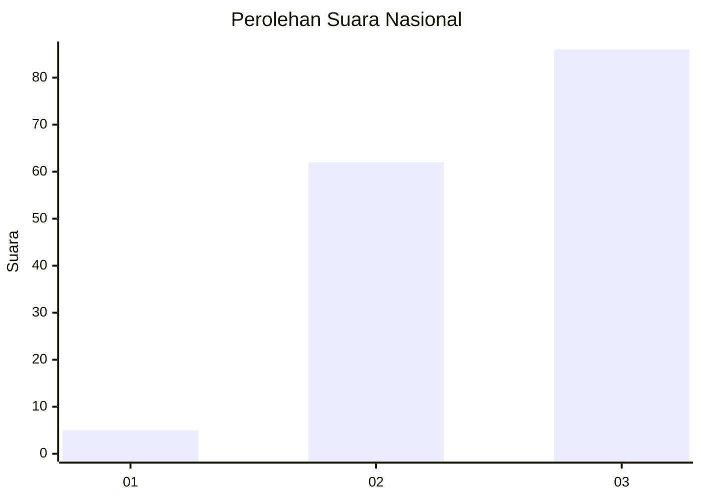
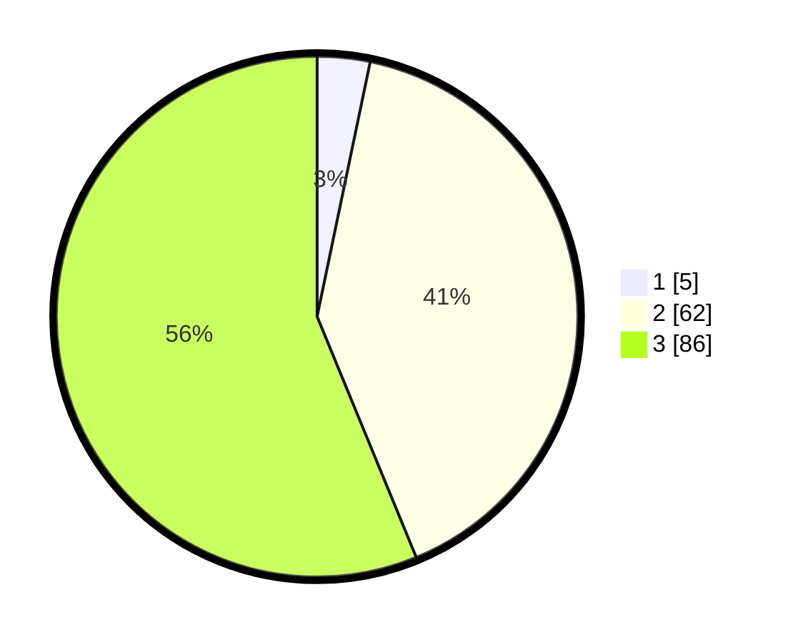

# Hasil

## Grafik

## Tabel

| No. | Nama Paslon    | Suara | Suara (raw) | Persentase |
|:--- |:-------------- | -----:| -----------:| ----------:|
| 1   | ANIES MUHAIMIN | 5     | [5][p-1]    | 3,27       |
| 2   | PRABOWO GIBRAN | 62    | [62][p-2]   | 40,52      |
| 3   | GANJAR MAHFUD  | 86    | [86][p-3]   | 56,21      |

[p-1]: https://github.com/gigit-pemilu/pemilu-2024/blob/main/pilpres/hitung-suara/sub/51-bali/sub/02-tabanan/sub/02-selemadeg-timur/sub/2010-gadungsari/sub/002-tps/sub/paslon-1.txt
[p-2]: https://github.com/gigit-pemilu/pemilu-2024/blob/main/pilpres/hitung-suara/sub/51-bali/sub/02-tabanan/sub/02-selemadeg-timur/sub/2010-gadungsari/sub/002-tps/sub/paslon-2.txt
[p-3]: https://github.com/gigit-pemilu/pemilu-2024/blob/main/pilpres/hitung-suara/sub/51-bali/sub/02-tabanan/sub/02-selemadeg-timur/sub/2010-gadungsari/sub/002-tps/sub/paslon-3.txt

## Foto C Plano

https://sirekap-obj-formc.kpu.go.id/8a8f/pemilu/ppwp/51/02/02/20/10/5102022010002-20240215-235832--527041b1-b9ac-4df1-952b-ce70630cdbb0.jpg

https://sirekap-obj-formc.kpu.go.id/8a8f/pemilu/ppwp/51/02/02/20/10/5102022010002-20240215-235835--8471ab46-dace-490c-b0f4-a70502bd7060.jpg

https://sirekap-obj-formc.kpu.go.id/8a8f/pemilu/ppwp/51/02/02/20/10/5102022010002-20240215-235833--7b399d06-7c27-4826-a33b-8560198201d0.jpg

## Metadata

| Key        | Value               |
| ---------- | ------------------- |
| Time Stamp | 2024-02-16 09:30:28 |

## DATA PEMILIH TETAP

Jumlah pemilih dalam DPT: **185**.
 * L: **93**.
 * P: **92**.

## DATA PENGGUNA HAK PILIH

Jumlah pengguna hak pilih dalam DPT: **156**.
 * L: **76**.
 * P: **80**.

Jumlah pengguna hak pilih dalam DPTb: **0**.
 * L: **0**.
 * P: **0**.

Jumlah pengguna hak pilih dalam DPK: **0**.
 * L: **0**.
 * P: **0**.

Jumlah pengguna hak pilih: **156**.
 * L: **76**.
 * P: **80**.

## JUMLAH SUARA SAH DAN TIDAK SAH

JUMLAH SELURUH SUARA SAH: **153**.

JUMLAH SUARA TIDAK SAH: **3**.

JUMLAH SELURUH SUARA SAH DAN SUARA TIDAK SAH: **156**.

