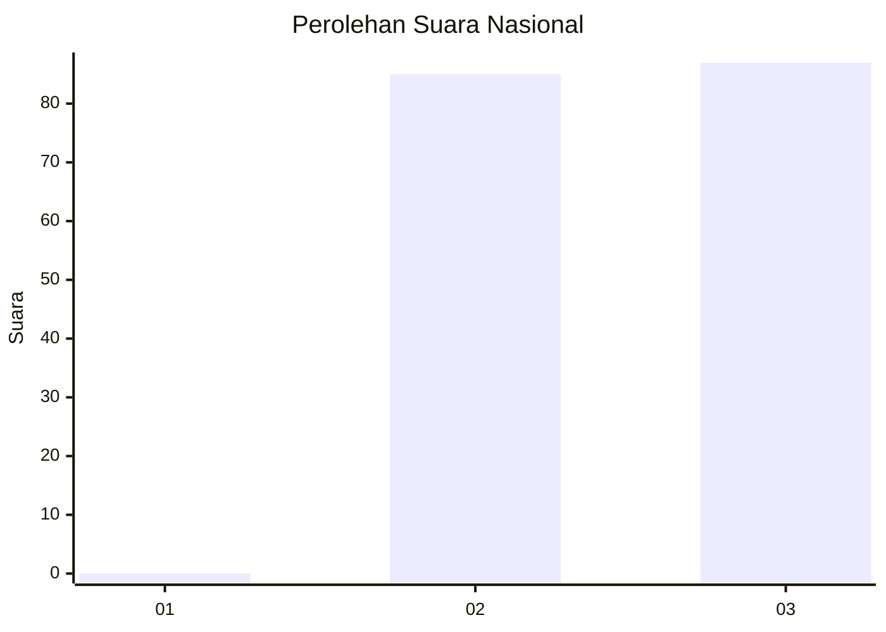
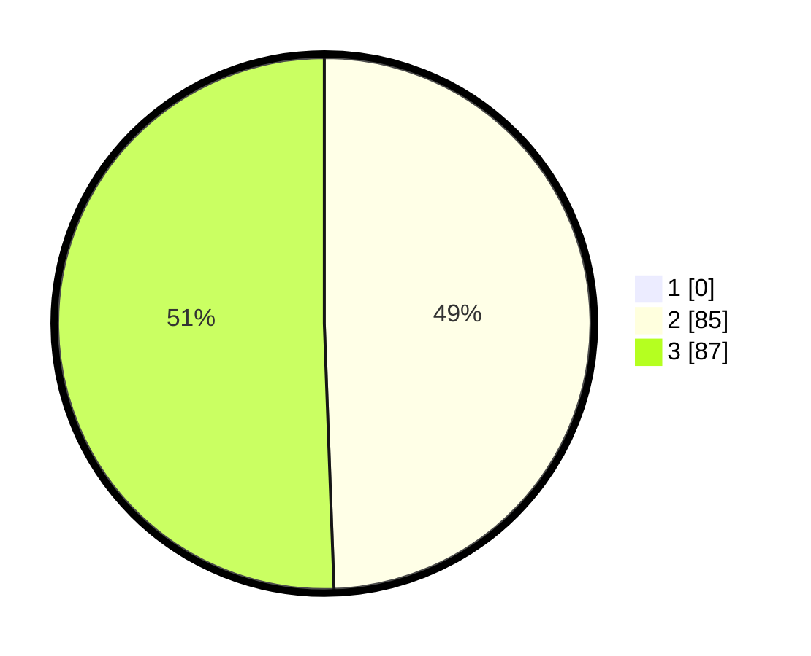

# Hasil

## Grafik

## Tabel

| No. | Nama Paslon    | Suara | Suara (raw) | Persentase |
|:--- |:-------------- | -----:| -----------:| ----------:|
| 1   | ANIES MUHAIMIN | 0     | [0][p-1]    | 0,00       |
| 2   | PRABOWO GIBRAN | 85    | [85][p-2]   | 49,42      |
| 3   | GANJAR MAHFUD  | 87    | [87][p-3]   | 50,58      |

[p-1]: https://github.com/gigit-pemilu/pemilu-2024/blob/main/pilpres/hitung-suara/sub/51-bali/sub/02-tabanan/sub/02-selemadeg-timur/sub/2010-gadungsari/sub/003-tps/sub/paslon-1.txt
[p-2]: https://github.com/gigit-pemilu/pemilu-2024/blob/main/pilpres/hitung-suara/sub/51-bali/sub/02-tabanan/sub/02-selemadeg-timur/sub/2010-gadungsari/sub/003-tps/sub/paslon-2.txt
[p-3]: https://github.com/gigit-pemilu/pemilu-2024/blob/main/pilpres/hitung-suara/sub/51-bali/sub/02-tabanan/sub/02-selemadeg-timur/sub/2010-gadungsari/sub/003-tps/sub/paslon-3.txt

## Foto C Plano

https://sirekap-obj-formc.kpu.go.id/fe7b/pemilu/ppwp/51/02/02/20/10/5102022010003-20240215-231536--37d91a0a-4104-49aa-bb6f-64d42a2b3548.jpg

https://sirekap-obj-formc.kpu.go.id/fe7b/pemilu/ppwp/51/02/02/20/10/5102022010003-20240215-231542--55399cf4-0f68-4b76-9e86-c0345a99d939.jpg

https://sirekap-obj-formc.kpu.go.id/fe7b/pemilu/ppwp/51/02/02/20/10/5102022010003-20240215-231538--3c624bde-e2ca-47b5-94f8-41c6cf985b3c.jpg

## Metadata

| Key        | Value               |
| ---------- | ------------------- |
| Time Stamp | 2024-02-16 09:30:28 |

## DATA PEMILIH TETAP

Jumlah pemilih dalam DPT: **190**.
 * L: **94**.
 * P: **96**.

## DATA PENGGUNA HAK PILIH

Jumlah pengguna hak pilih dalam DPT: **173**.
 * L: **83**.
 * P: **90**.

Jumlah pengguna hak pilih dalam DPTb: **0**.
 * L: **0**.
 * P: **0**.

Jumlah pengguna hak pilih dalam DPK: **0**.
 * L: **0**.
 * P: **0**.

Jumlah pengguna hak pilih: **173**.
 * L: **83**.
 * P: **90**.

## JUMLAH SUARA SAH DAN TIDAK SAH

JUMLAH SELURUH SUARA SAH: **172**.

JUMLAH SUARA TIDAK SAH: **1**.

JUMLAH SELURUH SUARA SAH DAN SUARA TIDAK SAH: **173**.

