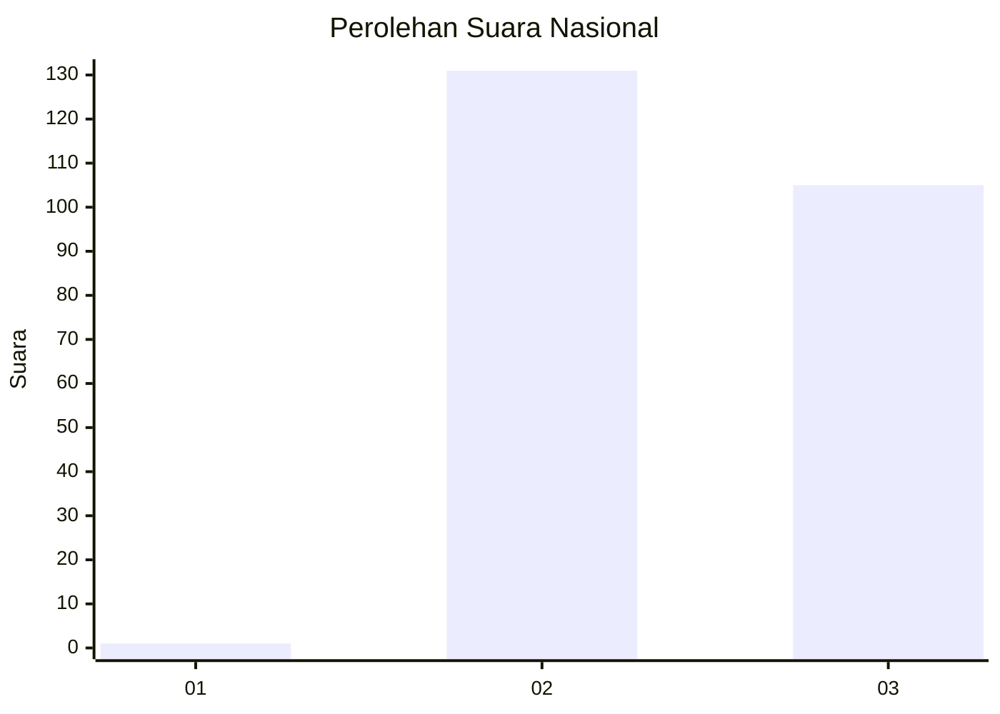
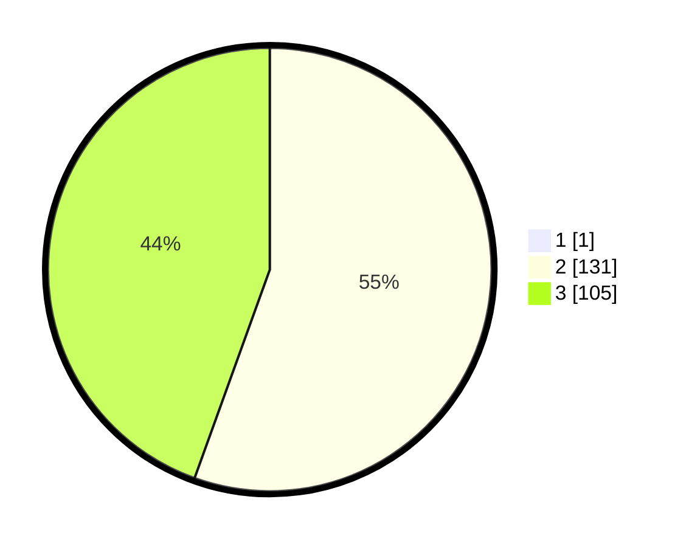

# Hasil

## Grafik

## Tabel

| No. | Nama Paslon    | Suara | Suara (raw) | Persentase |
|:--- |:-------------- | -----:| -----------:| ----------:|
| 1   | ANIES MUHAIMIN | 1     | [1][p-1]    | 0,42       |
| 2   | PRABOWO GIBRAN | 131   | [131][p-2]  | 55,27      |
| 3   | GANJAR MAHFUD  | 105   | [105][p-3]  | 44,30      |

[p-1]: https://github.com/gigit-pemilu/pemilu-2024/blob/main/pilpres/hitung-suara/sub/51-bali/sub/02-tabanan/sub/02-selemadeg-timur/sub/2010-gadungsari/sub/004-tps/sub/paslon-1.txt
[p-2]: https://github.com/gigit-pemilu/pemilu-2024/blob/main/pilpres/hitung-suara/sub/51-bali/sub/02-tabanan/sub/02-selemadeg-timur/sub/2010-gadungsari/sub/004-tps/sub/paslon-2.txt
[p-3]: https://github.com/gigit-pemilu/pemilu-2024/blob/main/pilpres/hitung-suara/sub/51-bali/sub/02-tabanan/sub/02-selemadeg-timur/sub/2010-gadungsari/sub/004-tps/sub/paslon-3.txt

## Foto C Plano

https://sirekap-obj-formc.kpu.go.id/6d7e/pemilu/ppwp/51/02/02/20/10/5102022010004-20240216-083434--3e96931b-b068-4dfe-943f-94aa239845ab.jpg

https://sirekap-obj-formc.kpu.go.id/6d7e/pemilu/ppwp/51/02/02/20/10/5102022010004-20240216-083436--3e0387cd-b9cf-476b-83c0-d4edae19c2fa.jpg

https://sirekap-obj-formc.kpu.go.id/6d7e/pemilu/ppwp/51/02/02/20/10/5102022010004-20240216-083435--d220cdc3-e3ef-449f-81aa-587197bfdcc1.jpg

## Metadata

| Key        | Value               |
| ---------- | ------------------- |
| Time Stamp | 2024-02-16 09:30:28 |

## DATA PEMILIH TETAP

Jumlah pemilih dalam DPT: **281**.
 * L: **137**.
 * P: **144**.

## DATA PENGGUNA HAK PILIH

Jumlah pengguna hak pilih dalam DPT: **247**.
 * L: **123**.
 * P: **124**.

Jumlah pengguna hak pilih dalam DPTb: **1**.
 * L: **0**.
 * P: **1**.

Jumlah pengguna hak pilih dalam DPK: **0**.
 * L: **0**.
 * P: **0**.

Jumlah pengguna hak pilih: **248**.
 * L: **123**.
 * P: **125**.

## JUMLAH SUARA SAH DAN TIDAK SAH

JUMLAH SELURUH SUARA SAH: **237**.

JUMLAH SUARA TIDAK SAH: **11**.

JUMLAH SELURUH SUARA SAH DAN SUARA TIDAK SAH: **248**.

